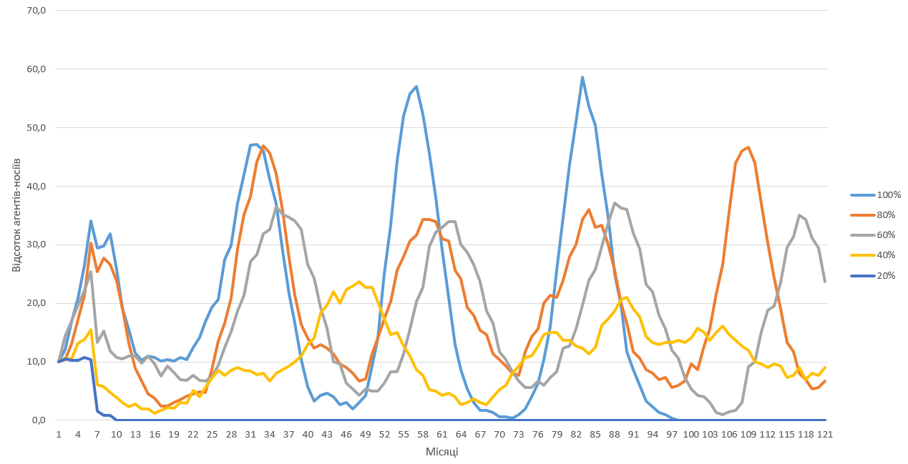
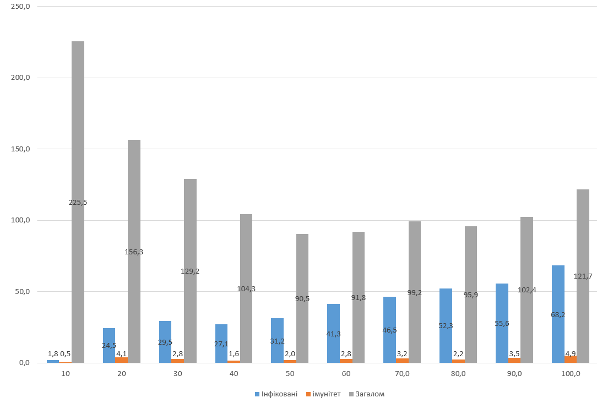
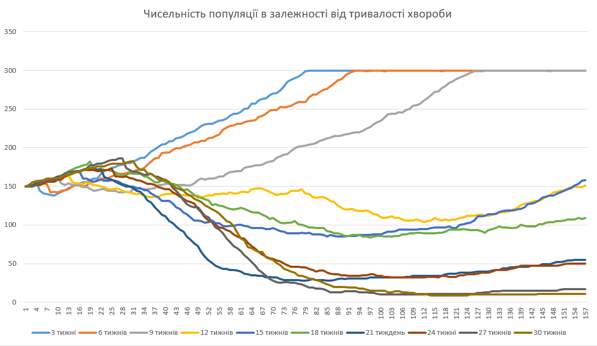
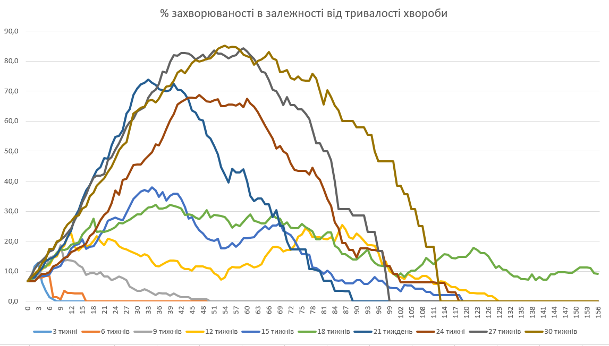

## Комп'ютерні системи імітаційного моделювання
## СПм-22-3, **Онищенко Олександр Іванович**
### Лабораторна робота №**1**. Опис імітаційних моделей та проведення обчислювальних експериментів

### Варіант 3, модель у середовищі NetLogo:
[Virus](https://www.netlogoweb.org/launch#https://www.netlogoweb.org/assets/modelslib/Sample%20Models/Biology/Virus.nlogo)

### Вербальний опис моделі:
Симуляція розповсюдження вірусу між особами-носіями. Серед заданої популяції агентів, 10 осіб з моменту початку симуляції є носіями вірусу, який передається між іншими агентами. Після закінчення терміну захворювання, носій з певною ймовірністю або вмирає, або виліковується і отримує імунітет, який проходить з часом. Також агенти з певною ймовірністю можуть розмножуватися (якщо вони не є хворими), та помирають від "старості".  

### Керуючі параметри:
- **number-people** визначає початкову кількість агентів у середовищі моделювання;
- **infectiousness** - заразність вірусу, визначає ймовірність передати вірус іншим агентам;
- **duration** визначає тривалість хвороби;
- **chance-recover** визначає ймовірність вилікуватися і набути імунітет після спливання терміну, що визначається параметром **duration**.

### Внутрішні параметри:
#### Загальні параметри моделі:
- **immunity-duration**. Тривалість дії імунітету після подолання вірусу. Значення за замовчуванням - 52 тижні (1 рік);
- **lifespan**. Тривалість життя агента. За замовчуванням - 2600 тижнів (50 років);
- **chance-reproduce**. Ймовірність появи нащадка на поточній ітерації (тижні). За замовчуванням - 1%;
- **carrying-capacity**. Загальна місткість середовища моделювання. За замовчуванням складає 300 агентів.
#### Параметри агента:
- **sick**. Булевий параметр, що визначає стан здоров'я агента (здоровий чи носій вірусу);
- **remaining-immunity**. Тривалість дії імунітету, що залишилася (в тижнях);
- **sick-time**. Визначає, як довго агент є носієм вірусу (в тижнях);
- **age**. Вік агента (в тижнях).

### Показники роботи системи:
- Загальна кількість агентів в симуляції. Не може бути вищою за параметр **carrying-capacity**;
- Кількість та відсотковий показник інфікованих агентів;
- Кількість та відсотковий показник агентів, що мають імунітет;

### Недоліки моделі:
- Поширення вірусу залежить від параметру заразності (**infectiousness**) та кількості агентів в симуляції, але не враховує фізичну відстань між агентами. Врахування взаємного положення агентів могло б зробити поведінку моделі більш наближеною до поведінки реального вірусу.
- Симуляція не враховує індивідуальні властивості носія. Моделювання було б більш реалістичним при наявності елементу випадковості щодо тривалості захворювання, наприклад, встановлення відхилень для тривалості захворювання (20±3, 25±5 тижнів тощо). Те ж стосується і тривалості імунітету, який наразі взагалі є внутрішньою константою - його можна було б також зробити керуючим параметром і додати випадкові відхилення.

## Обчислювальні експерименти
### 1. Вплив заразності вірусу на його життєздатність, при низькій летальності хвороби.
Досліджується залежність загального відсотку агентів-носіїв при зміні параметру заразності вірусу та низького показника смертності.
Експерименти проводяться при наступних показниках:
- Початкова кількість агентів (**number-people**) - 100
- Ймовірність вилікуватися (**chance-recover**) - 95%
- Заразність (**infectiousness**) - від 20% до 100% з кроком у 20% (реальне максимальне значення складає 99% - обмеження середовища моделювання) 
- Тривалість хвороби (**duration**) - 20 тижнів (за замовчуванням)
Обрана максимальна тривалість проведення симуляції - 120 місяців - 480 тижнів, з кроком 4 тижні - 1 місяць.
Якщо вірус виявиться не життєздатним в обраних умовах, експеримент закінчується раніше.

#### Таблиці отриманих результатів
##### Заразність - 20%
<table>
<thead>
<tr>
<th>Місяць</th>
<th>Кількість носіїв</th>
<th>Загальна кількість особин</th>
<th>Відсоток носіїв</th>
</tr>
</thead>
<tbody>
 <tr>
  <td>0</td>
  <td>10</td>
  <td>100</td>
  <td>10,0</td>
 </tr>
 <tr>
  <td>1</td>
  <td>11</td>
  <td>105</td>
  <td>10,5</td>
 </tr>
 <tr>
  <td>2</td>
  <td>11</td>
  <td>107</td>
  <td>10,3</td>
 </tr>
 <tr>
  <td>3</td>
  <td>11</td>
  <td>108</td>
  <td>10,2</td>
 </tr>
 <tr>
  <td>4</td>
  <td>12</td>
  <td>111</td>
  <td>10,8</td>
 </tr>
 <tr>
  <td>5</td>
  <td>12</td>
  <td>115</td>
  <td>10,4</td>
 </tr>
 <tr>
  <td>6</td>
  <td>2</td>
  <td>122</td>
  <td>1,6</td>
 </tr>
 <tr>
  <td>7</td>
  <td>1</td>
  <td>125</td>
  <td>0,8</td>
 </tr>
 <tr>
  <td>8</td>
  <td>1</td>
  <td>129</td>
  <td>0,8</td>
 </tr>
 <tr>
  <td>9</td>
  <td>0</td>
  <td>134</td>
  <td>0,0</td>
 </tr>
</tbody>
</table>

##### Заразність - 40%
<table>
<thead>
<tr>
<th>Тиждень</th>
<th>Кількість носіїв</th>
<th>Загальна кількість особин</th>
<th>Відсоток носіїв</th>
</tr>
</thead>
<tbody>
 <tr>
  <td>0</td>
  <td>10</td>
  <td>100</td>
  <td>10,0</td>
 </tr>
 <tr>
  <td>1</td>
  <td>11</td>
  <td>104</td>
  <td>10,6</td>
 </tr>
 <tr>
  <td>2</td>
  <td>11</td>
  <td>105</td>
  <td>10,5</td>
 </tr>
 <tr>
  <td>3</td>
  <td>14</td>
  <td>106</td>
  <td>13,2</td>
 </tr>
 <tr>
  <td>4</td>
  <td>15</td>
  <td>109</td>
  <td>13,8</td>
 </tr>
 <tr>
  <td>5</td>
  <td>17</td>
  <td>110</td>
  <td>15,5</td>
 </tr>
 <tr>
  <td>6</td>
  <td>7</td>
  <td>115</td>
  <td>6,1</td>
 </tr>
 <tr>
  <td>7</td>
  <td>7</td>
  <td>120</td>
  <td>5,8</td>
 </tr>
 <tr>
  <td>8</td>
  <td>6</td>
  <td>125</td>
  <td>4,8</td>
 </tr>
 <tr>
  <td>9</td>
  <td>5</td>
  <td>128</td>
  <td>3,9</td>
 </tr>
 <tr>
  <td>10</td>
  <td>4</td>
  <td>131</td>
  <td>3,1</td>
 </tr>
 <tr>
  <td>11</td>
  <td>3</td>
  <td>132</td>
  <td>2,3</td>
 </tr>
 <tr>
  <td>12</td>
  <td>4</td>
  <td>144</td>
  <td>2,8</td>
 </tr>
 <tr>
  <td>13</td>
  <td>3</td>
  <td>151</td>
  <td>2,0</td>
 </tr>
 <tr>
  <td>14</td>
  <td>3</td>
  <td>156</td>
  <td>1,9</td>
 </tr>
 <tr>
  <td>15</td>
  <td>2</td>
  <td>166</td>
  <td>1,2</td>
 </tr>
 <tr>
  <td>16</td>
  <td>3</td>
  <td>174</td>
  <td>1,7</td>
 </tr>
 <tr>
  <td>17</td>
  <td>4</td>
  <td>184</td>
  <td>2,2</td>
 </tr>
 <tr>
  <td>18</td>
  <td>4</td>
  <td>190</td>
  <td>2,1</td>
 </tr>
 <tr>
  <td>19</td>
  <td>6</td>
  <td>200</td>
  <td>3,0</td>
 </tr>
 <tr>
  <td>20</td>
  <td>6</td>
  <td>207</td>
  <td>2,9</td>
 </tr>
 <tr>
  <td>21</td>
  <td>11</td>
  <td>216</td>
  <td>5,1</td>
 </tr>
 <tr>
  <td>22</td>
  <td>9</td>
  <td>226</td>
  <td>4,0</td>
 </tr>
 <tr>
  <td>23</td>
  <td>13</td>
  <td>231</td>
  <td>5,6</td>
 </tr>
 <tr>
  <td>24</td>
  <td>17</td>
  <td>236</td>
  <td>7,2</td>
 </tr>
 <tr>
  <td>25</td>
  <td>21</td>
  <td>248</td>
  <td>8,5</td>
 </tr>
 <tr>
  <td>26</td>
  <td>20</td>
  <td>259</td>
  <td>7,7</td>
 </tr>
 <tr>
  <td>27</td>
  <td>23</td>
  <td>269</td>
  <td>8,6</td>
 </tr>
 <tr>
  <td>28</td>
  <td>25</td>
  <td>277</td>
  <td>9,0</td>
 </tr>
 <tr>
  <td>29</td>
  <td>24</td>
  <td>280</td>
  <td>8,6</td>
 </tr>
 <tr>
  <td>30</td>
  <td>24</td>
  <td>287</td>
  <td>8,4</td>
 </tr>
 <tr>
  <td>31</td>
  <td>23</td>
  <td>295</td>
  <td>7,8</td>
 </tr>
 <tr>
  <td>32</td>
  <td>24</td>
  <td>300</td>
  <td>8,0</td>
 </tr>
 <tr>
  <td>33</td>
  <td>20</td>
  <td>300</td>
  <td>6,7</td>
 </tr>
 <tr>
  <td>34</td>
  <td>24</td>
  <td>300</td>
  <td>8,0</td>
 </tr>
 <tr>
  <td>35</td>
  <td>26</td>
  <td>300</td>
  <td>8,7</td>
 </tr>
 <tr>
  <td>36</td>
  <td>28</td>
  <td>300</td>
  <td>9,3</td>
 </tr>
 <tr>
  <td>37</td>
  <td>30</td>
  <td>300</td>
  <td>10,0</td>
 </tr>
 <tr>
  <td>38</td>
  <td>33</td>
  <td>300</td>
  <td>11,0</td>
 </tr>
 <tr>
  <td>39</td>
  <td>39</td>
  <td>300</td>
  <td>13,0</td>
 </tr>
 <tr>
  <td>40</td>
  <td>42</td>
  <td>300</td>
  <td>14,0</td>
 </tr>
 <tr>
  <td>41</td>
  <td>55</td>
  <td>300</td>
  <td>18,3</td>
 </tr>
 <tr>
  <td>42</td>
  <td>59</td>
  <td>300</td>
  <td>19,7</td>
 </tr>
 <tr>
  <td>43</td>
  <td>66</td>
  <td>300</td>
  <td>22,0</td>
 </tr>
 <tr>
  <td>44</td>
  <td>60</td>
  <td>300</td>
  <td>20,0</td>
 </tr>
 <tr>
  <td>45</td>
  <td>67</td>
  <td>300</td>
  <td>22,3</td>
 </tr>
 <tr>
  <td>46</td>
  <td>69</td>
  <td>300</td>
  <td>23,0</td>
 </tr>
 <tr>
  <td>47</td>
  <td>71</td>
  <td>300</td>
  <td>23,7</td>
 </tr>
 <tr>
  <td>48</td>
  <td>68</td>
  <td>300</td>
  <td>22,7</td>
 </tr>
 <tr>
  <td>49</td>
  <td>68</td>
  <td>300</td>
  <td>22,7</td>
 </tr>
 <tr>
  <td>50</td>
  <td>61</td>
  <td>300</td>
  <td>20,3</td>
 </tr>
 <tr>
  <td>51</td>
  <td>52</td>
  <td>299</td>
  <td>17,4</td>
 </tr>
 <tr>
  <td>52</td>
  <td>44</td>
  <td>300</td>
  <td>14,7</td>
 </tr>
 <tr>
  <td>53</td>
  <td>45</td>
  <td>300</td>
  <td>15,0</td>
 </tr>
 <tr>
  <td>54</td>
  <td>38</td>
  <td>300</td>
  <td>12,7</td>
 </tr>
 <tr>
  <td>55</td>
  <td>33</td>
  <td>300</td>
  <td>11,0</td>
 </tr>
 <tr>
  <td>56</td>
  <td>26</td>
  <td>300</td>
  <td>8,7</td>
 </tr>
 <tr>
  <td>57</td>
  <td>23</td>
  <td>300</td>
  <td>7,7</td>
 </tr>
 <tr>
  <td>58</td>
  <td>16</td>
  <td>300</td>
  <td>5,3</td>
 </tr>
 <tr>
  <td>59</td>
  <td>15</td>
  <td>300</td>
  <td>5,0</td>
 </tr>
 <tr>
  <td>60</td>
  <td>13</td>
  <td>300</td>
  <td>4,3</td>
 </tr>
 <tr>
  <td>61</td>
  <td>14</td>
  <td>300</td>
  <td>4,7</td>
 </tr>
 <tr>
  <td>62</td>
  <td>12</td>
  <td>300</td>
  <td>4,0</td>
 </tr>
 <tr>
  <td>63</td>
  <td>8</td>
  <td>300</td>
  <td>2,7</td>
 </tr>
 <tr>
  <td>64</td>
  <td>9</td>
  <td>300</td>
  <td>3,0</td>
 </tr>
 <tr>
  <td>65</td>
  <td>11</td>
  <td>300</td>
  <td>3,7</td>
 </tr>
 <tr>
  <td>66</td>
  <td>9</td>
  <td>300</td>
  <td>3,0</td>
 </tr>
 <tr>
  <td>67</td>
  <td>8</td>
  <td>300</td>
  <td>2,7</td>
 </tr>
 <tr>
  <td>68</td>
  <td>12</td>
  <td>300</td>
  <td>4,0</td>
 </tr>
 <tr>
  <td>69</td>
  <td>16</td>
  <td>300</td>
  <td>5,3</td>
 </tr>
 <tr>
  <td>70</td>
  <td>18</td>
  <td>300</td>
  <td>6,0</td>
 </tr>
 <tr>
  <td>71</td>
  <td>24</td>
  <td>300</td>
  <td>8,0</td>
 </tr>
 <tr>
  <td>72</td>
  <td>28</td>
  <td>300</td>
  <td>9,3</td>
 </tr>
 <tr>
  <td>73</td>
  <td>32</td>
  <td>300</td>
  <td>10,7</td>
 </tr>
 <tr>
  <td>74</td>
  <td>33</td>
  <td>300</td>
  <td>11,0</td>
 </tr>
 <tr>
  <td>75</td>
  <td>38</td>
  <td>300</td>
  <td>12,7</td>
 </tr>
 <tr>
  <td>76</td>
  <td>44</td>
  <td>300</td>
  <td>14,7</td>
 </tr>
 <tr>
  <td>77</td>
  <td>45</td>
  <td>300</td>
  <td>15,0</td>
 </tr>
 <tr>
  <td>78</td>
  <td>45</td>
  <td>300</td>
  <td>15,0</td>
 </tr>
 <tr>
  <td>79</td>
  <td>41</td>
  <td>300</td>
  <td>13,7</td>
 </tr>
 <tr>
  <td>80</td>
  <td>41</td>
  <td>300</td>
  <td>13,7</td>
 </tr>
 <tr>
  <td>81</td>
  <td>38</td>
  <td>300</td>
  <td>12,7</td>
 </tr>
 <tr>
  <td>82</td>
  <td>37</td>
  <td>300</td>
  <td>12,3</td>
 </tr>
 <tr>
  <td>83</td>
  <td>34</td>
  <td>300</td>
  <td>11,3</td>
 </tr>
 <tr>
  <td>84</td>
  <td>37</td>
  <td>299</td>
  <td>12,4</td>
 </tr>
 <tr>
  <td>85</td>
  <td>49</td>
  <td>300</td>
  <td>16,3</td>
 </tr>
 <tr>
  <td>86</td>
  <td>52</td>
  <td>300</td>
  <td>17,3</td>
 </tr>
 <tr>
  <td>87</td>
  <td>56</td>
  <td>300</td>
  <td>18,7</td>
 </tr>
 <tr>
  <td>88</td>
  <td>62</td>
  <td>300</td>
  <td>20,7</td>
 </tr>
 <tr>
  <td>89</td>
  <td>63</td>
  <td>300</td>
  <td>21,0</td>
 </tr>
 <tr>
  <td>90</td>
  <td>57</td>
  <td>300</td>
  <td>19,0</td>
 </tr>
 <tr>
  <td>91</td>
  <td>53</td>
  <td>300</td>
  <td>17,7</td>
 </tr>
 <tr>
  <td>92</td>
  <td>43</td>
  <td>300</td>
  <td>14,3</td>
 </tr>
 <tr>
  <td>93</td>
  <td>40</td>
  <td>300</td>
  <td>13,3</td>
 </tr>
 <tr>
  <td>94</td>
  <td>39</td>
  <td>300</td>
  <td>13,0</td>
 </tr>
 <tr>
  <td>95</td>
  <td>40</td>
  <td>300</td>
  <td>13,3</td>
 </tr>
 <tr>
  <td>96</td>
  <td>40</td>
  <td>300</td>
  <td>13,3</td>
 </tr>
 <tr>
  <td>97</td>
  <td>41</td>
  <td>300</td>
  <td>13,7</td>
 </tr>
 <tr>
  <td>98</td>
  <td>40</td>
  <td>300</td>
  <td>13,3</td>
 </tr>
 <tr>
  <td>99</td>
  <td>42</td>
  <td>300</td>
  <td>14,0</td>
 </tr>
 <tr>
  <td>100</td>
  <td>47</td>
  <td>300</td>
  <td>15,7</td>
 </tr>
 <tr>
  <td>101</td>
  <td>45</td>
  <td>300</td>
  <td>15,0</td>
 </tr>
 <tr>
  <td>102</td>
  <td>41</td>
  <td>300</td>
  <td>13,7</td>
 </tr>
 <tr>
  <td>103</td>
  <td>45</td>
  <td>300</td>
  <td>15,0</td>
 </tr>
 <tr>
  <td>104</td>
  <td>48</td>
  <td>299</td>
  <td>16,1</td>
 </tr>
 <tr>
  <td>105</td>
  <td>44</td>
  <td>300</td>
  <td>14,7</td>
 </tr>
 <tr>
  <td>106</td>
  <td>41</td>
  <td>300</td>
  <td>13,7</td>
 </tr>
 <tr>
  <td>107</td>
  <td>38</td>
  <td>300</td>
  <td>12,7</td>
 </tr>
 <tr>
  <td>108</td>
  <td>36</td>
  <td>300</td>
  <td>12,0</td>
 </tr>
 <tr>
  <td>109</td>
  <td>30</td>
  <td>300</td>
  <td>10,0</td>
 </tr>
 <tr>
  <td>110</td>
  <td>29</td>
  <td>300</td>
  <td>9,7</td>
 </tr>
 <tr>
  <td>111</td>
  <td>27</td>
  <td>300</td>
  <td>9,0</td>
 </tr>
 <tr>
  <td>112</td>
  <td>29</td>
  <td>300</td>
  <td>9,7</td>
 </tr>
 <tr>
  <td>113</td>
  <td>28</td>
  <td>300</td>
  <td>9,3</td>
 </tr>
 <tr>
  <td>114</td>
  <td>22</td>
  <td>300</td>
  <td>7,3</td>
 </tr>
 <tr>
  <td>115</td>
  <td>23</td>
  <td>300</td>
  <td>7,7</td>
 </tr>
 <tr>
  <td>116</td>
  <td>27</td>
  <td>300</td>
  <td>9,0</td>
 </tr>
 <tr>
  <td>117</td>
  <td>21</td>
  <td>300</td>
  <td>7,0</td>
 </tr>
 <tr>
  <td>118</td>
  <td>24</td>
  <td>300</td>
  <td>8,0</td>
 </tr>
 <tr>
  <td>119</td>
  <td>23</td>
  <td>300</td>
  <td>7,7</td>
 </tr>
 <tr>
  <td>120</td>
  <td>27</td>
  <td>300</td>
  <td>9,0</td>
 </tr>
</tbody>
</table>

##### Заразність - 60%
<table>
<thead>
<tr>
<th>Місяць</th>
<th>Кількість носіїв</th>
<th>Загальна кількість особин</th>
<th>Відсоток носіїв</th>
</tr>
</thead>
<tbody>
<tr>
  <td>0</td>
  <td>10</td>
  <td>100</td>
  <td>10,0</td>
 </tr>
 <tr>
  <td>1</td>
  <td>15</td>
  <td>104</td>
  <td>14,4</td>
 </tr>
 <tr>
  <td>2</td>
  <td>18</td>
  <td>106</td>
  <td>17,0</td>
 </tr>
 <tr>
  <td>3</td>
  <td>22</td>
  <td>112</td>
  <td>19,6</td>
 </tr>
 <tr>
  <td>4</td>
  <td>26</td>
  <td>117</td>
  <td>22,2</td>
 </tr>
 <tr>
  <td>5</td>
  <td>30</td>
  <td>118</td>
  <td>25,4</td>
 </tr>
 <tr>
  <td>6</td>
  <td>16</td>
  <td>120</td>
  <td>13,3</td>
 </tr>
 <tr>
  <td>7</td>
  <td>19</td>
  <td>124</td>
  <td>15,3</td>
 </tr>
 <tr>
  <td>8</td>
  <td>15</td>
  <td>126</td>
  <td>11,9</td>
 </tr>
 <tr>
  <td>9</td>
  <td>14</td>
  <td>131</td>
  <td>10,7</td>
 </tr>
 <tr>
  <td>10</td>
  <td>14</td>
  <td>134</td>
  <td>10,4</td>
 </tr>
 <tr>
  <td>11</td>
  <td>15</td>
  <td>136</td>
  <td>11,0</td>
 </tr>
 <tr>
  <td>12</td>
  <td>15</td>
  <td>136</td>
  <td>11,0</td>
 </tr>
 <tr>
  <td>13</td>
  <td>14</td>
  <td>144</td>
  <td>9,7</td>
 </tr>
 <tr>
  <td>14</td>
  <td>16</td>
  <td>146</td>
  <td>11,0</td>
 </tr>
 <tr>
  <td>15</td>
  <td>15</td>
  <td>155</td>
  <td>9,7</td>
 </tr>
 <tr>
  <td>16</td>
  <td>12</td>
  <td>158</td>
  <td>7,6</td>
 </tr>
 <tr>
  <td>17</td>
  <td>15</td>
  <td>162</td>
  <td>9,3</td>
 </tr>
 <tr>
  <td>18</td>
  <td>14</td>
  <td>170</td>
  <td>8,2</td>
 </tr>
 <tr>
  <td>19</td>
  <td>12</td>
  <td>172</td>
  <td>7,0</td>
 </tr>
 <tr>
  <td>20</td>
  <td>12</td>
  <td>177</td>
  <td>6,8</td>
 </tr>
 <tr>
  <td>21</td>
  <td>14</td>
  <td>182</td>
  <td>7,7</td>
 </tr>
 <tr>
  <td>22</td>
  <td>13</td>
  <td>189</td>
  <td>6,9</td>
 </tr>
 <tr>
  <td>23</td>
  <td>13</td>
  <td>195</td>
  <td>6,7</td>
 </tr>
 <tr>
  <td>24</td>
  <td>15</td>
  <td>202</td>
  <td>7,4</td>
 </tr>
 <tr>
  <td>25</td>
  <td>20</td>
  <td>212</td>
  <td>9,4</td>
 </tr>
 <tr>
  <td>26</td>
  <td>28</td>
  <td>224</td>
  <td>12,5</td>
 </tr>
 <tr>
  <td>27</td>
  <td>36</td>
  <td>238</td>
  <td>15,1</td>
 </tr>
 <tr>
  <td>28</td>
  <td>46</td>
  <td>246</td>
  <td>18,7</td>
 </tr>
 <tr>
  <td>29</td>
  <td>55</td>
  <td>258</td>
  <td>21,3</td>
 </tr>
 <tr>
  <td>30</td>
  <td>71</td>
  <td>262</td>
  <td>27,1</td>
 </tr>
 <tr>
  <td>31</td>
  <td>75</td>
  <td>265</td>
  <td>28,3</td>
 </tr>
 <tr>
  <td>32</td>
  <td>86</td>
  <td>270</td>
  <td>31,9</td>
 </tr>
 <tr>
  <td>33</td>
  <td>90</td>
  <td>276</td>
  <td>32,6</td>
 </tr>
 <tr>
  <td>34</td>
  <td>103</td>
  <td>282</td>
  <td>36,5</td>
 </tr>
 <tr>
  <td>35</td>
  <td>102</td>
  <td>290</td>
  <td>35,2</td>
 </tr>
 <tr>
  <td>36</td>
  <td>103</td>
  <td>297</td>
  <td>34,7</td>
 </tr>
 <tr>
  <td>37</td>
  <td>102</td>
  <td>299</td>
  <td>34,1</td>
 </tr>
 <tr>
  <td>38</td>
  <td>98</td>
  <td>300</td>
  <td>32,7</td>
 </tr>
 <tr>
  <td>39</td>
  <td>80</td>
  <td>300</td>
  <td>26,7</td>
 </tr>
 <tr>
  <td>40</td>
  <td>73</td>
  <td>300</td>
  <td>24,3</td>
 </tr>
 <tr>
  <td>41</td>
  <td>58</td>
  <td>300</td>
  <td>19,3</td>
 </tr>
 <tr>
  <td>42</td>
  <td>47</td>
  <td>299</td>
  <td>15,7</td>
 </tr>
 <tr>
  <td>43</td>
  <td>30</td>
  <td>300</td>
  <td>10,0</td>
 </tr>
 <tr>
  <td>44</td>
  <td>29</td>
  <td>300</td>
  <td>9,7</td>
 </tr>
 <tr>
  <td>45</td>
  <td>19</td>
  <td>300</td>
  <td>6,3</td>
 </tr>
 <tr>
  <td>46</td>
  <td>16</td>
  <td>300</td>
  <td>5,3</td>
 </tr>
 <tr>
  <td>47</td>
  <td>13</td>
  <td>300</td>
  <td>4,3</td>
 </tr>
 <tr>
  <td>48</td>
  <td>16</td>
  <td>300</td>
  <td>5,3</td>
 </tr>
 <tr>
  <td>49</td>
  <td>15</td>
  <td>300</td>
  <td>5,0</td>
 </tr>
 <tr>
  <td>50</td>
  <td>15</td>
  <td>300</td>
  <td>5,0</td>
 </tr>
 <tr>
  <td>51</td>
  <td>19</td>
  <td>300</td>
  <td>6,3</td>
 </tr>
 <tr>
  <td>52</td>
  <td>25</td>
  <td>300</td>
  <td>8,3</td>
 </tr>
 <tr>
  <td>53</td>
  <td>25</td>
  <td>300</td>
  <td>8,3</td>
 </tr>
 <tr>
  <td>54</td>
  <td>34</td>
  <td>300</td>
  <td>11,3</td>
 </tr>
 <tr>
  <td>55</td>
  <td>47</td>
  <td>300</td>
  <td>15,7</td>
 </tr>
 <tr>
  <td>56</td>
  <td>61</td>
  <td>300</td>
  <td>20,3</td>
 </tr>
 <tr>
  <td>57</td>
  <td>68</td>
  <td>300</td>
  <td>22,7</td>
 </tr>
 <tr>
  <td>58</td>
  <td>89</td>
  <td>300</td>
  <td>29,7</td>
 </tr>
 <tr>
  <td>59</td>
  <td>96</td>
  <td>299</td>
  <td>32,1</td>
 </tr>
 <tr>
  <td>60</td>
  <td>99</td>
  <td>300</td>
  <td>33,0</td>
 </tr>
 <tr>
  <td>61</td>
  <td>102</td>
  <td>300</td>
  <td>34,0</td>
 </tr>
 <tr>
  <td>62</td>
  <td>102</td>
  <td>300</td>
  <td>34,0</td>
 </tr>
 <tr>
  <td>63</td>
  <td>90</td>
  <td>300</td>
  <td>30,0</td>
 </tr>
 <tr>
  <td>64</td>
  <td>86</td>
  <td>300</td>
  <td>28,7</td>
 </tr>
 <tr>
  <td>65</td>
  <td>80</td>
  <td>300</td>
  <td>26,7</td>
 </tr>
 <tr>
  <td>66</td>
  <td>71</td>
  <td>300</td>
  <td>23,7</td>
 </tr>
 <tr>
  <td>67</td>
  <td>56</td>
  <td>300</td>
  <td>18,7</td>
 </tr>
 <tr>
  <td>68</td>
  <td>50</td>
  <td>300</td>
  <td>16,7</td>
 </tr>
 <tr>
  <td>69</td>
  <td>35</td>
  <td>300</td>
  <td>11,7</td>
 </tr>
 <tr>
  <td>70</td>
  <td>31</td>
  <td>300</td>
  <td>10,3</td>
 </tr>
 <tr>
  <td>71</td>
  <td>25</td>
  <td>300</td>
  <td>8,3</td>
 </tr>
 <tr>
  <td>72</td>
  <td>20</td>
  <td>300</td>
  <td>6,7</td>
 </tr>
 <tr>
  <td>73</td>
  <td>17</td>
  <td>300</td>
  <td>5,7</td>
 </tr>
 <tr>
  <td>74</td>
  <td>17</td>
  <td>300</td>
  <td>5,7</td>
 </tr>
 <tr>
  <td>75</td>
  <td>20</td>
  <td>300</td>
  <td>6,7</td>
 </tr>
 <tr>
  <td>76</td>
  <td>18</td>
  <td>300</td>
  <td>6,0</td>
 </tr>
 <tr>
  <td>77</td>
  <td>22</td>
  <td>300</td>
  <td>7,3</td>
 </tr>
 <tr>
  <td>78</td>
  <td>25</td>
  <td>300</td>
  <td>8,3</td>
 </tr>
 <tr>
  <td>79</td>
  <td>37</td>
  <td>300</td>
  <td>12,3</td>
 </tr>
 <tr>
  <td>80</td>
  <td>38</td>
  <td>300</td>
  <td>12,7</td>
 </tr>
 <tr>
  <td>81</td>
  <td>47</td>
  <td>300</td>
  <td>15,7</td>
 </tr>
 <tr>
  <td>82</td>
  <td>59</td>
  <td>300</td>
  <td>19,7</td>
 </tr>
 <tr>
  <td>83</td>
  <td>72</td>
  <td>300</td>
  <td>24,0</td>
 </tr>
 <tr>
  <td>84</td>
  <td>77</td>
  <td>299</td>
  <td>25,8</td>
 </tr>
 <tr>
  <td>85</td>
  <td>89</td>
  <td>300</td>
  <td>29,7</td>
 </tr>
 <tr>
  <td>86</td>
  <td>101</td>
  <td>300</td>
  <td>33,7</td>
 </tr>
 <tr>
  <td>87</td>
  <td>111</td>
  <td>299</td>
  <td>37,1</td>
 </tr>
 <tr>
  <td>88</td>
  <td>109</td>
  <td>300</td>
  <td>36,3</td>
 </tr>
 <tr>
  <td>89</td>
  <td>108</td>
  <td>300</td>
  <td>36,0</td>
 </tr>
 <tr>
  <td>90</td>
  <td>96</td>
  <td>300</td>
  <td>32,0</td>
 </tr>
 <tr>
  <td>91</td>
  <td>88</td>
  <td>300</td>
  <td>29,3</td>
 </tr>
 <tr>
  <td>92</td>
  <td>69</td>
  <td>298</td>
  <td>23,2</td>
 </tr>
 <tr>
  <td>93</td>
  <td>66</td>
  <td>300</td>
  <td>22,0</td>
 </tr>
 <tr>
  <td>94</td>
  <td>54</td>
  <td>300</td>
  <td>18,0</td>
 </tr>
 <tr>
  <td>95</td>
  <td>47</td>
  <td>300</td>
  <td>15,7</td>
 </tr>
 <tr>
  <td>96</td>
  <td>36</td>
  <td>300</td>
  <td>12,0</td>
 </tr>
 <tr>
  <td>97</td>
  <td>32</td>
  <td>300</td>
  <td>10,7</td>
 </tr>
 <tr>
  <td>98</td>
  <td>22</td>
  <td>299</td>
  <td>7,4</td>
 </tr>
 <tr>
  <td>99</td>
  <td>16</td>
  <td>300</td>
  <td>5,3</td>
 </tr>
 <tr>
  <td>100</td>
  <td>13</td>
  <td>300</td>
  <td>4,3</td>
 </tr>
 <tr>
  <td>101</td>
  <td>12</td>
  <td>300</td>
  <td>4,0</td>
 </tr>
 <tr>
  <td>102</td>
  <td>9</td>
  <td>300</td>
  <td>3,0</td>
 </tr>
 <tr>
  <td>103</td>
  <td>4</td>
  <td>300</td>
  <td>1,3</td>
 </tr>
 <tr>
  <td>104</td>
  <td>3</td>
  <td>300</td>
  <td>1,0</td>
 </tr>
 <tr>
  <td>105</td>
  <td>4</td>
  <td>300</td>
  <td>1,5</td>
 </tr>
 <tr>
  <td>106</td>
  <td>5</td>
  <td>300</td>
  <td>1,7</td>
 </tr>
 <tr>
  <td>107</td>
  <td>9</td>
  <td>300</td>
  <td>3,0</td>
 </tr>
 <tr>
  <td>108</td>
  <td>28</td>
  <td>300</td>
  <td>9,2</td>
 </tr>
 <tr>
  <td>109</td>
  <td>30</td>
  <td>300</td>
  <td>10,0</td>
 </tr>
 <tr>
  <td>110</td>
  <td>45</td>
  <td>300</td>
  <td>15,1</td>
 </tr>
 <tr>
  <td>111</td>
  <td>56</td>
  <td>300</td>
  <td>18,8</td>
 </tr>
 <tr>
  <td>112</td>
  <td>59</td>
  <td>300</td>
  <td>19,5</td>
 </tr>
 <tr>
  <td>113</td>
  <td>71</td>
  <td>300</td>
  <td>23,6</td>
 </tr>
 <tr>
  <td>114</td>
  <td>89</td>
  <td>300</td>
  <td>29,5</td>
 </tr>
  <tr>
  <td>115</td>
  <td>94</td>
  <td>300</td>
  <td>31,4</td>
 </tr>
  <tr>
  <td>116</td>
  <td>115</td>
  <td>300</td>
  <td>35,0</td>
 </tr>
  <tr>
  <td>117</td>
  <td>103</td>
  <td>300</td>
  <td>34,3</td>
 </tr>
  <tr>
  <td>118</td>
  <td>93</td>
  <td>300</td>
  <td>31,1</td>
 </tr>
  <tr>
  <td>119</td>
  <td>88</td>
  <td>300</td>
  <td>29,4</td>
 </tr>
  <tr>
  <td>120</td>
  <td>71</td>
  <td>300</td>
  <td>23,7</td>
 </tr>
</tbody>
</table>

##### Заразність - 80%
<table>
<thead>
<tr>
<th>Місяць</th>
<th>Кількість носіїв</th>
<th>Загальна кількість особин</th>
<th>Відсоток носіїв</th>
</tr>
</thead>
<tbody>
<tr>
  <td>0</td>
  <td>10</td>
  <td>100</td>
  <td>10,0</td>
 </tr>
 <tr>
  <td>1</td>
  <td>11</td>
  <td>106</td>
  <td>10,4</td>
 </tr>
 <tr>
  <td>2</td>
  <td>14</td>
  <td>107</td>
  <td>13,1</td>
 </tr>
 <tr>
  <td>3</td>
  <td>19</td>
  <td>110</td>
  <td>17,3</td>
 </tr>
 <tr>
  <td>4</td>
  <td>25</td>
  <td>117</td>
  <td>21,4</td>
 </tr>
 <tr>
  <td>5</td>
  <td>37</td>
  <td>122</td>
  <td>30,3</td>
 </tr>
 <tr>
  <td>6</td>
  <td>31</td>
  <td>122</td>
  <td>25,4</td>
 </tr>
 <tr>
  <td>7</td>
  <td>35</td>
  <td>126</td>
  <td>27,8</td>
 </tr>
 <tr>
  <td>8</td>
  <td>33</td>
  <td>124</td>
  <td>26,6</td>
 </tr>
 <tr>
  <td>9</td>
  <td>30</td>
  <td>126</td>
  <td>23,8</td>
 </tr>
 <tr>
  <td>10</td>
  <td>25</td>
  <td>130</td>
  <td>19,2</td>
 </tr>
 <tr>
  <td>11</td>
  <td>18</td>
  <td>136</td>
  <td>13,2</td>
 </tr>
 <tr>
  <td>12</td>
  <td>13</td>
  <td>145</td>
  <td>9,0</td>
 </tr>
 <tr>
  <td>13</td>
  <td>10</td>
  <td>148</td>
  <td>6,8</td>
 </tr>
 <tr>
  <td>14</td>
  <td>7</td>
  <td>153</td>
  <td>4,6</td>
 </tr>
 <tr>
  <td>15</td>
  <td>6</td>
  <td>158</td>
  <td>3,8</td>
 </tr>
 <tr>
  <td>16</td>
  <td>4</td>
  <td>161</td>
  <td>2,5</td>
 </tr>
 <tr>
  <td>17</td>
  <td>4</td>
  <td>164</td>
  <td>2,4</td>
 </tr>
 <tr>
  <td>18</td>
  <td>5</td>
  <td>167</td>
  <td>3,0</td>
 </tr>
 <tr>
  <td>19</td>
  <td>6</td>
  <td>168</td>
  <td>3,6</td>
 </tr>
 <tr>
  <td>20</td>
  <td>7</td>
  <td>170</td>
  <td>4,1</td>
 </tr>
 <tr>
  <td>21</td>
  <td>8</td>
  <td>178</td>
  <td>4,5</td>
 </tr>
 <tr>
  <td>22</td>
  <td>9</td>
  <td>182</td>
  <td>4,9</td>
 </tr>
 <tr>
  <td>23</td>
  <td>9</td>
  <td>189</td>
  <td>4,8</td>
 </tr>
 <tr>
  <td>24</td>
  <td>17</td>
  <td>196</td>
  <td>8,7</td>
 </tr>
 <tr>
  <td>25</td>
  <td>28</td>
  <td>206</td>
  <td>13,6</td>
 </tr>
 <tr>
  <td>26</td>
  <td>36</td>
  <td>217</td>
  <td>16,6</td>
 </tr>
 <tr>
  <td>27</td>
  <td>47</td>
  <td>225</td>
  <td>20,9</td>
 </tr>
 <tr>
  <td>28</td>
  <td>67</td>
  <td>229</td>
  <td>29,3</td>
 </tr>
 <tr>
  <td>29</td>
  <td>82</td>
  <td>233</td>
  <td>35,2</td>
 </tr>
 <tr>
  <td>30</td>
  <td>91</td>
  <td>238</td>
  <td>38,2</td>
 </tr>
 <tr>
  <td>31</td>
  <td>108</td>
  <td>244</td>
  <td>44,3</td>
 </tr>
 <tr>
  <td>32</td>
  <td>116</td>
  <td>247</td>
  <td>47,0</td>
 </tr>
 <tr>
  <td>33</td>
  <td>116</td>
  <td>254</td>
  <td>45,7</td>
 </tr>
 <tr>
  <td>34</td>
  <td>110</td>
  <td>261</td>
  <td>42,1</td>
 </tr>
 <tr>
  <td>35</td>
  <td>96</td>
  <td>268</td>
  <td>35,8</td>
 </tr>
 <tr>
  <td>36</td>
  <td>76</td>
  <td>274</td>
  <td>27,7</td>
 </tr>
 <tr>
  <td>37</td>
  <td>60</td>
  <td>281</td>
  <td>21,4</td>
 </tr>
 <tr>
  <td>38</td>
  <td>47</td>
  <td>287</td>
  <td>16,4</td>
 </tr>
 <tr>
  <td>39</td>
  <td>42</td>
  <td>299</td>
  <td>14,0</td>
 </tr>
 <tr>
  <td>40</td>
  <td>37</td>
  <td>300</td>
  <td>12,3</td>
 </tr>
 <tr>
  <td>41</td>
  <td>39</td>
  <td>300</td>
  <td>13,0</td>
 </tr>
 <tr>
  <td>42</td>
  <td>37</td>
  <td>300</td>
  <td>12,3</td>
 </tr>
 <tr>
  <td>43</td>
  <td>34</td>
  <td>300</td>
  <td>11,3</td>
 </tr>
 <tr>
  <td>44</td>
  <td>29</td>
  <td>300</td>
  <td>9,7</td>
 </tr>
 <tr>
  <td>45</td>
  <td>27</td>
  <td>300</td>
  <td>9,0</td>
 </tr>
 <tr>
  <td>46</td>
  <td>24</td>
  <td>300</td>
  <td>8,0</td>
 </tr>
 <tr>
  <td>47</td>
  <td>20</td>
  <td>300</td>
  <td>6,7</td>
 </tr>
 <tr>
  <td>48</td>
  <td>21</td>
  <td>299</td>
  <td>7,0</td>
 </tr>
 <tr>
  <td>49</td>
  <td>34</td>
  <td>300</td>
  <td>11,3</td>
 </tr>
 <tr>
  <td>50</td>
  <td>42</td>
  <td>300</td>
  <td>14,0</td>
 </tr>
 <tr>
  <td>51</td>
  <td>52</td>
  <td>300</td>
  <td>17,3</td>
 </tr>
 <tr>
  <td>52</td>
  <td>61</td>
  <td>300</td>
  <td>20,3</td>
 </tr>
 <tr>
  <td>53</td>
  <td>77</td>
  <td>300</td>
  <td>25,7</td>
 </tr>
 <tr>
  <td>54</td>
  <td>84</td>
  <td>300</td>
  <td>28,0</td>
 </tr>
 <tr>
  <td>55</td>
  <td>92</td>
  <td>300</td>
  <td>30,7</td>
 </tr>
 <tr>
  <td>56</td>
  <td>95</td>
  <td>300</td>
  <td>31,7</td>
 </tr>
 <tr>
  <td>57</td>
  <td>103</td>
  <td>300</td>
  <td>34,3</td>
 </tr>
 <tr>
  <td>58</td>
  <td>103</td>
  <td>300</td>
  <td>34,3</td>
 </tr>
 <tr>
  <td>59</td>
  <td>102</td>
  <td>300</td>
  <td>34,0</td>
 </tr>
 <tr>
  <td>60</td>
  <td>93</td>
  <td>300</td>
  <td>31,0</td>
 </tr>
 <tr>
  <td>61</td>
  <td>92</td>
  <td>300</td>
  <td>30,7</td>
 </tr>
 <tr>
  <td>62</td>
  <td>77</td>
  <td>300</td>
  <td>25,7</td>
 </tr>
 <tr>
  <td>63</td>
  <td>72</td>
  <td>298</td>
  <td>24,2</td>
 </tr>
 <tr>
  <td>64</td>
  <td>58</td>
  <td>300</td>
  <td>19,3</td>
 </tr>
 <tr>
  <td>65</td>
  <td>54</td>
  <td>300</td>
  <td>18,0</td>
 </tr>
 <tr>
  <td>66</td>
  <td>46</td>
  <td>300</td>
  <td>15,3</td>
 </tr>
 <tr>
  <td>67</td>
  <td>44</td>
  <td>300</td>
  <td>14,7</td>
 </tr>
 <tr>
  <td>68</td>
  <td>34</td>
  <td>300</td>
  <td>11,3</td>
 </tr>
 <tr>
  <td>69</td>
  <td>31</td>
  <td>300</td>
  <td>10,3</td>
 </tr>
 <tr>
  <td>70</td>
  <td>28</td>
  <td>300</td>
  <td>9,3</td>
 </tr>
 <tr>
  <td>71</td>
  <td>24</td>
  <td>300</td>
  <td>8,0</td>
 </tr>
 <tr>
  <td>72</td>
  <td>23</td>
  <td>299</td>
  <td>7,7</td>
 </tr>
 <tr>
  <td>73</td>
  <td>35</td>
  <td>300</td>
  <td>11,7</td>
 </tr>
 <tr>
  <td>74</td>
  <td>43</td>
  <td>300</td>
  <td>14,3</td>
 </tr>
 <tr>
  <td>75</td>
  <td>47</td>
  <td>300</td>
  <td>15,7</td>
 </tr>
 <tr>
  <td>76</td>
  <td>60</td>
  <td>300</td>
  <td>20,0</td>
 </tr>
 <tr>
  <td>77</td>
  <td>64</td>
  <td>300</td>
  <td>21,3</td>
 </tr>
 <tr>
  <td>78</td>
  <td>63</td>
  <td>300</td>
  <td>21,0</td>
 </tr>
 <tr>
  <td>79</td>
  <td>72</td>
  <td>300</td>
  <td>24,0</td>
 </tr>
 <tr>
  <td>80</td>
  <td>84</td>
  <td>300</td>
  <td>28,0</td>
 </tr>
 <tr>
  <td>81</td>
  <td>90</td>
  <td>300</td>
  <td>30,0</td>
 </tr>
 <tr>
  <td>82</td>
  <td>103</td>
  <td>300</td>
  <td>34,3</td>
 </tr>
 <tr>
  <td>83</td>
  <td>108</td>
  <td>300</td>
  <td>36,0</td>
 </tr>
 <tr>
  <td>84</td>
  <td>99</td>
  <td>300</td>
  <td>33,0</td>
 </tr>
 <tr>
  <td>85</td>
  <td>100</td>
  <td>300</td>
  <td>33,3</td>
 </tr>
 <tr>
  <td>86</td>
  <td>90</td>
  <td>300</td>
  <td>30,0</td>
 </tr>
 <tr>
  <td>87</td>
  <td>77</td>
  <td>300</td>
  <td>25,7</td>
 </tr>
 <tr>
  <td>88</td>
  <td>60</td>
  <td>300</td>
  <td>20,0</td>
 </tr>
 <tr>
  <td>89</td>
  <td>50</td>
  <td>300</td>
  <td>16,7</td>
 </tr>
 <tr>
  <td>90</td>
  <td>35</td>
  <td>300</td>
  <td>11,7</td>
 </tr>
 <tr>
  <td>91</td>
  <td>32</td>
  <td>300</td>
  <td>10,7</td>
 </tr>
 <tr>
  <td>92</td>
  <td>26</td>
  <td>300</td>
  <td>8,7</td>
 </tr>
 <tr>
  <td>93</td>
  <td>24</td>
  <td>300</td>
  <td>8,0</td>
 </tr>
 <tr>
  <td>94</td>
  <td>21</td>
  <td>300</td>
  <td>7,0</td>
 </tr>
 <tr>
  <td>95</td>
  <td>22</td>
  <td>300</td>
  <td>7,3</td>
 </tr>
 <tr>
  <td>96</td>
  <td>17</td>
  <td>300</td>
  <td>5,7</td>
 </tr>
 <tr>
  <td>97</td>
  <td>18</td>
  <td>300</td>
  <td>6,0</td>
 </tr>
 <tr>
  <td>98</td>
  <td>20</td>
  <td>300</td>
  <td>6,7</td>
 </tr>
 <tr>
  <td>99</td>
  <td>29</td>
  <td>300</td>
  <td>9,7</td>
 </tr>
 <tr>
  <td>100</td>
  <td>26</td>
  <td>300</td>
  <td>8,7</td>
 </tr>
 <tr>
  <td>101</td>
  <td>38</td>
  <td>300</td>
  <td>12,7</td>
 </tr>
 <tr>
  <td>102</td>
  <td>47</td>
  <td>300</td>
  <td>15,7</td>
 </tr>
 <tr>
  <td>103</td>
  <td>65</td>
  <td>300</td>
  <td>21,7</td>
 </tr>
 <tr>
  <td>104</td>
  <td>80</td>
  <td>300</td>
  <td>26,7</td>
 </tr>
 <tr>
  <td>105</td>
  <td>107</td>
  <td>300</td>
  <td>35,7</td>
 </tr>
 <tr>
  <td>106</td>
  <td>132</td>
  <td>300</td>
  <td>44,0</td>
 </tr>
 <tr>
  <td>107</td>
  <td>138</td>
  <td>300</td>
  <td>46,0</td>
 </tr>
 <tr>
  <td>108</td>
  <td>140</td>
  <td>300</td>
  <td>46,7</td>
 </tr>
 <tr>
  <td>109</td>
  <td>132</td>
  <td>300</td>
  <td>44,0</td>
 </tr>
 <tr>
  <td>110</td>
  <td>111</td>
  <td>300</td>
  <td>37,0</td>
 </tr>
 <tr>
  <td>111</td>
  <td>91</td>
  <td>300</td>
  <td>30,3</td>
 </tr>
 <tr>
  <td>112</td>
  <td>73</td>
  <td>300</td>
  <td>24,3</td>
 </tr>
 <tr>
  <td>113</td>
  <td>57</td>
  <td>300</td>
  <td>19,0</td>
 </tr>
 <tr>
  <td>114</td>
  <td>40</td>
  <td>300</td>
  <td>13,3</td>
 </tr>
 <tr>
  <td>115</td>
  <td>35</td>
  <td>300</td>
  <td>11,7</td>
 </tr>
 <tr>
  <td>116</td>
  <td>24</td>
  <td>300</td>
  <td>8,0</td>
 </tr>
 <tr>
  <td>117</td>
  <td>21</td>
  <td>300</td>
  <td>7,0</td>
 </tr>
 <tr>
  <td>118</td>
  <td>16</td>
  <td>300</td>
  <td>5,3</td>
 </tr>
 <tr>
  <td>119</td>
  <td>17</td>
  <td>300</td>
  <td>5,7</td>
 </tr>
 <tr>
  <td>120</td>
  <td>20</td>
  <td>300</td>
  <td>6,7</td>
 </tr>
</tbody>
</table>

##### Заразність - 100%
<table>
<thead>
<tr>
<th>Місяць</th>
<th>Кількість носіїв</th>
<th>Загальна кількість особин</th>
<th>Відсоток носіїв</th>
</tr>
</thead>
<tbody>
<tr>
  <td>0</td>
  <td>10</td>
  <td>100</td>
  <td>10,0</td>
 </tr>
 <tr>
  <td>1</td>
  <td>13</td>
  <td>108</td>
  <td>12,0</td>
 </tr>
 <tr>
  <td>2</td>
  <td>19</td>
  <td>113</td>
  <td>16,8</td>
 </tr>
 <tr>
  <td>3</td>
  <td>25</td>
  <td>120</td>
  <td>20,8</td>
 </tr>
 <tr>
  <td>4</td>
  <td>32</td>
  <td>121</td>
  <td>26,4</td>
 </tr>
 <tr>
  <td>5</td>
  <td>43</td>
  <td>126</td>
  <td>34,1</td>
 </tr>
 <tr>
  <td>6</td>
  <td>38</td>
  <td>129</td>
  <td>29,5</td>
 </tr>
 <tr>
  <td>7</td>
  <td>39</td>
  <td>131</td>
  <td>29,8</td>
 </tr>
 <tr>
  <td>8</td>
  <td>44</td>
  <td>138</td>
  <td>31,9</td>
 </tr>
 <tr>
  <td>9</td>
  <td>36</td>
  <td>140</td>
  <td>25,7</td>
 </tr>
 <tr>
  <td>10</td>
  <td>28</td>
  <td>146</td>
  <td>19,2</td>
 </tr>
 <tr>
  <td>11</td>
  <td>24</td>
  <td>155</td>
  <td>15,5</td>
 </tr>
 <tr>
  <td>12</td>
  <td>19</td>
  <td>165</td>
  <td>11,5</td>
 </tr>
 <tr>
  <td>13</td>
  <td>17</td>
  <td>166</td>
  <td>10,2</td>
 </tr>
 <tr>
  <td>14</td>
  <td>19</td>
  <td>172</td>
  <td>11,0</td>
 </tr>
 <tr>
  <td>15</td>
  <td>19</td>
  <td>176</td>
  <td>10,8</td>
 </tr>
 <tr>
  <td>16</td>
  <td>18</td>
  <td>177</td>
  <td>10,2</td>
 </tr>
 <tr>
  <td>17</td>
  <td>19</td>
  <td>182</td>
  <td>10,4</td>
 </tr>
 <tr>
  <td>18</td>
  <td>19</td>
  <td>188</td>
  <td>10,1</td>
 </tr>
 <tr>
  <td>19</td>
  <td>21</td>
  <td>195</td>
  <td>10,8</td>
 </tr>
 <tr>
  <td>20</td>
  <td>21</td>
  <td>202</td>
  <td>10,4</td>
 </tr>
 <tr>
  <td>21</td>
  <td>27</td>
  <td>216</td>
  <td>12,5</td>
 </tr>
 <tr>
  <td>22</td>
  <td>32</td>
  <td>225</td>
  <td>14,2</td>
 </tr>
 <tr>
  <td>23</td>
  <td>39</td>
  <td>232</td>
  <td>16,8</td>
 </tr>
 <tr>
  <td>24</td>
  <td>47</td>
  <td>243</td>
  <td>19,3</td>
 </tr>
 <tr>
  <td>25</td>
  <td>52</td>
  <td>252</td>
  <td>20,6</td>
 </tr>
 <tr>
  <td>26</td>
  <td>71</td>
  <td>258</td>
  <td>27,5</td>
 </tr>
 <tr>
  <td>27</td>
  <td>80</td>
  <td>267</td>
  <td>30,0</td>
 </tr>
 <tr>
  <td>28</td>
  <td>103</td>
  <td>277</td>
  <td>37,2</td>
 </tr>
 <tr>
  <td>29</td>
  <td>118</td>
  <td>281</td>
  <td>42,0</td>
 </tr>
 <tr>
  <td>30</td>
  <td>136</td>
  <td>289</td>
  <td>47,1</td>
 </tr>
 <tr>
  <td>31</td>
  <td>138</td>
  <td>293</td>
  <td>47,1</td>
 </tr>
 <tr>
  <td>32</td>
  <td>135</td>
  <td>293</td>
  <td>46,1</td>
 </tr>
 <tr>
  <td>33</td>
  <td>122</td>
  <td>296</td>
  <td>41,2</td>
 </tr>
 <tr>
  <td>34</td>
  <td>111</td>
  <td>300</td>
  <td>37,0</td>
 </tr>
 <tr>
  <td>35</td>
  <td>87</td>
  <td>300</td>
  <td>29,0</td>
 </tr>
 <tr>
  <td>36</td>
  <td>65</td>
  <td>300</td>
  <td>21,7</td>
 </tr>
 <tr>
  <td>37</td>
  <td>50</td>
  <td>300</td>
  <td>16,7</td>
 </tr>
 <tr>
  <td>38</td>
  <td>31</td>
  <td>300</td>
  <td>10,3</td>
 </tr>
 <tr>
  <td>39</td>
  <td>17</td>
  <td>299</td>
  <td>5,7</td>
 </tr>
 <tr>
  <td>40</td>
  <td>10</td>
  <td>300</td>
  <td>3,3</td>
 </tr>
 <tr>
  <td>41</td>
  <td>13</td>
  <td>300</td>
  <td>4,3</td>
 </tr>
 <tr>
  <td>42</td>
  <td>14</td>
  <td>300</td>
  <td>4,7</td>
 </tr>
 <tr>
  <td>43</td>
  <td>12</td>
  <td>300</td>
  <td>4,0</td>
 </tr>
 <tr>
  <td>44</td>
  <td>8</td>
  <td>300</td>
  <td>2,7</td>
 </tr>
 <tr>
  <td>45</td>
  <td>9</td>
  <td>300</td>
  <td>3,0</td>
 </tr>
 <tr>
  <td>46</td>
  <td>6</td>
  <td>300</td>
  <td>2,0</td>
 </tr>
 <tr>
  <td>47</td>
  <td>9</td>
  <td>300</td>
  <td>3,0</td>
 </tr>
 <tr>
  <td>48</td>
  <td>13</td>
  <td>300</td>
  <td>4,3</td>
 </tr>
 <tr>
  <td>49</td>
  <td>28</td>
  <td>300</td>
  <td>9,3</td>
 </tr>
 <tr>
  <td>50</td>
  <td>42</td>
  <td>300</td>
  <td>14,0</td>
 </tr>
 <tr>
  <td>51</td>
  <td>75</td>
  <td>300</td>
  <td>25,0</td>
 </tr>
 <tr>
  <td>52</td>
  <td>100</td>
  <td>300</td>
  <td>33,3</td>
 </tr>
 <tr>
  <td>53</td>
  <td>133</td>
  <td>300</td>
  <td>44,3</td>
 </tr>
 <tr>
  <td>54</td>
  <td>156</td>
  <td>300</td>
  <td>52,0</td>
 </tr>
 <tr>
  <td>55</td>
  <td>167</td>
  <td>299</td>
  <td>55,9</td>
 </tr>
 <tr>
  <td>56</td>
  <td>171</td>
  <td>300</td>
  <td>57,0</td>
 </tr>
 <tr>
  <td>57</td>
  <td>157</td>
  <td>300</td>
  <td>52,3</td>
 </tr>
 <tr>
  <td>58</td>
  <td>137</td>
  <td>300</td>
  <td>45,7</td>
 </tr>
 <tr>
  <td>59</td>
  <td>114</td>
  <td>299</td>
  <td>38,1</td>
 </tr>
 <tr>
  <td>60</td>
  <td>87</td>
  <td>299</td>
  <td>29,1</td>
 </tr>
 <tr>
  <td>61</td>
  <td>63</td>
  <td>300</td>
  <td>21,0</td>
 </tr>
 <tr>
  <td>62</td>
  <td>39</td>
  <td>300</td>
  <td>13,0</td>
 </tr>
 <tr>
  <td>63</td>
  <td>26</td>
  <td>300</td>
  <td>8,7</td>
 </tr>
 <tr>
  <td>64</td>
  <td>16</td>
  <td>300</td>
  <td>5,3</td>
 </tr>
 <tr>
  <td>65</td>
  <td>9</td>
  <td>300</td>
  <td>3,0</td>
 </tr>
 <tr>
  <td>66</td>
  <td>5</td>
  <td>300</td>
  <td>1,7</td>
 </tr>
 <tr>
  <td>67</td>
  <td>5</td>
  <td>300</td>
  <td>1,7</td>
 </tr>
 <tr>
  <td>68</td>
  <td>4</td>
  <td>300</td>
  <td>1,3</td>
 </tr>
 <tr>
  <td>69</td>
  <td>2</td>
  <td>300</td>
  <td>0,7</td>
 </tr>
 <tr>
  <td>70</td>
  <td>2</td>
  <td>300</td>
  <td>0,7</td>
 </tr>
 <tr>
  <td>71</td>
  <td>1</td>
  <td>300</td>
  <td>0,3</td>
 </tr>
 <tr>
  <td>72</td>
  <td>3</td>
  <td>300</td>
  <td>1,0</td>
 </tr>
 <tr>
  <td>73</td>
  <td>6</td>
  <td>300</td>
  <td>2,0</td>
 </tr>
 <tr>
  <td>74</td>
  <td>12</td>
  <td>300</td>
  <td>4,0</td>
 </tr>
 <tr>
  <td>75</td>
  <td>19</td>
  <td>300</td>
  <td>6,3</td>
 </tr>
 <tr>
  <td>76</td>
  <td>31</td>
  <td>300</td>
  <td>10,3</td>
 </tr>
 <tr>
  <td>77</td>
  <td>48</td>
  <td>300</td>
  <td>16,0</td>
 </tr>
 <tr>
  <td>78</td>
  <td>77</td>
  <td>300</td>
  <td>25,7</td>
 </tr>
 <tr>
  <td>79</td>
  <td>104</td>
  <td>300</td>
  <td>34,7</td>
 </tr>
 <tr>
  <td>80</td>
  <td>131</td>
  <td>300</td>
  <td>43,7</td>
 </tr>
 <tr>
  <td>81</td>
  <td>153</td>
  <td>300</td>
  <td>51,0</td>
 </tr>
 <tr>
  <td>82</td>
  <td>176</td>
  <td>300</td>
  <td>58,7</td>
 </tr>
 <tr>
  <td>83</td>
  <td>161</td>
  <td>300</td>
  <td>53,7</td>
 </tr>
 <tr>
  <td>84</td>
  <td>151</td>
  <td>299</td>
  <td>50,5</td>
 </tr>
 <tr>
  <td>85</td>
  <td>126</td>
  <td>300</td>
  <td>42,0</td>
 </tr>
 <tr>
  <td>86</td>
  <td>104</td>
  <td>300</td>
  <td>34,7</td>
 </tr>
 <tr>
  <td>87</td>
  <td>75</td>
  <td>299</td>
  <td>25,1</td>
 </tr>
 <tr>
  <td>88</td>
  <td>59</td>
  <td>300</td>
  <td>19,7</td>
 </tr>
 <tr>
  <td>89</td>
  <td>35</td>
  <td>300</td>
  <td>11,7</td>
 </tr>
 <tr>
  <td>90</td>
  <td>26</td>
  <td>300</td>
  <td>8,7</td>
 </tr>
 <tr>
  <td>91</td>
  <td>18</td>
  <td>300</td>
  <td>6,0</td>
 </tr>
 <tr>
  <td>92</td>
  <td>10</td>
  <td>300</td>
  <td>3,3</td>
 </tr>
 <tr>
  <td>93</td>
  <td>7</td>
  <td>300</td>
  <td>2,3</td>
 </tr>
 <tr>
  <td>94</td>
  <td>4</td>
  <td>300</td>
  <td>1,3</td>
 </tr>
 <tr>
  <td>95</td>
  <td>3</td>
  <td>300</td>
  <td>1,0</td>
 </tr>
 <tr>
  <td>96</td>
  <td>1</td>
  <td>300</td>
  <td>0,3</td>
 </tr>
 <tr>
  <td>97</td>
  <td>0</td>
  <td>300</td>
  <td>0,0</td>
 </tr>
</tbody>
</table>

#### Графік даних експерименту

#### Висновки щодо експерименту

З отриманих даних можна бачити, що за низьких значень заразності вірусу (20%) вірус не є життєздатним і не встигає поширитися до інших носіїв до того як перші заражені агенти загинуть чи набудуть імунітет. По мірі зростання заразності вірусу, відсоток заражених осіб починає коливатися в часі - періоди різких "спалахів" вірусу змінюються періодами їх дуже низького поширення і навпаки, із періодичністю приблизно в 26-28 тижнів. Але в той же час, якщо швидкість розповсюдження вірусу занадто висока (100%), під час піків захворюваності всі інфіковані агенти буду набувати імунітету в приблизно однаковий проміжок часу, кількість потенційних носіїв буде дуже низькою, і вірус не матиме простору для розповсюдження, що поставить його існування під загрозу. 
Найбільш комфортні умови для існування даного вірусу виявлені при показнику заразності на проміжку 40-80%, при чому для 80% мінімуми захворюваності є найбільш високими, що робить це значення найбільш вигідним для пристосування вірусу із низьким рівнем летальності.

### 2. Оцінка загрози існуванню популяції при наявності вірусу з високою летальністю, для змінної тривалості хвороби 
Досліджується залежність загального відсотку агентів-носіїв та агентів з імунітетом від тривалості хвороби, при високому показнику смертності для вірусу.
Експерименти проводяться при наступних показниках:
- Початкова кількість агентів (**number-people**) - 100
- Ймовірність вилікуватися (**chance-recover**) - 5%
- Заразність (**infectiousness**) - 50% 
- Тривалість хвороби (**duration**) - від 10 до 100 тижнів із кроком в 10 тижнів
Обрана максимальна тривалість проведення симуляції - 260 тижнів (5 років).
#### Таблиця отриманих результатів

<table>
<thead>
<tr>
 <th>Тривалість захворювання</th>
 <th>Середній % носіїв</th>
 <th>Середній % агентів з імунітетом</th>
 <th>Середній розмір популяції</th>
</tr>
</thead>
<tbody>
 <tr><td>10</td><td>0,8</td><td>0,2</td><td>225,5</td></tr>
 <tr><td>20</td><td>15,7</td><td>2,6</td><td>156,3</td></tr>
 <tr><td>30</td><td>22,8</td><td>2,2</td><td>129,2</td></tr>
 <tr><td>40</td><td>26,0</td><td>1,5</td><td>104,3</td></tr>
 <tr><td>50</td><td>34,5</td><td>2,2</td><td>90,5</td></tr>
  <tr><td>60</td><td>45,0</td><td>3,0</td><td>91,8</td></tr>
   <tr><td>70</td><td>46,9</td><td>3,2</td><td>99,2</td></tr>
    <tr><td>80</td><td>54,6</td><td>2,3</td><td>95,9</td></tr>
     <tr><td>90</td><td>54,3</td><td>3,5</td><td>102,4</td></tr>
      <tr><td>100</td><td>56,1</td><td>4,9</td><td>121,7</td></tr>
</tbody>
</table>

#### Діаграма даних експерименту

#### Висновки щодо експерименту

З отриманих даних можна зробити висновок, що при високому рівні летальності та середньому рівні заразності, відсоток інфікованих осіб в популяції буде зростати разом із тривалістю захворювання, а доля осіб з імунітетом зазнає несуттєвих змін. Слід також зауважити, що найбільшої загрози для популяції вірус має при значеннях обраного діапазону тривалості захворювання у 50-80%, при подальшому ж зростанні даного показника, спостерігається збільшення середньої кількості агентів порівняно з початковою.

### 3. Перевірка гіпотези про те, що абсолютно летальний та найзаразніший вірус не становить загрози існуванню популяції при тривалості хвороби меншій за 20 тижнів
Згідно алгоритму поведінки вірусу, можливість передати вірус від агента-носія до здорового агента залежить не тільки від заразності вірусу, але й від того, як довго буде існувати можливість передачі віруса, тобто - від тривалості хвороби. Тому, навіть якщо вірус буде абсолютно летальним та матиме найбільшу можливу заразність, можна припустити, що він не зможе винищити всю популяцію при низькій тривалості захворювання. Припустимо, що максимальною допустимою тривалістю в даному випадку буде та, що встановлена за замовчуванням - 20 тижнів.

Досліджується залежність загальної кількості агентів в симуляції та долі агентів-носіїв від тривалості захворювання, для вірусу, що має найвищу смертність та заразність.
Експерименти проводяться при наступних показниках:
- Початкова кількість агентів (**number-people**) - 150
- Ймовірність вилікуватися (**chance-recover**) - 0%
- Заразність (**infectiousness**) - 99% 
- Тривалість хвороби (**duration**) - від 3 до 30 тижнів із кроком в 3 тижні
Обрана максимальна тривалість проведення симуляції - 3 роки (156 тижнів)

#### Таблиці отриманих результатів

##### 1) Розміри популяції

<table>
 <tr>
  <td>Тиждень</td>
  <td>3 тижні</td>
  <td>6 тижнів</td>
  <td>9 тижнів</td>
  <td>12 тижнів</td>
  <td>15 тижнів</td>
  <td>18 тижнів</td>
  <td>21 тиждень</td>
  <td>24 тижні</td>
  <td>27 тижнів</td>
  <td>30 тижнів</td>
 </tr>
 <tr>
  <td>0</td>
  <td>150</td>
  <td>150</td>
  <td>150</td>
  <td>150</td>
  <td>150</td>
  <td>150</td>
  <td>150</td>
  <td>150</td>
  <td>150</td>
  <td>150</td>
  
 </tr>
 <tr>
  <td>1</td>
  <td>152</td>
  <td>152</td>
  <td>152</td>
  <td>152</td>
  <td>151</td>
  <td>150</td>
  <td>151</td>
  <td>151</td>
  <td>150</td>
  <td>152</td>
 </tr>
 <tr>
  <td>2</td>
  <td>155</td>
  <td>152</td>
  <td>155</td>
  <td>153</td>
  <td>151</td>
  <td>151</td>
  <td>151</td>
  <td>151</td>
  <td>150</td>
  <td>155</td>
 </tr>
 <tr>
  <td>3</td>
  <td>155</td>
  <td>152</td>
  <td>157</td>
  <td>153</td>
  <td>152</td>
  <td>151</td>
  <td>154</td>
  <td>152</td>
  <td>152</td>
  <td>156</td>
  
 </tr>
 <tr>
  <td>4</td>
  <td>144</td>
  <td>153</td>
  <td>157</td>
  <td>152</td>
  <td>153</td>
  <td>153</td>
  <td>155</td>
  <td>152</td>
  <td>155</td>
  <td>157</td>
  
 </tr>
 <tr>
  <td>5</td>
  <td>141</td>
  <td>153</td>
  <td>159</td>
  <td>153</td>
  <td>155</td>
  <td>155</td>
  <td>156</td>
  <td>154</td>
  <td>156</td>
  <td>157</td>
  
 </tr>
 <tr>
  <td>6</td>
  <td>140</td>
  <td>153</td>
  <td>160</td>
  <td>158</td>
  <td>156</td>
  <td>158</td>
  <td>157</td>
  <td>156</td>
  <td>157</td>
  <td>160</td>
  
 </tr>
 <tr>
  <td>7</td>
  <td>139</td>
  <td>142</td>
  <td>160</td>
  <td>160</td>
  <td>157</td>
  <td>159</td>
  <td>158</td>
  <td>156</td>
  <td>158</td>
  <td>160</td>
  
 </tr>
 <tr>
  <td>8</td>
  <td>138</td>
  <td>143</td>
  <td>161</td>
  <td>160</td>
  <td>160</td>
  <td>160</td>
  <td>161</td>
  <td>156</td>
  <td>159</td>
  <td>160</td>
  
 </tr>
 <tr>
  <td>9</td>
  <td>141</td>
  <td>142</td>
  <td>161</td>
  <td>161</td>
  <td>162</td>
  <td>162</td>
  <td>163</td>
  <td>159</td>
  <td>161</td>
  <td>161</td>
  
 </tr>
 <tr>
  <td>10</td>
  <td>143</td>
  <td>144</td>
  <td>154</td>
  <td>162</td>
  <td>163</td>
  <td>164</td>
  <td>163</td>
  <td>159</td>
  <td>163</td>
  <td>162</td>
  
 </tr>
 <tr>
  <td>11</td>
  <td>145</td>
  <td>145</td>
  <td>152</td>
  <td>162</td>
  <td>164</td>
  <td>166</td>
  <td>164</td>
  <td>163</td>
  <td>167</td>
  <td>164</td>
  
 </tr>
 <tr>
  <td>12</td>
  <td>148</td>
  <td>146</td>
  <td>154</td>
  <td>164</td>
  <td>165</td>
  <td>170</td>
  <td>165</td>
  <td>165</td>
  <td>168</td>
  <td>165</td>
  
 </tr>
 <tr>
  <td>13</td>
  <td>150</td>
  <td>150</td>
  <td>152</td>
  <td>155</td>
  <td>166</td>
  <td>172</td>
  <td>167</td>
  <td>166</td>
  <td>169</td>
  <td>166</td>
  
 </tr>
 <tr>
  <td>14</td>
  <td>152</td>
  <td>152</td>
  <td>151</td>
  <td>154</td>
  <td>168</td>
  <td>174</td>
  <td>168</td>
  <td>168</td>
  <td>170</td>
  <td>168</td>
  
 </tr>
 <tr>
  <td>15</td>
  <td>154</td>
  <td>154</td>
  <td>151</td>
  <td>154</td>
  <td>170</td>
  <td>175</td>
  <td>168</td>
  <td>169</td>
  <td>170</td>
  <td>168</td>
  
 </tr>
 <tr>
  <td>16</td>
  <td>155</td>
  <td>150</td>
  <td>149</td>
  <td>153</td>
  <td>160</td>
  <td>177</td>
  <td>171</td>
  <td>171</td>
  <td>172</td>
  <td>171</td>
  
 </tr>
 <tr>
  <td>17</td>
  <td>156</td>
  <td>151</td>
  <td>149</td>
  <td>155</td>
  <td>160</td>
  <td>178</td>
  <td>171</td>
  <td>171</td>
  <td>173</td>
  <td>172</td>
  
 </tr>
 <tr>
  <td>18</td>
  <td>158</td>
  <td>155</td>
  <td>147</td>
  <td>154</td>
  <td>158</td>
  <td>182</td>
  <td>171</td>
  <td>171</td>
  <td>177</td>
  <td>174</td>
  
 </tr>
 <tr>
  <td>19</td>
  <td>160</td>
  <td>156</td>
  <td>144</td>
  <td>152</td>
  <td>156</td>
  <td>173</td>
  <td>172</td>
  <td>171</td>
  <td>177</td>
  <td>174</td>
  
 </tr>
 <tr>
  <td>20</td>
  <td>160</td>
  <td>157</td>
  <td>145</td>
  <td>151</td>
  <td>157</td>
  <td>172</td>
  <td>172</td>
  <td>170</td>
  <td>179</td>
  <td>176</td>
  
 </tr>
 <tr>
  <td>21</td>
  <td>166</td>
  <td>160</td>
  <td>146</td>
  <td>150</td>
  <td>159</td>
  <td>173</td>
  <td>172</td>
  <td>170</td>
  <td>179</td>
  <td>176</td>
  
 </tr>
 <tr>
  <td>22</td>
  <td>170</td>
  <td>160</td>
  <td>146</td>
  <td>149</td>
  <td>157</td>
  <td>171</td>
  <td>162</td>
  <td>171</td>
  <td>181</td>
  <td>176</td>
  
 </tr>
 <tr>
  <td>23</td>
  <td>172</td>
  <td>161</td>
  <td>144</td>
  <td>146</td>
  <td>157</td>
  <td>171</td>
  <td>160</td>
  <td>171</td>
  <td>183</td>
  <td>178</td>
  
 </tr>
 <tr>
  <td>24</td>
  <td>174</td>
  <td>163</td>
  <td>144</td>
  <td>146</td>
  <td>158</td>
  <td>170</td>
  <td>159</td>
  <td>173</td>
  <td>184</td>
  <td>179</td>
  
 </tr>
 <tr>
  <td>25</td>
  <td>175</td>
  <td>165</td>
  <td>144</td>
  <td>147</td>
  <td>157</td>
  <td>168</td>
  <td>156</td>
  <td>163</td>
  <td>184</td>
  <td>179</td>
  
 </tr>
 <tr>
  <td>26</td>
  <td>177</td>
  <td>166</td>
  <td>142</td>
  <td>147</td>
  <td>156</td>
  <td>166</td>
  <td>154</td>
  <td>163</td>
  <td>186</td>
  <td>179</td>
  
 </tr>
 <tr>
  <td>27</td>
  <td>178</td>
  <td>166</td>
  <td>142</td>
  <td>144</td>
  <td>153</td>
  <td>165</td>
  <td>152</td>
  <td>162</td>
  <td>186</td>
  <td>179</td>
  
 </tr>
 <tr>
  <td>28</td>
  <td>180</td>
  <td>167</td>
  <td>143</td>
  <td>143</td>
  <td>152</td>
  <td>165</td>
  <td>150</td>
  <td>163</td>
  <td>174</td>
  <td>181</td>
  
 </tr>
 <tr>
  <td>29</td>
  <td>180</td>
  <td>169</td>
  <td>142</td>
  <td>142</td>
  <td>150</td>
  <td>167</td>
  <td>150</td>
  <td>161</td>
  <td>171</td>
  <td>182</td>
  
 </tr>
 <tr>
  <td>30</td>
  <td>182</td>
  <td>169</td>
  <td>146</td>
  <td>141</td>
  <td>150</td>
  <td>166</td>
  <td>148</td>
  <td>160</td>
  <td>169</td>
  <td>183</td>
  
 </tr>
 <tr>
  <td>31</td>
  <td>184</td>
  <td>171</td>
  <td>147</td>
  <td>140</td>
  <td>148</td>
  <td>166</td>
  <td>144</td>
  <td>158</td>
  <td>169</td>
  <td>175</td>
  
 </tr>
 <tr>
  <td>32</td>
  <td>187</td>
  <td>172</td>
  <td>147</td>
  <td>140</td>
  <td>148</td>
  <td>166</td>
  <td>143</td>
  <td>157</td>
  <td>167</td>
  <td>171</td>
  
 </tr>
 <tr>
  <td>33</td>
  <td>187</td>
  <td>174</td>
  <td>146</td>
  <td>138</td>
  <td>145</td>
  <td>163</td>
  <td>138</td>
  <td>155</td>
  <td>165</td>
  <td>172</td>
  
 </tr>
 <tr>
  <td>34</td>
  <td>190</td>
  <td>178</td>
  <td>146</td>
  <td>137</td>
  <td>145</td>
  <td>162</td>
  <td>132</td>
  <td>153</td>
  <td>165</td>
  <td>167</td>
  
 </tr>
 <tr>
  <td>35</td>
  <td>195</td>
  <td>182</td>
  <td>147</td>
  <td>136</td>
  <td>141</td>
  <td>159</td>
  <td>129</td>
  <td>153</td>
  <td>166</td>
  <td>166</td>
  
 </tr>
 <tr>
  <td>36</td>
  <td>198</td>
  <td>186</td>
  <td>148</td>
  <td>137</td>
  <td>138</td>
  <td>155</td>
  <td>123</td>
  <td>152</td>
  <td>163</td>
  <td>163</td>
  
 </tr>
 <tr>
  <td>37</td>
  <td>201</td>
  <td>187</td>
  <td>152</td>
  <td>137</td>
  <td>135</td>
  <td>155</td>
  <td>118</td>
  <td>149</td>
  <td>162</td>
  <td>159</td>
  
 </tr>
 <tr>
  <td>38</td>
  <td>204</td>
  <td>193</td>
  <td>152</td>
  <td>139</td>
  <td>131</td>
  <td>157</td>
  <td>113</td>
  <td>148</td>
  <td>160</td>
  <td>158</td>
  
 </tr>
 <tr>
  <td>39</td>
  <td>205</td>
  <td>194</td>
  <td>153</td>
  <td>140</td>
  <td>131</td>
  <td>156</td>
  <td>111</td>
  <td>146</td>
  <td>158</td>
  <td>159</td>
  
 </tr>
 <tr>
  <td>40</td>
  <td>208</td>
  <td>194</td>
  <td>153</td>
  <td>140</td>
  <td>131</td>
  <td>154</td>
  <td>105</td>
  <td>146</td>
  <td>155</td>
  <td>155</td>
  
 </tr>
 <tr>
  <td>41</td>
  <td>209</td>
  <td>197</td>
  <td>153</td>
  <td>141</td>
  <td>128</td>
  <td>153</td>
  <td>102</td>
  <td>142</td>
  <td>148</td>
  <td>151</td>
  
 </tr>
 <tr>
  <td>42</td>
  <td>212</td>
  <td>199</td>
  <td>152</td>
  <td>140</td>
  <td>123</td>
  <td>152</td>
  <td>98</td>
  <td>140</td>
  <td>144</td>
  <td>148</td>
  
 </tr>
 <tr>
  <td>43</td>
  <td>213</td>
  <td>199</td>
  <td>152</td>
  <td>139</td>
  <td>121</td>
  <td>149</td>
  <td>94</td>
  <td>137</td>
  <td>139</td>
  <td>146</td>
  
 </tr>
 <tr>
  <td>44</td>
  <td>215</td>
  <td>201</td>
  <td>152</td>
  <td>139</td>
  <td>116</td>
  <td>145</td>
  <td>91</td>
  <td>134</td>
  <td>132</td>
  <td>144</td>
  
 </tr>
 <tr>
  <td>45</td>
  <td>218</td>
  <td>203</td>
  <td>151</td>
  <td>138</td>
  <td>114</td>
  <td>146</td>
  <td>85</td>
  <td>131</td>
  <td>127</td>
  <td>140</td>
  
 </tr>
 <tr>
  <td>46</td>
  <td>220</td>
  <td>204</td>
  <td>151</td>
  <td>138</td>
  <td>110</td>
  <td>143</td>
  <td>81</td>
  <td>130</td>
  <td>124</td>
  <td>138</td>
  
 </tr>
 <tr>
  <td>47</td>
  <td>221</td>
  <td>207</td>
  <td>154</td>
  <td>138</td>
  <td>106</td>
  <td>139</td>
  <td>76</td>
  <td>128</td>
  <td>123</td>
  <td>134</td>
  
 </tr>
 <tr>
  <td>48</td>
  <td>225</td>
  <td>207</td>
  <td>158</td>
  <td>138</td>
  <td>106</td>
  <td>136</td>
  <td>73</td>
  <td>121</td>
  <td>123</td>
  <td>132</td>
  
 </tr>
 <tr>
  <td>49</td>
  <td>228</td>
  <td>209</td>
  <td>160</td>
  <td>136</td>
  <td>105</td>
  <td>135</td>
  <td>65</td>
  <td>117</td>
  <td>118</td>
  <td>130</td>
  
 </tr>
 <tr>
  <td>50</td>
  <td>230</td>
  <td>209</td>
  <td>159</td>
  <td>137</td>
  <td>103</td>
  <td>133</td>
  <td>59</td>
  <td>110</td>
  <td>112</td>
  <td>126</td>
  
 </tr>
 <tr>
  <td>51</td>
  <td>231</td>
  <td>212</td>
  <td>160</td>
  <td>139</td>
  <td>104</td>
  <td>132</td>
  <td>54</td>
  <td>106</td>
  <td>110</td>
  <td>123</td>
  
 </tr>
 <tr>
  <td>52</td>
  <td>231</td>
  <td>213</td>
  <td>160</td>
  <td>138</td>
  <td>106</td>
  <td>126</td>
  <td>51</td>
  <td>104</td>
  <td>103</td>
  <td>120</td>
  
 </tr>
 <tr>
  <td>53</td>
  <td>233</td>
  <td>215</td>
  <td>161</td>
  <td>140</td>
  <td>102</td>
  <td>127</td>
  <td>47</td>
  <td>100</td>
  <td>97</td>
  <td>118</td>
  
 </tr>
 <tr>
  <td>54</td>
  <td>235</td>
  <td>217</td>
  <td>163</td>
  <td>140</td>
  <td>102</td>
  <td>125</td>
  <td>45</td>
  <td>97</td>
  <td>94</td>
  <td>115</td>
  
 </tr>
 <tr>
  <td>55</td>
  <td>236</td>
  <td>223</td>
  <td>163</td>
  <td>141</td>
  <td>99</td>
  <td>124</td>
  <td>43</td>
  <td>96</td>
  <td>89</td>
  <td>110</td>
  
 </tr>
 <tr>
  <td>56</td>
  <td>238</td>
  <td>226</td>
  <td>166</td>
  <td>140</td>
  <td>98</td>
  <td>122</td>
  <td>43</td>
  <td>93</td>
  <td>82</td>
  <td>105</td>
  
 </tr>
 <tr>
  <td>57</td>
  <td>241</td>
  <td>228</td>
  <td>168</td>
  <td>142</td>
  <td>99</td>
  <td>121</td>
  <td>42</td>
  <td>92</td>
  <td>78</td>
  <td>104</td>
  
 </tr>
 <tr>
  <td>58</td>
  <td>244</td>
  <td>229</td>
  <td>169</td>
  <td>141</td>
  <td>99</td>
  <td>120</td>
  <td>42</td>
  <td>88</td>
  <td>73</td>
  <td>99</td>
  
 </tr>
 <tr>
  <td>59</td>
  <td>244</td>
  <td>231</td>
  <td>170</td>
  <td>141</td>
  <td>100</td>
  <td>121</td>
  <td>41</td>
  <td>85</td>
  <td>70</td>
  <td>90</td>
  
 </tr>
 <tr>
  <td>60</td>
  <td>247</td>
  <td>231</td>
  <td>170</td>
  <td>143</td>
  <td>100</td>
  <td>122</td>
  <td>40</td>
  <td>83</td>
  <td>66</td>
  <td>82</td>
  
 </tr>
 <tr>
  <td>61</td>
  <td>250</td>
  <td>233</td>
  <td>174</td>
  <td>143</td>
  <td>99</td>
  <td>121</td>
  <td>37</td>
  <td>82</td>
  <td>61</td>
  <td>80</td>
  
 </tr>
 <tr>
  <td>62</td>
  <td>251</td>
  <td>234</td>
  <td>175</td>
  <td>142</td>
  <td>98</td>
  <td>119</td>
  <td>36</td>
  <td>77</td>
  <td>57</td>
  <td>71</td>
  
 </tr>
 <tr>
  <td>63</td>
  <td>257</td>
  <td>235</td>
  <td>176</td>
  <td>146</td>
  <td>96</td>
  <td>117</td>
  <td>35</td>
  <td>73</td>
  <td>52</td>
  <td>70</td>
  
 </tr>
 <tr>
  <td>64</td>
  <td>257</td>
  <td>236</td>
  <td>177</td>
  <td>147</td>
  <td>96</td>
  <td>116</td>
  <td>35</td>
  <td>69</td>
  <td>47</td>
  <td>67</td>
  
 </tr>
 <tr>
  <td>65</td>
  <td>261</td>
  <td>240</td>
  <td>177</td>
  <td>148</td>
  <td>96</td>
  <td>116</td>
  <td>34</td>
  <td>65</td>
  <td>42</td>
  <td>65</td>
  
 </tr>
 <tr>
  <td>66</td>
  <td>263</td>
  <td>241</td>
  <td>178</td>
  <td>147</td>
  <td>96</td>
  <td>113</td>
  <td>34</td>
  <td>62</td>
  <td>38</td>
  <td>65</td>
  
 </tr>
 <tr>
  <td>67</td>
  <td>264</td>
  <td>244</td>
  <td>181</td>
  <td>145</td>
  <td>95</td>
  <td>111</td>
  <td>32</td>
  <td>59</td>
  <td>34</td>
  <td>58</td>
  
 </tr>
 <tr>
  <td>68</td>
  <td>268</td>
  <td>248</td>
  <td>182</td>
  <td>143</td>
  <td>95</td>
  <td>108</td>
  <td>33</td>
  <td>57</td>
  <td>30</td>
  <td>56</td>
  
 </tr>
 <tr>
  <td>69</td>
  <td>270</td>
  <td>249</td>
  <td>183</td>
  <td>141</td>
  <td>96</td>
  <td>109</td>
  <td>32</td>
  <td>56</td>
  <td>28</td>
  <td>55</td>
  
 </tr>
 <tr>
  <td>70</td>
  <td>271</td>
  <td>249</td>
  <td>187</td>
  <td>139</td>
  <td>94</td>
  <td>106</td>
  <td>32</td>
  <td>54</td>
  <td>26</td>
  <td>51</td>
  
 </tr>
 <tr>
  <td>71</td>
  <td>274</td>
  <td>253</td>
  <td>189</td>
  <td>140</td>
  <td>92</td>
  <td>103</td>
  <td>30</td>
  <td>53</td>
  <td>25</td>
  <td>48</td>
  
 </tr>
 <tr>
  <td>72</td>
  <td>280</td>
  <td>252</td>
  <td>191</td>
  <td>140</td>
  <td>91</td>
  <td>102</td>
  <td>29</td>
  <td>50</td>
  <td>26</td>
  <td>43</td>
  
 </tr>
 <tr>
  <td>73</td>
  <td>285</td>
  <td>253</td>
  <td>192</td>
  <td>141</td>
  <td>89</td>
  <td>103</td>
  <td>29</td>
  <td>48</td>
  <td>26</td>
  <td>42</td>
  
 </tr>
 <tr>
  <td>74</td>
  <td>288</td>
  <td>254</td>
  <td>196</td>
  <td>144</td>
  <td>89</td>
  <td>103</td>
  <td>29</td>
  <td>46</td>
  <td>25</td>
  <td>40</td>
  
 </tr>
 <tr>
  <td>75</td>
  <td>290</td>
  <td>257</td>
  <td>199</td>
  <td>144</td>
  <td>89</td>
  <td>105</td>
  <td>29</td>
  <td>46</td>
  <td>25</td>
  <td>38</td>
  
 </tr>
 <tr>
  <td>76</td>
  <td>292</td>
  <td>259</td>
  <td>201</td>
  <td>144</td>
  <td>89</td>
  <td>101</td>
  <td>29</td>
  <td>46</td>
  <td>24</td>
  <td>34</td>
  
 </tr>
 <tr>
  <td>77</td>
  <td>295</td>
  <td>259</td>
  <td>202</td>
  <td>146</td>
  <td>90</td>
  <td>100</td>
  <td>28</td>
  <td>45</td>
  <td>23</td>
  <td>34</td>
  
 </tr>
 <tr>
  <td>78</td>
  <td>299</td>
  <td>259</td>
  <td>203</td>
  <td>141</td>
  <td>89</td>
  <td>99</td>
  <td>28</td>
  <td>45</td>
  <td>21</td>
  <td>33</td>
  
 </tr>
 <tr>
  <td>79</td>
  <td>300</td>
  <td>265</td>
  <td>204</td>
  <td>140</td>
  <td>90</td>
  <td>97</td>
  <td>29</td>
  <td>43</td>
  <td>19</td>
  <td>31</td>
  
 </tr>
 <tr>
  <td>80</td>
  <td>300</td>
  <td>269</td>
  <td>205</td>
  <td>136</td>
  <td>88</td>
  <td>97</td>
  <td>30</td>
  <td>42</td>
  <td>19</td>
  <td>30</td>
  
 </tr>
 <tr>
  <td>81</td>
  <td>300</td>
  <td>269</td>
  <td>206</td>
  <td>135</td>
  <td>88</td>
  <td>96</td>
  <td>29</td>
  <td>40</td>
  <td>18</td>
  <td>29</td>
  
 </tr>
 <tr>
  <td>82</td>
  <td>300</td>
  <td>272</td>
  <td>209</td>
  <td>136</td>
  <td>88</td>
  <td>96</td>
  <td>29</td>
  <td>41</td>
  <td>18</td>
  <td>27</td>
  
 </tr>
 <tr>
  <td>83</td>
  <td>300</td>
  <td>275</td>
  <td>210</td>
  <td>136</td>
  <td>87</td>
  <td>96</td>
  <td>29</td>
  <td>41</td>
  <td>17</td>
  <td>25</td>
  
 </tr>
 <tr>
  <td>84</td>
  <td>300</td>
  <td>276</td>
  <td>212</td>
  <td>134</td>
  <td>85</td>
  <td>92</td>
  <td>28</td>
  <td>38</td>
  <td>15</td>
  <td>23</td>
  
 </tr>
 <tr>
  <td>85</td>
  <td>300</td>
  <td>280</td>
  <td>213</td>
  <td>131</td>
  <td>87</td>
  <td>91</td>
  <td>28</td>
  <td>37</td>
  <td>13</td>
  <td>22</td>
  
 </tr>
 <tr>
  <td>86</td>
  <td>300</td>
  <td>283</td>
  <td>215</td>
  <td>130</td>
  <td>86</td>
  <td>89</td>
  <td>29</td>
  <td>36</td>
  <td>13</td>
  <td>20</td>
  
 </tr>
 <tr>
  <td>87</td>
  <td>300</td>
  <td>287</td>
  <td>215</td>
  <td>125</td>
  <td>85</td>
  <td>89</td>
  <td>30</td>
  <td>36</td>
  <td>13</td>
  <td>20</td>
  
 </tr>
 <tr>
  <td>88</td>
  <td>300</td>
  <td>289</td>
  <td>216</td>
  <td>122</td>
  <td>85</td>
  <td>88</td>
  <td>31</td>
  <td>35</td>
  <td>13</td>
  <td>20</td>
  
 </tr>
 <tr>
  <td>89</td>
  <td>300</td>
  <td>293</td>
  <td>217</td>
  <td>120</td>
  <td>85</td>
  <td>86</td>
  <td>30</td>
  <td>35</td>
  <td>14</td>
  <td>20</td>
  
 </tr>
 <tr>
  <td>90</td>
  <td>300</td>
  <td>296</td>
  <td>218</td>
  <td>120</td>
  <td>86</td>
  <td>86</td>
  <td>31</td>
  <td>34</td>
  <td>14</td>
  <td>19</td>
  
 </tr>
 <tr>
  <td>91</td>
  <td>300</td>
  <td>298</td>
  <td>219</td>
  <td>121</td>
  <td>86</td>
  <td>87</td>
  <td>31</td>
  <td>34</td>
  <td>14</td>
  <td>19</td>
  
 </tr>
 <tr>
  <td>92</td>
  <td>300</td>
  <td>300</td>
  <td>220</td>
  <td>119</td>
  <td>86</td>
  <td>87</td>
  <td>31</td>
  <td>34</td>
  <td>14</td>
  <td>19</td>
  
 </tr>
 <tr>
  <td>93</td>
  <td>300</td>
  <td>300</td>
  <td>220</td>
  <td>118</td>
  <td>87</td>
  <td>87</td>
  <td>31</td>
  <td>34</td>
  <td>13</td>
  <td>18</td>
  
 </tr>
 <tr>
  <td>94</td>
  <td>300</td>
  <td>300</td>
  <td>222</td>
  <td>118</td>
  <td>87</td>
  <td>85</td>
  <td>31</td>
  <td>35</td>
  <td>13</td>
  <td>18</td>
  
 </tr>
 <tr>
  <td>95</td>
  <td>299</td>
  <td>300</td>
  <td>225</td>
  <td>119</td>
  <td>87</td>
  <td>85</td>
  <td>31</td>
  <td>35</td>
  <td>13</td>
  <td>16</td>
  
 </tr>
 <tr>
  <td>96</td>
  <td>300</td>
  <td>300</td>
  <td>227</td>
  <td>117</td>
  <td>87</td>
  <td>84</td>
  <td>32</td>
  <td>36</td>
  <td>12</td>
  <td>15</td>
  
 </tr>
 <tr>
  <td>97</td>
  <td>300</td>
  <td>300</td>
  <td>230</td>
  <td>114</td>
  <td>88</td>
  <td>85</td>
  <td>32</td>
  <td>36</td>
  <td>12</td>
  <td>15</td>
  
 </tr>
 <tr>
  <td>98</td>
  <td>300</td>
  <td>300</td>
  <td>233</td>
  <td>113</td>
  <td>88</td>
  <td>86</td>
  <td>32</td>
  <td>34</td>
  <td>11</td>
  <td>15</td>
  
 </tr>
 <tr>
  <td>99</td>
  <td>300</td>
  <td>300</td>
  <td>235</td>
  <td>110</td>
  <td>88</td>
  <td>86</td>
  <td>32</td>
  <td>34</td>
  <td>10</td>
  <td>15</td>
  
 </tr>
 <tr>
  <td>100</td>
  <td>299</td>
  <td>300</td>
  <td>239</td>
  <td>109</td>
  <td>90</td>
  <td>85</td>
  <td>32</td>
  <td>33</td>
  <td>10</td>
  <td>15</td>
  
 </tr>
 <tr>
  <td>101</td>
  <td>300</td>
  <td>300</td>
  <td>243</td>
  <td>110</td>
  <td>91</td>
  <td>85</td>
  <td>32</td>
  <td>33</td>
  <td>10</td>
  <td>13</td>
  
 </tr>
 <tr>
  <td>102</td>
  <td>300</td>
  <td>300</td>
  <td>244</td>
  <td>111</td>
  <td>91</td>
  <td>85</td>
  <td>32</td>
  <td>32</td>
  <td>10</td>
  <td>13</td>
  
 </tr>
 <tr>
  <td>103</td>
  <td>300</td>
  <td>300</td>
  <td>244</td>
  <td>109</td>
  <td>92</td>
  <td>86</td>
  <td>32</td>
  <td>32</td>
  <td>10</td>
  <td>14</td>
  
 </tr>
 <tr>
  <td>104</td>
  <td>300</td>
  <td>300</td>
  <td>246</td>
  <td>109</td>
  <td>94</td>
  <td>86</td>
  <td>32</td>
  <td>32</td>
  <td>10</td>
  <td>14</td>
  
 </tr>
 <tr>
  <td>105</td>
  <td>300</td>
  <td>300</td>
  <td>245</td>
  <td>107</td>
  <td>94</td>
  <td>88</td>
  <td>32</td>
  <td>32</td>
  <td>10</td>
  <td>13</td>
  
 </tr>
 <tr>
  <td>106</td>
  <td>300</td>
  <td>300</td>
  <td>249</td>
  <td>106</td>
  <td>94</td>
  <td>88</td>
  <td>33</td>
  <td>32</td>
  <td>10</td>
  <td>13</td>
  
 </tr>
 <tr>
  <td>107</td>
  <td>300</td>
  <td>300</td>
  <td>250</td>
  <td>106</td>
  <td>94</td>
  <td>89</td>
  <td>33</td>
  <td>32</td>
  <td>10</td>
  <td>12</td>
  
 </tr>
 <tr>
  <td>108</td>
  <td>300</td>
  <td>300</td>
  <td>254</td>
  <td>106</td>
  <td>94</td>
  <td>89</td>
  <td>34</td>
  <td>32</td>
  <td>10</td>
  <td>12</td>
  
 </tr>
 <tr>
  <td>109</td>
  <td>300</td>
  <td>300</td>
  <td>255</td>
  <td>107</td>
  <td>94</td>
  <td>90</td>
  <td>34</td>
  <td>32</td>
  <td>10</td>
  <td>11</td>
  
 </tr>
 <tr>
  <td>110</td>
  <td>300</td>
  <td>300</td>
  <td>257</td>
  <td>106</td>
  <td>95</td>
  <td>90</td>
  <td>34</td>
  <td>32</td>
  <td>10</td>
  <td>11</td>
  
 </tr>
 <tr>
  <td>111</td>
  <td>300</td>
  <td>300</td>
  <td>261</td>
  <td>104</td>
  <td>95</td>
  <td>89</td>
  <td>34</td>
  <td>32</td>
  <td>10</td>
  <td>11</td>
  
 </tr>
 <tr>
  <td>112</td>
  <td>300</td>
  <td>300</td>
  <td>264</td>
  <td>105</td>
  <td>95</td>
  <td>89</td>
  <td>34</td>
  <td>33</td>
  <td>11</td>
  <td>10</td>
  
 </tr>
 <tr>
  <td>113</td>
  <td>300</td>
  <td>300</td>
  <td>268</td>
  <td>106</td>
  <td>96</td>
  <td>89</td>
  <td>34</td>
  <td>33</td>
  <td>11</td>
  <td>9</td>
  
 </tr>
 <tr>
  <td>114</td>
  <td>300</td>
  <td>300</td>
  <td>272</td>
  <td>109</td>
  <td>97</td>
  <td>89</td>
  <td>34</td>
  <td>33</td>
  <td>11</td>
  <td>9</td>
  
 </tr>
 <tr>
  <td>115</td>
  <td>300</td>
  <td>300</td>
  <td>273</td>
  <td>107</td>
  <td>97</td>
  <td>90</td>
  <td>34</td>
  <td>32</td>
  <td>11</td>
  <td>9</td>
  
 </tr>
 <tr>
  <td>116</td>
  <td>300</td>
  <td>299</td>
  <td>277</td>
  <td>106</td>
  <td>97</td>
  <td>90</td>
  <td>34</td>
  <td>34</td>
  <td>11</td>
  <td>9</td>
  
 </tr>
 <tr>
  <td>117</td>
  <td>300</td>
  <td>300</td>
  <td>280</td>
  <td>107</td>
  <td>97</td>
  <td>91</td>
  <td>36</td>
  <td>34</td>
  <td>11</td>
  <td>9</td>
  
 </tr>
 <tr>
  <td>118</td>
  <td>300</td>
  <td>300</td>
  <td>284</td>
  <td>106</td>
  <td>98</td>
  <td>94</td>
  <td>37</td>
  <td>33</td>
  <td>11</td>
  <td>9</td>
  
 </tr>
 <tr>
  <td>119</td>
  <td>300</td>
  <td>300</td>
  <td>286</td>
  <td>107</td>
  <td>96</td>
  <td>94</td>
  <td>37</td>
  <td>33</td>
  <td>11</td>
  <td>9</td>
  
 </tr>
 <tr>
  <td>120</td>
  <td>300</td>
  <td>300</td>
  <td>289</td>
  <td>107</td>
  <td>96</td>
  <td>94</td>
  <td>37</td>
  <td>33</td>
  <td>11</td>
  <td>9</td>
  
 </tr>
 <tr>
  <td>121</td>
  <td>300</td>
  <td>300</td>
  <td>291</td>
  <td>109</td>
  <td>100</td>
  <td>94</td>
  <td>38</td>
  <td>35</td>
  <td>11</td>
  <td>9</td>
  
 </tr>
 <tr>
  <td>122</td>
  <td>300</td>
  <td>300</td>
  <td>293</td>
  <td>110</td>
  <td>101</td>
  <td>95</td>
  <td>38</td>
  <td>35</td>
  <td>11</td>
  <td>9</td>
  
 </tr>
 <tr>
  <td>123</td>
  <td>300</td>
  <td>300</td>
  <td>295</td>
  <td>112</td>
  <td>102</td>
  <td>94</td>
  <td>38</td>
  <td>36</td>
  <td>11</td>
  <td>9</td>
  
 </tr>
 <tr>
  <td>124</td>
  <td>300</td>
  <td>300</td>
  <td>297</td>
  <td>112</td>
  <td>103</td>
  <td>93</td>
  <td>38</td>
  <td>36</td>
  <td>11</td>
  <td>10</td>
  
 </tr>
 <tr>
  <td>125</td>
  <td>300</td>
  <td>300</td>
  <td>299</td>
  <td>112</td>
  <td>106</td>
  <td>93</td>
  <td>39</td>
  <td>36</td>
  <td>11</td>
  <td>10</td>
  
 </tr>
 <tr>
  <td>126</td>
  <td>300</td>
  <td>300</td>
  <td>299</td>
  <td>113</td>
  <td>111</td>
  <td>93</td>
  <td>40</td>
  <td>37</td>
  <td>12</td>
  <td>10</td>
  
 </tr>
 <tr>
  <td>127</td>
  <td>299</td>
  <td>300</td>
  <td>300</td>
  <td>113</td>
  <td>111</td>
  <td>92</td>
  <td>40</td>
  <td>38</td>
  <td>12</td>
  <td>10</td>
  
 </tr>
 <tr>
  <td>128</td>
  <td>300</td>
  <td>300</td>
  <td>300</td>
  <td>112</td>
  <td>112</td>
  <td>90</td>
  <td>40</td>
  <td>38</td>
  <td>13</td>
  <td>10</td>
  
 </tr>
 <tr>
  <td>129</td>
  <td>300</td>
  <td>300</td>
  <td>300</td>
  <td>112</td>
  <td>114</td>
  <td>93</td>
  <td>40</td>
  <td>38</td>
  <td>13</td>
  <td>10</td>
  
 </tr>
 <tr>
  <td>130</td>
  <td>300</td>
  <td>300</td>
  <td>300</td>
  <td>113</td>
  <td>114</td>
  <td>95</td>
  <td>41</td>
  <td>40</td>
  <td>14</td>
  <td>10</td>
  
 </tr>
 <tr>
  <td>131</td>
  <td>300</td>
  <td>300</td>
  <td>300</td>
  <td>114</td>
  <td>115</td>
  <td>96</td>
  <td>42</td>
  <td>42</td>
  <td>14</td>
  <td>10</td>
  
 </tr>
 <tr>
  <td>132</td>
  <td>300</td>
  <td>300</td>
  <td>300</td>
  <td>116</td>
  <td>117</td>
  <td>98</td>
  <td>42</td>
  <td>42</td>
  <td>14</td>
  <td>10</td>
  
 </tr>
 <tr>
  <td>133</td>
  <td>300</td>
  <td>300</td>
  <td>300</td>
  <td>117</td>
  <td>118</td>
  <td>97</td>
  <td>44</td>
  <td>42</td>
  <td>15</td>
  <td>10</td>
  
 </tr>
 <tr>
  <td>134</td>
  <td>300</td>
  <td>300</td>
  <td>300</td>
  <td>117</td>
  <td>119</td>
  <td>97</td>
  <td>44</td>
  <td>42</td>
  <td>15</td>
  <td>10</td>
  
 </tr>
 <tr>
  <td>135</td>
  <td>300</td>
  <td>300</td>
  <td>300</td>
  <td>118</td>
  <td>119</td>
  <td>96</td>
  <td>45</td>
  <td>43</td>
  <td>15</td>
  <td>10</td>
  
 </tr>
 <tr>
  <td>136</td>
  <td>300</td>
  <td>300</td>
  <td>300</td>
  <td>120</td>
  <td>119</td>
  <td>96</td>
  <td>45</td>
  <td>44</td>
  <td>15</td>
  <td>10</td>
  
 </tr>
 <tr>
  <td>137</td>
  <td>300</td>
  <td>300</td>
  <td>300</td>
  <td>122</td>
  <td>120</td>
  <td>97</td>
  <td>46</td>
  <td>45</td>
  <td>15</td>
  <td>10</td>
  
 </tr>
 <tr>
  <td>138</td>
  <td>300</td>
  <td>300</td>
  <td>300</td>
  <td>126</td>
  <td>121</td>
  <td>100</td>
  <td>46</td>
  <td>47</td>
  <td>15</td>
  <td>10</td>
  
 </tr>
 <tr>
  <td>139</td>
  <td>300</td>
  <td>300</td>
  <td>300</td>
  <td>128</td>
  <td>123</td>
  <td>99</td>
  <td>46</td>
  <td>47</td>
  <td>15</td>
  <td>10</td>
  
 </tr>
 <tr>
  <td>140</td>
  <td>300</td>
  <td>300</td>
  <td>300</td>
  <td>128</td>
  <td>127</td>
  <td>98</td>
  <td>46</td>
  <td>47</td>
  <td>15</td>
  <td>10</td>
  
 </tr>
 <tr>
  <td>141</td>
  <td>300</td>
  <td>300</td>
  <td>300</td>
  <td>130</td>
  <td>128</td>
  <td>98</td>
  <td>47</td>
  <td>47</td>
  <td>15</td>
  <td>10</td>
  
 </tr>
 <tr>
  <td>142</td>
  <td>300</td>
  <td>300</td>
  <td>300</td>
  <td>131</td>
  <td>129</td>
  <td>98</td>
  <td>47</td>
  <td>47</td>
  <td>15</td>
  <td>10</td>
  
 </tr>
 <tr>
  <td>143</td>
  <td>300</td>
  <td>300</td>
  <td>300</td>
  <td>131</td>
  <td>132</td>
  <td>101</td>
  <td>47</td>
  <td>47</td>
  <td>15</td>
  <td>11</td>
  
 </tr>
 <tr>
  <td>144</td>
  <td>300</td>
  <td>300</td>
  <td>300</td>
  <td>133</td>
  <td>135</td>
  <td>101</td>
  <td>49</td>
  <td>47</td>
  <td>15</td>
  <td>11</td>
  
 </tr>
 <tr>
  <td>145</td>
  <td>300</td>
  <td>300</td>
  <td>300</td>
  <td>137</td>
  <td>137</td>
  <td>103</td>
  <td>49</td>
  <td>47</td>
  <td>15</td>
  <td>11</td>
  
 </tr>
 <tr>
  <td>146</td>
  <td>300</td>
  <td>300</td>
  <td>299</td>
  <td>138</td>
  <td>138</td>
  <td>104</td>
  <td>49</td>
  <td>47</td>
  <td>15</td>
  <td>11</td>
  
 </tr>
 <tr>
  <td>147</td>
  <td>300</td>
  <td>300</td>
  <td>300</td>
  <td>142</td>
  <td>138</td>
  <td>104</td>
  <td>51</td>
  <td>47</td>
  <td>15</td>
  <td>11</td>
  
 </tr>
 <tr>
  <td>148</td>
  <td>300</td>
  <td>300</td>
  <td>300</td>
  <td>143</td>
  <td>140</td>
  <td>105</td>
  <td>52</td>
  <td>47</td>
  <td>15</td>
  <td>11</td>
  
 </tr>
 <tr>
  <td>149</td>
  <td>300</td>
  <td>300</td>
  <td>300</td>
  <td>144</td>
  <td>142</td>
  <td>105</td>
  <td>52</td>
  <td>48</td>
  <td>16</td>
  <td>11</td>
  
 </tr>
 <tr>
  <td>150</td>
  <td>300</td>
  <td>300</td>
  <td>300</td>
  <td>145</td>
  <td>144</td>
  <td>106</td>
  <td>53</td>
  <td>49</td>
  <td>17</td>
  <td>11</td>
  
 </tr>
 <tr>
  <td>151</td>
  <td>300</td>
  <td>300</td>
  <td>300</td>
  <td>147</td>
  <td>146</td>
  <td>107</td>
  <td>54</td>
  <td>50</td>
  <td>17</td>
  <td>11</td>
  
 </tr>
 <tr>
  <td>152</td>
  <td>300</td>
  <td>300</td>
  <td>300</td>
  <td>149</td>
  <td>148</td>
  <td>107</td>
  <td>54</td>
  <td>50</td>
  <td>17</td>
  <td>11</td>
  
 </tr>
 <tr>
  <td>153</td>
  <td>300</td>
  <td>300</td>
  <td>300</td>
  <td>150</td>
  <td>151</td>
  <td>107</td>
  <td>55</td>
  <td>50</td>
  <td>17</td>
  <td>11</td>
  
 </tr>
 <tr>
  <td>154</td>
  <td>300</td>
  <td>300</td>
  <td>300</td>
  <td>149</td>
  <td>153</td>
  <td>109</td>
  <td>55</td>
  <td>50</td>
  <td>17</td>
  <td>11</td>
  
 </tr>
 <tr>
  <td>155</td>
  <td>300</td>
  <td>300</td>
  <td>300</td>
  <td>149</td>
  <td>157</td>
  <td>108</td>
  <td>55</td>
  <td>50</td>
  <td>17</td>
  <td>11</td>
  
 </tr>
 <tr>
  <td>156</td>
  <td>300</td>
  <td>300</td>
  <td>300</td>
  <td>151</td>
  <td>158</td>
  <td>109</td>
  <td>55</td>
  <td>50</td>
  <td>17</td>
  <td>11</td>
  
 </tr>
</table>

##### 2) Кількість носіїв

<table>
 <tr>
  <td>Тиждень</td>
  <td>3 тижні</td>
  <td>6 тижнів</td>
  <td>9 тижнів</td>
  <td>12 тижнів</td>
  <td>15 тижнів</td>
  <td>18 тижнів</td>
  <td>21 тиждень</td>
  <td>24 тижні</td>
  <td>27 тижнів</td>
  <td>30 тижнів</td>
 </tr>
 <tr>
  <td>0</td>
  <td>10</td>
  <td>10</td>
  <td>10</td>
  <td>10</td>
  <td>10</td>
  <td>10</td>
  <td>10</td>
  <td>10</td>
  <td>10</td>
  <td>10</td>
 </tr>
 <tr>
  <td>1</td>
  <td>12</td>
  <td>11</td>
  <td>11</td>
  <td>13</td>
  <td>10</td>
  <td>11</td>
  <td>12</td>
  <td>10</td>
  <td>13</td>
  <td>12</td>
 </tr>
 <tr>
  <td>2</td>
  <td>18</td>
  <td>12</td>
  <td>12</td>
  <td>14</td>
  <td>10</td>
  <td>12</td>
  <td>12</td>
  <td>10</td>
  <td>16</td>
  <td>14</td>
 </tr>
 <tr>
  <td>3</td>
  <td>20</td>
  <td>12</td>
  <td>13</td>
  <td>16</td>
  <td>12</td>
  <td>15</td>
  <td>15</td>
  <td>12</td>
  <td>19</td>
  <td>16</td>
 </tr>
 <tr>
  <td>4</td>
  <td>9</td>
  <td>12</td>
  <td>17</td>
  <td>16</td>
  <td>13</td>
  <td>17</td>
  <td>17</td>
  <td>14</td>
  <td>21</td>
  <td>20</td>
 </tr>
 <tr>
  <td>5</td>
  <td>5</td>
  <td>13</td>
  <td>18</td>
  <td>18</td>
  <td>13</td>
  <td>18</td>
  <td>21</td>
  <td>14</td>
  <td>23</td>
  <td>22</td>
 </tr>
 <tr>
  <td>6</td>
  <td>2</td>
  <td>13</td>
  <td>23</td>
  <td>19</td>
  <td>14</td>
  <td>20</td>
  <td>22</td>
  <td>15</td>
  <td>26</td>
  <td>28</td>
 </tr>
 <tr>
  <td>7</td>
  <td>1</td>
  <td>2</td>
  <td>24</td>
  <td>23</td>
  <td>17</td>
  <td>23</td>
  <td>23</td>
  <td>18</td>
  <td>27</td>
  <td>28</td>
 </tr>
 <tr>
  <td>8</td>
  <td>0</td>
  <td>2</td>
  <td>24</td>
  <td>24</td>
  <td>18</td>
  <td>26</td>
  <td>25</td>
  <td>19</td>
  <td>31</td>
  <td>32</td>
 </tr>
 <tr>
  <td>9</td>
  <td>0</td>
  <td>1</td>
  <td>30</td>
  <td>28</td>
  <td>19</td>
  <td>28</td>
  <td>29</td>
  <td>21</td>
  <td>33</td>
  <td>33</td>
 </tr>
 <tr>
  <td>10</td>
  <td>0</td>
  <td>5</td>
  <td>21</td>
  <td>30</td>
  <td>23</td>
  <td>28</td>
  <td>31</td>
  <td>23</td>
  <td>35</td>
  <td>39</td>
 </tr>
 <tr>
  <td>11</td>
  <td>0</td>
  <td>4</td>
  <td>21</td>
  <td>35</td>
  <td>25</td>
  <td>29</td>
  <td>35</td>
  <td>24</td>
  <td>38</td>
  <td>42</td>
 </tr>
 <tr>
  <td>12</td>
  <td>0</td>
  <td>4</td>
  <td>21</td>
  <td>37</td>
  <td>29</td>
  <td>32</td>
  <td>39</td>
  <td>27</td>
  <td>41</td>
  <td>44</td>
 </tr>
 <tr>
  <td>13</td>
  <td>0</td>
  <td>4</td>
  <td>20</td>
  <td>28</td>
  <td>31</td>
  <td>33</td>
  <td>47</td>
  <td>28</td>
  <td>46</td>
  <td>47</td>
 </tr>
 <tr>
  <td>14</td>
  <td>0</td>
  <td>4</td>
  <td>18</td>
  <td>26</td>
  <td>32</td>
  <td>34</td>
  <td>51</td>
  <td>30</td>
  <td>50</td>
  <td>48</td>
 </tr>
 <tr>
  <td>15</td>
  <td>0</td>
  <td>4</td>
  <td>17</td>
  <td>28</td>
  <td>35</td>
  <td>39</td>
  <td>57</td>
  <td>31</td>
  <td>56</td>
  <td>52</td>
 </tr>
 <tr>
  <td>16</td>
  <td>0</td>
  <td>0</td>
  <td>13</td>
  <td>28</td>
  <td>28</td>
  <td>42</td>
  <td>63</td>
  <td>33</td>
  <td>61</td>
  <td>54</td>
 </tr>
 <tr>
  <td>17</td>
  <td>0</td>
  <td>0</td>
  <td>14</td>
  <td>29</td>
  <td>29</td>
  <td>44</td>
  <td>66</td>
  <td>37</td>
  <td>67</td>
  <td>60</td>
 </tr>
 <tr>
  <td>18</td>
  <td>0</td>
  <td>0</td>
  <td>14</td>
  <td>31</td>
  <td>29</td>
  <td>50</td>
  <td>71</td>
  <td>39</td>
  <td>73</td>
  <td>63</td>
 </tr>
 <tr>
  <td>19</td>
  <td>0</td>
  <td>0</td>
  <td>13</td>
  <td>33</td>
  <td>31</td>
  <td>40</td>
  <td>75</td>
  <td>42</td>
  <td>74</td>
  <td>67</td>
 </tr>
 <tr>
  <td>20</td>
  <td>0</td>
  <td>0</td>
  <td>14</td>
  <td>30</td>
  <td>35</td>
  <td>40</td>
  <td>77</td>
  <td>46</td>
  <td>75</td>
  <td>70</td>
 </tr>
 <tr>
  <td>21</td>
  <td>0</td>
  <td>0</td>
  <td>12</td>
  <td>28</td>
  <td>38</td>
  <td>40</td>
  <td>82</td>
  <td>49</td>
  <td>76</td>
  <td>72</td>
 </tr>
 <tr>
  <td>22</td>
  <td>0</td>
  <td>0</td>
  <td>12</td>
  <td>31</td>
  <td>42</td>
  <td>40</td>
  <td>77</td>
  <td>51</td>
  <td>85</td>
  <td>76</td>
 </tr>
 <tr>
  <td>23</td>
  <td>0</td>
  <td>0</td>
  <td>10</td>
  <td>30</td>
  <td>43</td>
  <td>41</td>
  <td>83</td>
  <td>56</td>
  <td>88</td>
  <td>80</td>
 </tr>
 <tr>
  <td>24</td>
  <td>0</td>
  <td>0</td>
  <td>11</td>
  <td>29</td>
  <td>44</td>
  <td>42</td>
  <td>87</td>
  <td>64</td>
  <td>93</td>
  <td>85</td>
 </tr>
 <tr>
  <td>25</td>
  <td>0</td>
  <td>0</td>
  <td>12</td>
  <td>27</td>
  <td>43</td>
  <td>44</td>
  <td>86</td>
  <td>58</td>
  <td>97</td>
  <td>90</td>
 </tr>
 <tr>
  <td>26</td>
  <td>0</td>
  <td>0</td>
  <td>11</td>
  <td>26</td>
  <td>42</td>
  <td>43</td>
  <td>88</td>
  <td>66</td>
  <td>103</td>
  <td>93</td>
 </tr>
 <tr>
  <td>27</td>
  <td>0</td>
  <td>0</td>
  <td>10</td>
  <td>25</td>
  <td>45</td>
  <td>44</td>
  <td>95</td>
  <td>66</td>
  <td>108</td>
  <td>95</td>
 </tr>
 <tr>
  <td>28</td>
  <td>0</td>
  <td>0</td>
  <td>7</td>
  <td>24</td>
  <td>48</td>
  <td>45</td>
  <td>96</td>
  <td>70</td>
  <td>104</td>
  <td>104</td>
 </tr>
 <tr>
  <td>29</td>
  <td>0</td>
  <td>0</td>
  <td>6</td>
  <td>23</td>
  <td>51</td>
  <td>47</td>
  <td>103</td>
  <td>73</td>
  <td>104</td>
  <td>114</td>
 </tr>
 <tr>
  <td>30</td>
  <td>0</td>
  <td>0</td>
  <td>5</td>
  <td>22</td>
  <td>53</td>
  <td>48</td>
  <td>105</td>
  <td>73</td>
  <td>107</td>
  <td>116</td>
 </tr>
 <tr>
  <td>31</td>
  <td>0</td>
  <td>0</td>
  <td>5</td>
  <td>21</td>
  <td>54</td>
  <td>48</td>
  <td>104</td>
  <td>72</td>
  <td>108</td>
  <td>113</td>
 </tr>
 <tr>
  <td>32</td>
  <td>0</td>
  <td>0</td>
  <td>6</td>
  <td>22</td>
  <td>55</td>
  <td>50</td>
  <td>104</td>
  <td>74</td>
  <td>108</td>
  <td>111</td>
 </tr>
 <tr>
  <td>33</td>
  <td>0</td>
  <td>0</td>
  <td>5</td>
  <td>21</td>
  <td>53</td>
  <td>51</td>
  <td>102</td>
  <td>75</td>
  <td>112</td>
  <td>115</td>
 </tr>
 <tr>
  <td>34</td>
  <td>0</td>
  <td>0</td>
  <td>4</td>
  <td>18</td>
  <td>55</td>
  <td>51</td>
  <td>96</td>
  <td>76</td>
  <td>115</td>
  <td>112</td>
 </tr>
 <tr>
  <td>35</td>
  <td>0</td>
  <td>0</td>
  <td>3</td>
  <td>16</td>
  <td>52</td>
  <td>51</td>
  <td>93</td>
  <td>80</td>
  <td>117</td>
  <td>110</td>
 </tr>
 <tr>
  <td>36</td>
  <td>0</td>
  <td>0</td>
  <td>4</td>
  <td>16</td>
  <td>48</td>
  <td>48</td>
  <td>87</td>
  <td>79</td>
  <td>118</td>
  <td>110</td>
 </tr>
 <tr>
  <td>37</td>
  <td>0</td>
  <td>0</td>
  <td>4</td>
  <td>17</td>
  <td>49</td>
  <td>48</td>
  <td>83</td>
  <td>81</td>
  <td>124</td>
  <td>111</td>
 </tr>
 <tr>
  <td>38</td>
  <td>0</td>
  <td>0</td>
  <td>4</td>
  <td>18</td>
  <td>44</td>
  <td>49</td>
  <td>79</td>
  <td>85</td>
  <td>122</td>
  <td>113</td>
 </tr>
 <tr>
  <td>39</td>
  <td>0</td>
  <td>0</td>
  <td>3</td>
  <td>19</td>
  <td>46</td>
  <td>50</td>
  <td>78</td>
  <td>88</td>
  <td>126</td>
  <td>114</td>
 </tr>
 <tr>
  <td>40</td>
  <td>0</td>
  <td>0</td>
  <td>4</td>
  <td>19</td>
  <td>47</td>
  <td>49</td>
  <td>76</td>
  <td>91</td>
  <td>127</td>
  <td>114</td>
 </tr>
 <tr>
  <td>41</td>
  <td>0</td>
  <td>0</td>
  <td>3</td>
  <td>19</td>
  <td>46</td>
  <td>48</td>
  <td>72</td>
  <td>93</td>
  <td>121</td>
  <td>115</td>
 </tr>
 <tr>
  <td>42</td>
  <td>0</td>
  <td>0</td>
  <td>2</td>
  <td>16</td>
  <td>42</td>
  <td>47</td>
  <td>69</td>
  <td>93</td>
  <td>119</td>
  <td>114</td>
 </tr>
 <tr>
  <td>43</td>
  <td>0</td>
  <td>0</td>
  <td>2</td>
  <td>15</td>
  <td>38</td>
  <td>43</td>
  <td>65</td>
  <td>92</td>
  <td>115</td>
  <td>111</td>
 </tr>
 <tr>
  <td>44</td>
  <td>0</td>
  <td>0</td>
  <td>2</td>
  <td>15</td>
  <td>32</td>
  <td>42</td>
  <td>61</td>
  <td>91</td>
  <td>109</td>
  <td>112</td>
 </tr>
 <tr>
  <td>45</td>
  <td>0</td>
  <td>0</td>
  <td>1</td>
  <td>14</td>
  <td>32</td>
  <td>42</td>
  <td>54</td>
  <td>89</td>
  <td>104</td>
  <td>111</td>
 </tr>
 <tr>
  <td>46</td>
  <td>0</td>
  <td>0</td>
  <td>1</td>
  <td>16</td>
  <td>28</td>
  <td>40</td>
  <td>51</td>
  <td>88</td>
  <td>100</td>
  <td>111</td>
 </tr>
 <tr>
  <td>47</td>
  <td>0</td>
  <td>0</td>
  <td>1</td>
  <td>16</td>
  <td>25</td>
  <td>38</td>
  <td>46</td>
  <td>88</td>
  <td>100</td>
  <td>107</td>
 </tr>
 <tr>
  <td>48</td>
  <td>0</td>
  <td>0</td>
  <td>1</td>
  <td>16</td>
  <td>24</td>
  <td>39</td>
  <td>44</td>
  <td>82</td>
  <td>101</td>
  <td>106</td>
 </tr>
 <tr>
  <td>49</td>
  <td>0</td>
  <td>0</td>
  <td>1</td>
  <td>15</td>
  <td>22</td>
  <td>41</td>
  <td>36</td>
  <td>78</td>
  <td>95</td>
  <td>105</td>
 </tr>
 <tr>
  <td>50</td>
  <td>0</td>
  <td>0</td>
  <td>0</td>
  <td>15</td>
  <td>21</td>
  <td>37</td>
  <td>32</td>
  <td>73</td>
  <td>92</td>
  <td>102</td>
 </tr>
 <tr>
  <td>51</td>
  <td>0</td>
  <td>0</td>
  <td>0</td>
  <td>13</td>
  <td>21</td>
  <td>38</td>
  <td>28</td>
  <td>71</td>
  <td>92</td>
  <td>101</td>
 </tr>
 <tr>
  <td>52</td>
  <td>0</td>
  <td>0</td>
  <td>0</td>
  <td>12</td>
  <td>22</td>
  <td>36</td>
  <td>25</td>
  <td>70</td>
  <td>85</td>
  <td>101</td>
 </tr>
 <tr>
  <td>53</td>
  <td>0</td>
  <td>0</td>
  <td>0</td>
  <td>10</td>
  <td>18</td>
  <td>36</td>
  <td>21</td>
  <td>65</td>
  <td>80</td>
  <td>100</td>
 </tr>
 <tr>
  <td>54</td>
  <td>0</td>
  <td>0</td>
  <td>0</td>
  <td>11</td>
  <td>18</td>
  <td>35</td>
  <td>19</td>
  <td>63</td>
  <td>77</td>
  <td>98</td>
 </tr>
 <tr>
  <td>55</td>
  <td>0</td>
  <td>0</td>
  <td>0</td>
  <td>15</td>
  <td>18</td>
  <td>33</td>
  <td>17</td>
  <td>63</td>
  <td>72</td>
  <td>93</td>
 </tr>
 <tr>
  <td>56</td>
  <td>0</td>
  <td>0</td>
  <td>0</td>
  <td>16</td>
  <td>19</td>
  <td>30</td>
  <td>19</td>
  <td>61</td>
  <td>67</td>
  <td>89</td>
 </tr>
 <tr>
  <td>57</td>
  <td>0</td>
  <td>0</td>
  <td>0</td>
  <td>16</td>
  <td>18</td>
  <td>31</td>
  <td>18</td>
  <td>60</td>
  <td>64</td>
  <td>88</td>
 </tr>
 <tr>
  <td>58</td>
  <td>0</td>
  <td>0</td>
  <td>0</td>
  <td>16</td>
  <td>19</td>
  <td>30</td>
  <td>18</td>
  <td>58</td>
  <td>61</td>
  <td>83</td>
 </tr>
 <tr>
  <td>59</td>
  <td>0</td>
  <td>0</td>
  <td>0</td>
  <td>17</td>
  <td>21</td>
  <td>32</td>
  <td>18</td>
  <td>55</td>
  <td>59</td>
  <td>74</td>
 </tr>
 <tr>
  <td>60</td>
  <td>0</td>
  <td>0</td>
  <td>0</td>
  <td>18</td>
  <td>21</td>
  <td>34</td>
  <td>16</td>
  <td>56</td>
  <td>55</td>
  <td>67</td>
 </tr>
 <tr>
  <td>61</td>
  <td>0</td>
  <td>0</td>
  <td>0</td>
  <td>17</td>
  <td>21</td>
  <td>35</td>
  <td>13</td>
  <td>54</td>
  <td>50</td>
  <td>65</td>
 </tr>
 <tr>
  <td>62</td>
  <td>0</td>
  <td>0</td>
  <td>0</td>
  <td>16</td>
  <td>21</td>
  <td>32</td>
  <td>12</td>
  <td>50</td>
  <td>46</td>
  <td>56</td>
 </tr>
 <tr>
  <td>63</td>
  <td>0</td>
  <td>0</td>
  <td>0</td>
  <td>17</td>
  <td>22</td>
  <td>31</td>
  <td>12</td>
  <td>46</td>
  <td>41</td>
  <td>56</td>
 </tr>
 <tr>
  <td>64</td>
  <td>0</td>
  <td>0</td>
  <td>0</td>
  <td>18</td>
  <td>23</td>
  <td>30</td>
  <td>12</td>
  <td>42</td>
  <td>36</td>
  <td>54</td>
 </tr>
 <tr>
  <td>65</td>
  <td>0</td>
  <td>0</td>
  <td>0</td>
  <td>22</td>
  <td>24</td>
  <td>30</td>
  <td>11</td>
  <td>38</td>
  <td>32</td>
  <td>53</td>
 </tr>
 <tr>
  <td>66</td>
  <td>0</td>
  <td>0</td>
  <td>0</td>
  <td>24</td>
  <td>23</td>
  <td>31</td>
  <td>11</td>
  <td>35</td>
  <td>28</td>
  <td>54</td>
 </tr>
 <tr>
  <td>67</td>
  <td>0</td>
  <td>0</td>
  <td>0</td>
  <td>26</td>
  <td>24</td>
  <td>32</td>
  <td>9</td>
  <td>32</td>
  <td>24</td>
  <td>47</td>
 </tr>
 <tr>
  <td>68</td>
  <td>0</td>
  <td>0</td>
  <td>0</td>
  <td>26</td>
  <td>24</td>
  <td>30</td>
  <td>10</td>
  <td>29</td>
  <td>21</td>
  <td>45</td>
 </tr>
 <tr>
  <td>69</td>
  <td>0</td>
  <td>0</td>
  <td>0</td>
  <td>25</td>
  <td>25</td>
  <td>30</td>
  <td>8</td>
  <td>29</td>
  <td>19</td>
  <td>42</td>
 </tr>
 <tr>
  <td>70</td>
  <td>0</td>
  <td>0</td>
  <td>0</td>
  <td>23</td>
  <td>22</td>
  <td>27</td>
  <td>8</td>
  <td>27</td>
  <td>17</td>
  <td>39</td>
 </tr>
 <tr>
  <td>71</td>
  <td>0</td>
  <td>0</td>
  <td>0</td>
  <td>24</td>
  <td>21</td>
  <td>27</td>
  <td>6</td>
  <td>26</td>
  <td>17</td>
  <td>37</td>
 </tr>
 <tr>
  <td>72</td>
  <td>0</td>
  <td>0</td>
  <td>0</td>
  <td>24</td>
  <td>20</td>
  <td>25</td>
  <td>5</td>
  <td>23</td>
  <td>17</td>
  <td>32</td>
 </tr>
 <tr>
  <td>73</td>
  <td>0</td>
  <td>0</td>
  <td>0</td>
  <td>26</td>
  <td>18</td>
  <td>25</td>
  <td>5</td>
  <td>21</td>
  <td>17</td>
  <td>31</td>
 </tr>
 <tr>
  <td>74</td>
  <td>0</td>
  <td>0</td>
  <td>0</td>
  <td>31</td>
  <td>16</td>
  <td>25</td>
  <td>5</td>
  <td>20</td>
  <td>16</td>
  <td>30</td>
 </tr>
 <tr>
  <td>75</td>
  <td>0</td>
  <td>0</td>
  <td>0</td>
  <td>32</td>
  <td>14</td>
  <td>27</td>
  <td>5</td>
  <td>20</td>
  <td>16</td>
  <td>28</td>
 </tr>
 <tr>
  <td>76</td>
  <td>0</td>
  <td>0</td>
  <td>0</td>
  <td>35</td>
  <td>14</td>
  <td>25</td>
  <td>5</td>
  <td>20</td>
  <td>15</td>
  <td>25</td>
 </tr>
 <tr>
  <td>77</td>
  <td>0</td>
  <td>0</td>
  <td>0</td>
  <td>34</td>
  <td>14</td>
  <td>24</td>
  <td>3</td>
  <td>19</td>
  <td>14</td>
  <td>25</td>
 </tr>
 <tr>
  <td>78</td>
  <td>0</td>
  <td>0</td>
  <td>0</td>
  <td>30</td>
  <td>10</td>
  <td>23</td>
  <td>3</td>
  <td>20</td>
  <td>12</td>
  <td>25</td>
 </tr>
 <tr>
  <td>79</td>
  <td>0</td>
  <td>0</td>
  <td>0</td>
  <td>30</td>
  <td>10</td>
  <td>20</td>
  <td>3</td>
  <td>18</td>
  <td>10</td>
  <td>23</td>
 </tr>
 <tr>
  <td>80</td>
  <td>0</td>
  <td>0</td>
  <td>0</td>
  <td>29</td>
  <td>9</td>
  <td>20</td>
  <td>3</td>
  <td>17</td>
  <td>10</td>
  <td>21</td>
 </tr>
 <tr>
  <td>81</td>
  <td>0</td>
  <td>0</td>
  <td>0</td>
  <td>28</td>
  <td>8</td>
  <td>21</td>
  <td>2</td>
  <td>15</td>
  <td>9</td>
  <td>19</td>
 </tr>
 <tr>
  <td>82</td>
  <td>0</td>
  <td>0</td>
  <td>0</td>
  <td>28</td>
  <td>9</td>
  <td>22</td>
  <td>2</td>
  <td>14</td>
  <td>9</td>
  <td>19</td>
 </tr>
 <tr>
  <td>83</td>
  <td>0</td>
  <td>0</td>
  <td>0</td>
  <td>29</td>
  <td>8</td>
  <td>22</td>
  <td>2</td>
  <td>13</td>
  <td>8</td>
  <td>17</td>
 </tr>
 <tr>
  <td>84</td>
  <td>0</td>
  <td>0</td>
  <td>0</td>
  <td>27</td>
  <td>6</td>
  <td>17</td>
  <td>1</td>
  <td>10</td>
  <td>6</td>
  <td>15</td>
 </tr>
 <tr>
  <td>85</td>
  <td>0</td>
  <td>0</td>
  <td>0</td>
  <td>30</td>
  <td>6</td>
  <td>16</td>
  <td>1</td>
  <td>9</td>
  <td>4</td>
  <td>14</td>
 </tr>
 <tr>
  <td>86</td>
  <td>0</td>
  <td>0</td>
  <td>0</td>
  <td>33</td>
  <td>6</td>
  <td>14</td>
  <td>1</td>
  <td>7</td>
  <td>4</td>
  <td>12</td>
 </tr>
 <tr>
  <td>87</td>
  <td>0</td>
  <td>0</td>
  <td>0</td>
  <td>30</td>
  <td>5</td>
  <td>14</td>
  <td>1</td>
  <td>7</td>
  <td>4</td>
  <td>12</td>
 </tr>
 <tr>
  <td>88</td>
  <td>0</td>
  <td>0</td>
  <td>0</td>
  <td>26</td>
  <td>5</td>
  <td>13</td>
  <td>1</td>
  <td>6</td>
  <td>4</td>
  <td>12</td>
 </tr>
 <tr>
  <td>89</td>
  <td>0</td>
  <td>0</td>
  <td>0</td>
  <td>25</td>
  <td>5</td>
  <td>12</td>
  <td>0</td>
  <td>6</td>
  <td>4</td>
  <td>12</td>
 </tr>
 <tr>
  <td>90</td>
  <td>0</td>
  <td>0</td>
  <td>0</td>
  <td>27</td>
  <td>6</td>
  <td>12</td>
  <td>0</td>
  <td>5</td>
  <td>4</td>
  <td>11</td>
 </tr>
 <tr>
  <td>91</td>
  <td>0</td>
  <td>0</td>
  <td>0</td>
  <td>26</td>
  <td>6</td>
  <td>13</td>
  <td>0</td>
  <td>6</td>
  <td>4</td>
  <td>11</td>
 </tr>
 <tr>
  <td>92</td>
  <td>0</td>
  <td>0</td>
  <td>0</td>
  <td>24</td>
  <td>5</td>
  <td>14</td>
  <td>0</td>
  <td>6</td>
  <td>4</td>
  <td>11</td>
 </tr>
 <tr>
  <td>93</td>
  <td>0</td>
  <td>0</td>
  <td>0</td>
  <td>22</td>
  <td>5</td>
  <td>15</td>
  <td>0</td>
  <td>6</td>
  <td>3</td>
  <td>10</td>
 </tr>
 <tr>
  <td>94</td>
  <td>0</td>
  <td>0</td>
  <td>0</td>
  <td>22</td>
  <td>6</td>
  <td>12</td>
  <td>0</td>
  <td>6</td>
  <td>3</td>
  <td>10</td>
 </tr>
 <tr>
  <td>95</td>
  <td>0</td>
  <td>0</td>
  <td>0</td>
  <td>22</td>
  <td>7</td>
  <td>11</td>
  <td>0</td>
  <td>6</td>
  <td>3</td>
  <td>8</td>
 </tr>
 <tr>
  <td>96</td>
  <td>0</td>
  <td>0</td>
  <td>0</td>
  <td>19</td>
  <td>6</td>
  <td>10</td>
  <td>0</td>
  <td>6</td>
  <td>2</td>
  <td>7</td>
 </tr>
 <tr>
  <td>97</td>
  <td>0</td>
  <td>0</td>
  <td>0</td>
  <td>14</td>
  <td>6</td>
  <td>10</td>
  <td>0</td>
  <td>6</td>
  <td>2</td>
  <td>7</td>
 </tr>
 <tr>
  <td>98</td>
  <td>0</td>
  <td>0</td>
  <td>0</td>
  <td>15</td>
  <td>5</td>
  <td>10</td>
  <td>0</td>
  <td>4</td>
  <td>1</td>
  <td>7</td>
 </tr>
 <tr>
  <td>99</td>
  <td>0</td>
  <td>0</td>
  <td>0</td>
  <td>11</td>
  <td>4</td>
  <td>10</td>
  <td>0</td>
  <td>4</td>
  <td>0</td>
  <td>7</td>
 </tr>
 <tr>
  <td>100</td>
  <td>0</td>
  <td>0</td>
  <td>0</td>
  <td>10</td>
  <td>4</td>
  <td>8</td>
  <td>0</td>
  <td>3</td>
  <td>0</td>
  <td>7</td>
 </tr>
 <tr>
  <td>101</td>
  <td>0</td>
  <td>0</td>
  <td>0</td>
  <td>9</td>
  <td>4</td>
  <td>7</td>
  <td>0</td>
  <td>3</td>
  <td>0</td>
  <td>5</td>
 </tr>
 <tr>
  <td>102</td>
  <td>0</td>
  <td>0</td>
  <td>0</td>
  <td>9</td>
  <td>3</td>
  <td>8</td>
  <td>0</td>
  <td>2</td>
  <td>0</td>
  <td>5</td>
 </tr>
 <tr>
  <td>103</td>
  <td>0</td>
  <td>0</td>
  <td>0</td>
  <td>8</td>
  <td>5</td>
  <td>7</td>
  <td>0</td>
  <td>2</td>
  <td>0</td>
  <td>5</td>
 </tr>
 <tr>
  <td>104</td>
  <td>0</td>
  <td>0</td>
  <td>0</td>
  <td>10</td>
  <td>5</td>
  <td>8</td>
  <td>0</td>
  <td>2</td>
  <td>0</td>
  <td>5</td>
 </tr>
 <tr>
  <td>105</td>
  <td>0</td>
  <td>0</td>
  <td>0</td>
  <td>9</td>
  <td>5</td>
  <td>9</td>
  <td>0</td>
  <td>2</td>
  <td>0</td>
  <td>4</td>
 </tr>
 <tr>
  <td>106</td>
  <td>0</td>
  <td>0</td>
  <td>0</td>
  <td>8</td>
  <td>4</td>
  <td>9</td>
  <td>0</td>
  <td>2</td>
  <td>0</td>
  <td>4</td>
 </tr>
 <tr>
  <td>107</td>
  <td>0</td>
  <td>0</td>
  <td>0</td>
  <td>8</td>
  <td>4</td>
  <td>10</td>
  <td>0</td>
  <td>2</td>
  <td>0</td>
  <td>3</td>
 </tr>
 <tr>
  <td>108</td>
  <td>0</td>
  <td>0</td>
  <td>0</td>
  <td>9</td>
  <td>4</td>
  <td>11</td>
  <td>0</td>
  <td>2</td>
  <td>0</td>
  <td>3</td>
 </tr>
 <tr>
  <td>109</td>
  <td>0</td>
  <td>0</td>
  <td>0</td>
  <td>9</td>
  <td>3</td>
  <td>13</td>
  <td>0</td>
  <td>2</td>
  <td>0</td>
  <td>2</td>
 </tr>
 <tr>
  <td>110</td>
  <td>0</td>
  <td>0</td>
  <td>0</td>
  <td>8</td>
  <td>3</td>
  <td>12</td>
  <td>0</td>
  <td>2</td>
  <td>0</td>
  <td>2</td>
 </tr>
 <tr>
  <td>111</td>
  <td>0</td>
  <td>0</td>
  <td>0</td>
  <td>6</td>
  <td>2</td>
  <td>11</td>
  <td>0</td>
  <td>2</td>
  <td>0</td>
  <td>2</td>
 </tr>
 <tr>
  <td>112</td>
  <td>0</td>
  <td>0</td>
  <td>0</td>
  <td>6</td>
  <td>2</td>
  <td>12</td>
  <td>0</td>
  <td>2</td>
  <td>0</td>
  <td>1</td>
 </tr>
 <tr>
  <td>113</td>
  <td>0</td>
  <td>0</td>
  <td>0</td>
  <td>7</td>
  <td>2</td>
  <td>13</td>
  <td>0</td>
  <td>2</td>
  <td>0</td>
  <td>0</td>
 </tr>
 <tr>
  <td>114</td>
  <td>0</td>
  <td>0</td>
  <td>0</td>
  <td>7</td>
  <td>2</td>
  <td>14</td>
  <td>0</td>
  <td>2</td>
  <td>0</td>
  <td>0</td>
 </tr>
 <tr>
  <td>115</td>
  <td>0</td>
  <td>0</td>
  <td>0</td>
  <td>6</td>
  <td>2</td>
  <td>14</td>
  <td>0</td>
  <td>1</td>
  <td>0</td>
  <td>0</td>
 </tr>
 <tr>
  <td>116</td>
  <td>0</td>
  <td>0</td>
  <td>0</td>
  <td>5</td>
  <td>2</td>
  <td>13</td>
  <td>0</td>
  <td>1</td>
  <td>0</td>
  <td>0</td>
 </tr>
 <tr>
  <td>117</td>
  <td>0</td>
  <td>0</td>
  <td>0</td>
  <td>5</td>
  <td>2</td>
  <td>13</td>
  <td>0</td>
  <td>1</td>
  <td>0</td>
  <td>0</td>
 </tr>
 <tr>
  <td>118</td>
  <td>0</td>
  <td>0</td>
  <td>0</td>
  <td>4</td>
  <td>2</td>
  <td>14</td>
  <td>0</td>
  <td>0</td>
  <td>0</td>
  <td>0</td>
 </tr>
 <tr>
  <td>119</td>
  <td>0</td>
  <td>0</td>
  <td>0</td>
  <td>4</td>
  <td>0</td>
  <td>14</td>
  <td>0</td>
  <td>0</td>
  <td>0</td>
  <td>0</td>
 </tr>
 <tr>
  <td>120</td>
  <td>0</td>
  <td>0</td>
  <td>0</td>
  <td>4</td>
  <td>0</td>
  <td>14</td>
  <td>0</td>
  <td>0</td>
  <td>0</td>
  <td>0</td>
 </tr>
 <tr>
  <td>121</td>
  <td>0</td>
  <td>0</td>
  <td>0</td>
  <td>3</td>
  <td>0</td>
  <td>15</td>
  <td>0</td>
  <td>0</td>
  <td>0</td>
  <td>0</td>
 </tr>
 <tr>
  <td>122</td>
  <td>0</td>
  <td>0</td>
  <td>0</td>
  <td>3</td>
  <td>0</td>
  <td>17</td>
  <td>0</td>
  <td>0</td>
  <td>0</td>
  <td>0</td>
 </tr>
 <tr>
  <td>123</td>
  <td>0</td>
  <td>0</td>
  <td>0</td>
  <td>3</td>
  <td>0</td>
  <td>16</td>
  <td>0</td>
  <td>0</td>
  <td>0</td>
  <td>0</td>
 </tr>
 <tr>
  <td>124</td>
  <td>0</td>
  <td>0</td>
  <td>0</td>
  <td>3</td>
  <td>0</td>
  <td>15</td>
  <td>0</td>
  <td>0</td>
  <td>0</td>
  <td>0</td>
 </tr>
 <tr>
  <td>125</td>
  <td>0</td>
  <td>0</td>
  <td>0</td>
  <td>3</td>
  <td>0</td>
  <td>15</td>
  <td>0</td>
  <td>0</td>
  <td>0</td>
  <td>0</td>
 </tr>
 <tr>
  <td>126</td>
  <td>0</td>
  <td>0</td>
  <td>0</td>
  <td>2</td>
  <td>0</td>
  <td>14</td>
  <td>0</td>
  <td>0</td>
  <td>0</td>
  <td>0</td>
 </tr>
 <tr>
  <td>127</td>
  <td>0</td>
  <td>0</td>
  <td>0</td>
  <td>2</td>
  <td>0</td>
  <td>12</td>
  <td>0</td>
  <td>0</td>
  <td>0</td>
  <td>0</td>
 </tr>
 <tr>
  <td>128</td>
  <td>0</td>
  <td>0</td>
  <td>0</td>
  <td>1</td>
  <td>0</td>
  <td>10</td>
  <td>0</td>
  <td>0</td>
  <td>0</td>
  <td>0</td>
 </tr>
 <tr>
  <td>129</td>
  <td>0</td>
  <td>0</td>
  <td>0</td>
  <td>0</td>
  <td>0</td>
  <td>11</td>
  <td>0</td>
  <td>0</td>
  <td>0</td>
  <td>0</td>
 </tr>
 <tr>
  <td>130</td>
  <td>0</td>
  <td>0</td>
  <td>0</td>
  <td>0</td>
  <td>0</td>
  <td>10</td>
  <td>0</td>
  <td>0</td>
  <td>0</td>
  <td>0</td>
 </tr>
 <tr>
  <td>131</td>
  <td>0</td>
  <td>0</td>
  <td>0</td>
  <td>0</td>
  <td>0</td>
  <td>10</td>
  <td>0</td>
  <td>0</td>
  <td>0</td>
  <td>0</td>
 </tr>
 <tr>
  <td>132</td>
  <td>0</td>
  <td>0</td>
  <td>0</td>
  <td>0</td>
  <td>0</td>
  <td>9</td>
  <td>0</td>
  <td>0</td>
  <td>0</td>
  <td>0</td>
 </tr>
 <tr>
  <td>133</td>
  <td>0</td>
  <td>0</td>
  <td>0</td>
  <td>0</td>
  <td>0</td>
  <td>8</td>
  <td>0</td>
  <td>0</td>
  <td>0</td>
  <td>0</td>
 </tr>
 <tr>
  <td>134</td>
  <td>0</td>
  <td>0</td>
  <td>0</td>
  <td>0</td>
  <td>0</td>
  <td>8</td>
  <td>0</td>
  <td>0</td>
  <td>0</td>
  <td>0</td>
 </tr>
 <tr>
  <td>135</td>
  <td>0</td>
  <td>0</td>
  <td>0</td>
  <td>0</td>
  <td>0</td>
  <td>7</td>
  <td>0</td>
  <td>0</td>
  <td>0</td>
  <td>0</td>
 </tr>
 <tr>
  <td>136</td>
  <td>0</td>
  <td>0</td>
  <td>0</td>
  <td>0</td>
  <td>0</td>
  <td>7</td>
  <td>0</td>
  <td>0</td>
  <td>0</td>
  <td>0</td>
 </tr>
 <tr>
  <td>137</td>
  <td>0</td>
  <td>0</td>
  <td>0</td>
  <td>0</td>
  <td>0</td>
  <td>7</td>
  <td>0</td>
  <td>0</td>
  <td>0</td>
  <td>0</td>
 </tr>
 <tr>
  <td>138</td>
  <td>0</td>
  <td>0</td>
  <td>0</td>
  <td>0</td>
  <td>0</td>
  <td>9</td>
  <td>0</td>
  <td>0</td>
  <td>0</td>
  <td>0</td>
 </tr>
 <tr>
  <td>139</td>
  <td>0</td>
  <td>0</td>
  <td>0</td>
  <td>0</td>
  <td>0</td>
  <td>7</td>
  <td>0</td>
  <td>0</td>
  <td>0</td>
  <td>0</td>
 </tr>
 <tr>
  <td>140</td>
  <td>0</td>
  <td>0</td>
  <td>0</td>
  <td>0</td>
  <td>0</td>
  <td>8</td>
  <td>0</td>
  <td>0</td>
  <td>0</td>
  <td>0</td>
 </tr>
 <tr>
  <td>141</td>
  <td>0</td>
  <td>0</td>
  <td>0</td>
  <td>0</td>
  <td>0</td>
  <td>7</td>
  <td>0</td>
  <td>0</td>
  <td>0</td>
  <td>0</td>
 </tr>
 <tr>
  <td>142</td>
  <td>0</td>
  <td>0</td>
  <td>0</td>
  <td>0</td>
  <td>0</td>
  <td>7</td>
  <td>0</td>
  <td>0</td>
  <td>0</td>
  <td>0</td>
 </tr>
 <tr>
  <td>143</td>
  <td>0</td>
  <td>0</td>
  <td>0</td>
  <td>0</td>
  <td>0</td>
  <td>9</td>
  <td>0</td>
  <td>0</td>
  <td>0</td>
  <td>0</td>
 </tr>
 <tr>
  <td>144</td>
  <td>0</td>
  <td>0</td>
  <td>0</td>
  <td>0</td>
  <td>0</td>
  <td>9</td>
  <td>0</td>
  <td>0</td>
  <td>0</td>
  <td>0</td>
 </tr>
 <tr>
  <td>145</td>
  <td>0</td>
  <td>0</td>
  <td>0</td>
  <td>0</td>
  <td>0</td>
  <td>10</td>
  <td>0</td>
  <td>0</td>
  <td>0</td>
  <td>0</td>
 </tr>
 <tr>
  <td>146</td>
  <td>0</td>
  <td>0</td>
  <td>0</td>
  <td>0</td>
  <td>0</td>
  <td>10</td>
  <td>0</td>
  <td>0</td>
  <td>0</td>
  <td>0</td>
 </tr>
 <tr>
  <td>147</td>
  <td>0</td>
  <td>0</td>
  <td>0</td>
  <td>0</td>
  <td>0</td>
  <td>10</td>
  <td>0</td>
  <td>0</td>
  <td>0</td>
  <td>0</td>
 </tr>
 <tr>
  <td>148</td>
  <td>0</td>
  <td>0</td>
  <td>0</td>
  <td>0</td>
  <td>0</td>
  <td>10</td>
  <td>0</td>
  <td>0</td>
  <td>0</td>
  <td>0</td>
 </tr>
 <tr>
  <td>149</td>
  <td>0</td>
  <td>0</td>
  <td>0</td>
  <td>0</td>
  <td>0</td>
  <td>10</td>
  <td>0</td>
  <td>0</td>
  <td>0</td>
  <td>0</td>
 </tr>
 <tr>
  <td>150</td>
  <td>0</td>
  <td>0</td>
  <td>0</td>
  <td>0</td>
  <td>0</td>
  <td>11</td>
  <td>0</td>
  <td>0</td>
  <td>0</td>
  <td>0</td>
 </tr>
 <tr>
  <td>151</td>
  <td>0</td>
  <td>0</td>
  <td>0</td>
  <td>0</td>
  <td>0</td>
  <td>12</td>
  <td>0</td>
  <td>0</td>
  <td>0</td>
  <td>0</td>
 </tr>
 <tr>
  <td>152</td>
  <td>0</td>
  <td>0</td>
  <td>0</td>
  <td>0</td>
  <td>0</td>
  <td>12</td>
  <td>0</td>
  <td>0</td>
  <td>0</td>
  <td>0</td>
 </tr>
 <tr>
  <td>153</td>
  <td>0</td>
  <td>0</td>
  <td>0</td>
  <td>0</td>
  <td>0</td>
  <td>12</td>
  <td>0</td>
  <td>0</td>
  <td>0</td>
  <td>0</td>
 </tr>
 <tr>
  <td>154</td>
  <td>0</td>
  <td>0</td>
  <td>0</td>
  <td>0</td>
  <td>0</td>
  <td>12</td>
  <td>0</td>
  <td>0</td>
  <td>0</td>
  <td>0</td>
 </tr>
 <tr>
  <td>155</td>
  <td>0</td>
  <td>0</td>
  <td>0</td>
  <td>0</td>
  <td>0</td>
  <td>10</td>
  <td>0</td>
  <td>0</td>
  <td>0</td>
  <td>0</td>
 </tr>
 <tr>
  <td>156</td>
  <td>0</td>
  <td>0</td>
  <td>0</td>
  <td>0</td>
  <td>0</td>
  <td>10</td>
  <td>0</td>
  <td>0</td>
  <td>0</td>
  <td>0</td>
 </tr>
</table>

##### 3) Відсоток захворювань

<table>
 <tr>
  <td>Тиждень</td>
  <td>3 тижні</td>
  <td>6 тижнів</td>
  <td>9 тижнів</td>
  <td>12 тижнів</td>
  <td>15 тижнів</td>
  <td>18 тижнів</td>
  <td>21 тиждень</td>
  <td>24 тижні</td>
  <td>27 тижнів</td>
  <td>30 тижнів</td>
 </tr>
 <tr>
  <td>0</td>
  <td>6,67</td>
  <td>6,67</td>
  <td>6,67</td>
  <td>6,67</td>
  <td>6,67</td>
  <td>6,67</td>
  <td>6,67</td>
  <td>6,67</td>
  <td>6,67</td>
  <td>6,67</td>
 </tr>
 <tr>
  <td>1</td>
  <td>7,89</td>
  <td>7,24</td>
  <td>7,24</td>
  <td>8,55</td>
  <td>6,62</td>
  <td>7,33</td>
  <td>7,95</td>
  <td>6,62</td>
  <td>8,67</td>
  <td>7,89</td>
 </tr>
 <tr>
  <td>2</td>
  <td>11,61</td>
  <td>7,89</td>
  <td>7,74</td>
  <td>9,15</td>
  <td>6,62</td>
  <td>7,95</td>
  <td>7,95</td>
  <td>6,62</td>
  <td>10,67</td>
  <td>9,03</td>
 </tr>
 <tr>
  <td>3</td>
  <td>12,90</td>
  <td>7,89</td>
  <td>8,28</td>
  <td>10,46</td>
  <td>7,89</td>
  <td>9,93</td>
  <td>9,74</td>
  <td>7,89</td>
  <td>12,50</td>
  <td>10,26</td>
 </tr>
 <tr>
  <td>4</td>
  <td>6,25</td>
  <td>7,84</td>
  <td>10,83</td>
  <td>10,53</td>
  <td>8,50</td>
  <td>11,11</td>
  <td>10,97</td>
  <td>9,21</td>
  <td>13,55</td>
  <td>12,74</td>
 </tr>
 <tr>
  <td>5</td>
  <td>3,55</td>
  <td>8,50</td>
  <td>11,32</td>
  <td>11,76</td>
  <td>8,39</td>
  <td>11,61</td>
  <td>13,46</td>
  <td>9,09</td>
  <td>14,74</td>
  <td>14,01</td>
 </tr>
 <tr>
  <td>6</td>
  <td>1,43</td>
  <td>8,50</td>
  <td>14,38</td>
  <td>12,03</td>
  <td>8,97</td>
  <td>12,66</td>
  <td>14,01</td>
  <td>9,62</td>
  <td>16,56</td>
  <td>17,50</td>
 </tr>
 <tr>
  <td>7</td>
  <td>0,72</td>
  <td>1,41</td>
  <td>15,00</td>
  <td>14,38</td>
  <td>10,83</td>
  <td>14,47</td>
  <td>14,56</td>
  <td>11,54</td>
  <td>17,09</td>
  <td>17,50</td>
 </tr>
 <tr>
  <td>8</td>
  <td>0,00</td>
  <td>1,40</td>
  <td>14,91</td>
  <td>15,00</td>
  <td>11,25</td>
  <td>16,25</td>
  <td>15,53</td>
  <td>12,18</td>
  <td>19,50</td>
  <td>20,00</td>
 </tr>
 <tr>
  <td>9</td>
  <td>0,00</td>
  <td>0,70</td>
  <td>18,63</td>
  <td>17,39</td>
  <td>11,73</td>
  <td>17,28</td>
  <td>17,79</td>
  <td>13,21</td>
  <td>20,50</td>
  <td>20,50</td>
 </tr>
 <tr>
  <td>10</td>
  <td>0,00</td>
  <td>3,47</td>
  <td>13,64</td>
  <td>18,52</td>
  <td>14,11</td>
  <td>17,07</td>
  <td>19,02</td>
  <td>14,47</td>
  <td>21,47</td>
  <td>24,07</td>
 </tr>
 <tr>
  <td>11</td>
  <td>0,00</td>
  <td>2,76</td>
  <td>13,82</td>
  <td>21,60</td>
  <td>15,24</td>
  <td>17,47</td>
  <td>21,34</td>
  <td>14,72</td>
  <td>22,75</td>
  <td>25,61</td>
 </tr>
 <tr>
  <td>12</td>
  <td>0,00</td>
  <td>2,74</td>
  <td>13,64</td>
  <td>22,56</td>
  <td>17,58</td>
  <td>18,82</td>
  <td>23,64</td>
  <td>16,36</td>
  <td>24,40</td>
  <td>26,67</td>
 </tr>
 <tr>
  <td>13</td>
  <td>0,00</td>
  <td>2,67</td>
  <td>13,16</td>
  <td>18,06</td>
  <td>18,67</td>
  <td>19,19</td>
  <td>28,14</td>
  <td>16,87</td>
  <td>27,22</td>
  <td>28,31</td>
 </tr>
 <tr>
  <td>14</td>
  <td>0,00</td>
  <td>2,63</td>
  <td>11,92</td>
  <td>16,88</td>
  <td>19,05</td>
  <td>19,54</td>
  <td>30,36</td>
  <td>17,86</td>
  <td>29,41</td>
  <td>28,57</td>
 </tr>
 <tr>
  <td>15</td>
  <td>0,00</td>
  <td>2,60</td>
  <td>11,26</td>
  <td>18,18</td>
  <td>20,59</td>
  <td>22,29</td>
  <td>33,93</td>
  <td>18,34</td>
  <td>32,94</td>
  <td>30,95</td>
 </tr>
 <tr>
  <td>16</td>
  <td>0,00</td>
  <td>0,00</td>
  <td>8,72</td>
  <td>18,30</td>
  <td>17,50</td>
  <td>23,73</td>
  <td>36,84</td>
  <td>19,30</td>
  <td>35,47</td>
  <td>31,58</td>
 </tr>
 <tr>
  <td>17</td>
  <td>0,00</td>
  <td>0,00</td>
  <td>9,40</td>
  <td>18,71</td>
  <td>18,13</td>
  <td>24,72</td>
  <td>38,60</td>
  <td>21,64</td>
  <td>38,73</td>
  <td>34,88</td>
 </tr>
 <tr>
  <td>18</td>
  <td>0,00</td>
  <td>0,00</td>
  <td>9,52</td>
  <td>20,13</td>
  <td>18,35</td>
  <td>27,47</td>
  <td>41,52</td>
  <td>22,81</td>
  <td>41,24</td>
  <td>36,21</td>
 </tr>
 <tr>
  <td>19</td>
  <td>0,00</td>
  <td>0,00</td>
  <td>9,03</td>
  <td>21,71</td>
  <td>19,87</td>
  <td>23,12</td>
  <td>43,60</td>
  <td>24,56</td>
  <td>41,81</td>
  <td>38,51</td>
 </tr>
 <tr>
  <td>20</td>
  <td>0,00</td>
  <td>0,00</td>
  <td>9,66</td>
  <td>19,87</td>
  <td>22,29</td>
  <td>23,26</td>
  <td>44,77</td>
  <td>27,06</td>
  <td>41,90</td>
  <td>39,77</td>
 </tr>
 <tr>
  <td>21</td>
  <td>0,00</td>
  <td>0,00</td>
  <td>8,22</td>
  <td>18,67</td>
  <td>23,90</td>
  <td>23,12</td>
  <td>47,67</td>
  <td>28,82</td>
  <td>42,46</td>
  <td>40,91</td>
 </tr>
 <tr>
  <td>22</td>
  <td>0,00</td>
  <td>0,00</td>
  <td>8,22</td>
  <td>20,81</td>
  <td>26,75</td>
  <td>23,39</td>
  <td>47,53</td>
  <td>29,82</td>
  <td>46,96</td>
  <td>43,18</td>
 </tr>
 <tr>
  <td>23</td>
  <td>0,00</td>
  <td>0,00</td>
  <td>6,94</td>
  <td>20,55</td>
  <td>27,39</td>
  <td>23,98</td>
  <td>51,88</td>
  <td>32,75</td>
  <td>48,09</td>
  <td>44,94</td>
 </tr>
 <tr>
  <td>24</td>
  <td>0,00</td>
  <td>0,00</td>
  <td>7,64</td>
  <td>19,86</td>
  <td>27,85</td>
  <td>24,71</td>
  <td>54,72</td>
  <td>36,99</td>
  <td>50,54</td>
  <td>47,49</td>
 </tr>
 <tr>
  <td>25</td>
  <td>0,00</td>
  <td>0,00</td>
  <td>8,33</td>
  <td>18,37</td>
  <td>27,39</td>
  <td>26,19</td>
  <td>55,13</td>
  <td>35,58</td>
  <td>52,72</td>
  <td>50,28</td>
 </tr>
 <tr>
  <td>26</td>
  <td>0,00</td>
  <td>0,00</td>
  <td>7,75</td>
  <td>17,69</td>
  <td>26,92</td>
  <td>25,90</td>
  <td>57,14</td>
  <td>40,49</td>
  <td>55,38</td>
  <td>51,96</td>
 </tr>
 <tr>
  <td>27</td>
  <td>0,00</td>
  <td>0,00</td>
  <td>7,04</td>
  <td>17,36</td>
  <td>29,41</td>
  <td>26,67</td>
  <td>62,50</td>
  <td>40,74</td>
  <td>58,06</td>
  <td>53,07</td>
 </tr>
 <tr>
  <td>28</td>
  <td>0,00</td>
  <td>0,00</td>
  <td>4,90</td>
  <td>16,78</td>
  <td>31,58</td>
  <td>27,27</td>
  <td>64,00</td>
  <td>42,94</td>
  <td>59,77</td>
  <td>57,46</td>
 </tr>
 <tr>
  <td>29</td>
  <td>0,00</td>
  <td>0,00</td>
  <td>4,23</td>
  <td>16,20</td>
  <td>34,00</td>
  <td>28,14</td>
  <td>68,67</td>
  <td>45,34</td>
  <td>60,82</td>
  <td>62,64</td>
 </tr>
 <tr>
  <td>30</td>
  <td>0,00</td>
  <td>0,00</td>
  <td>3,42</td>
  <td>15,60</td>
  <td>35,33</td>
  <td>28,92</td>
  <td>70,95</td>
  <td>45,63</td>
  <td>63,31</td>
  <td>63,39</td>
 </tr>
 <tr>
  <td>31</td>
  <td>0,00</td>
  <td>0,00</td>
  <td>3,40</td>
  <td>15,00</td>
  <td>36,49</td>
  <td>28,92</td>
  <td>72,22</td>
  <td>45,57</td>
  <td>63,91</td>
  <td>64,57</td>
 </tr>
 <tr>
  <td>32</td>
  <td>0,00</td>
  <td>0,00</td>
  <td>4,08</td>
  <td>15,71</td>
  <td>37,16</td>
  <td>30,12</td>
  <td>72,73</td>
  <td>47,13</td>
  <td>64,67</td>
  <td>64,91</td>
 </tr>
 <tr>
  <td>33</td>
  <td>0,00</td>
  <td>0,00</td>
  <td>3,42</td>
  <td>15,22</td>
  <td>36,55</td>
  <td>31,29</td>
  <td>73,91</td>
  <td>48,39</td>
  <td>67,88</td>
  <td>66,86</td>
 </tr>
 <tr>
  <td>34</td>
  <td>0,00</td>
  <td>0,00</td>
  <td>2,74</td>
  <td>13,14</td>
  <td>37,93</td>
  <td>31,48</td>
  <td>72,73</td>
  <td>49,67</td>
  <td>69,70</td>
  <td>67,07</td>
 </tr>
 <tr>
  <td>35</td>
  <td>0,00</td>
  <td>0,00</td>
  <td>2,04</td>
  <td>11,76</td>
  <td>36,88</td>
  <td>32,08</td>
  <td>72,09</td>
  <td>52,29</td>
  <td>70,48</td>
  <td>66,27</td>
 </tr>
 <tr>
  <td>36</td>
  <td>0,00</td>
  <td>0,00</td>
  <td>2,70</td>
  <td>11,68</td>
  <td>34,78</td>
  <td>30,97</td>
  <td>70,73</td>
  <td>51,97</td>
  <td>72,39</td>
  <td>67,48</td>
 </tr>
 <tr>
  <td>37</td>
  <td>0,00</td>
  <td>0,00</td>
  <td>2,63</td>
  <td>12,41</td>
  <td>36,30</td>
  <td>30,97</td>
  <td>70,34</td>
  <td>54,36</td>
  <td>76,54</td>
  <td>69,81</td>
 </tr>
 <tr>
  <td>38</td>
  <td>0,00</td>
  <td>0,00</td>
  <td>2,63</td>
  <td>12,95</td>
  <td>33,59</td>
  <td>31,21</td>
  <td>69,91</td>
  <td>57,43</td>
  <td>76,25</td>
  <td>71,52</td>
 </tr>
 <tr>
  <td>39</td>
  <td>0,00</td>
  <td>0,00</td>
  <td>1,96</td>
  <td>13,57</td>
  <td>35,11</td>
  <td>32,05</td>
  <td>70,27</td>
  <td>60,27</td>
  <td>79,75</td>
  <td>71,70</td>
 </tr>
 <tr>
  <td>40</td>
  <td>0,00</td>
  <td>0,00</td>
  <td>2,61</td>
  <td>13,57</td>
  <td>35,88</td>
  <td>31,82</td>
  <td>72,38</td>
  <td>62,33</td>
  <td>81,94</td>
  <td>73,55</td>
 </tr>
 <tr>
  <td>41</td>
  <td>0,00</td>
  <td>0,00</td>
  <td>1,96</td>
  <td>13,48</td>
  <td>35,94</td>
  <td>31,37</td>
  <td>70,59</td>
  <td>65,49</td>
  <td>81,76</td>
  <td>76,16</td>
 </tr>
 <tr>
  <td>42</td>
  <td>0,00</td>
  <td>0,00</td>
  <td>1,32</td>
  <td>11,43</td>
  <td>34,15</td>
  <td>30,92</td>
  <td>70,41</td>
  <td>66,43</td>
  <td>82,64</td>
  <td>77,03</td>
 </tr>
 <tr>
  <td>43</td>
  <td>0,00</td>
  <td>0,00</td>
  <td>1,32</td>
  <td>10,79</td>
  <td>31,40</td>
  <td>28,86</td>
  <td>69,15</td>
  <td>67,15</td>
  <td>82,73</td>
  <td>76,03</td>
 </tr>
 <tr>
  <td>44</td>
  <td>0,00</td>
  <td>0,00</td>
  <td>1,32</td>
  <td>10,79</td>
  <td>27,59</td>
  <td>28,97</td>
  <td>67,03</td>
  <td>67,91</td>
  <td>82,58</td>
  <td>77,78</td>
 </tr>
 <tr>
  <td>45</td>
  <td>0,00</td>
  <td>0,00</td>
  <td>0,66</td>
  <td>10,14</td>
  <td>28,07</td>
  <td>28,77</td>
  <td>63,53</td>
  <td>67,94</td>
  <td>81,89</td>
  <td>79,29</td>
 </tr>
 <tr>
  <td>46</td>
  <td>0,00</td>
  <td>0,00</td>
  <td>0,66</td>
  <td>11,59</td>
  <td>25,45</td>
  <td>27,97</td>
  <td>62,96</td>
  <td>67,69</td>
  <td>80,65</td>
  <td>80,43</td>
 </tr>
 <tr>
  <td>47</td>
  <td>0,00</td>
  <td>0,00</td>
  <td>0,65</td>
  <td>11,59</td>
  <td>23,58</td>
  <td>27,34</td>
  <td>60,53</td>
  <td>68,75</td>
  <td>81,30</td>
  <td>79,85</td>
 </tr>
 <tr>
  <td>48</td>
  <td>0,00</td>
  <td>0,00</td>
  <td>0,63</td>
  <td>11,59</td>
  <td>22,64</td>
  <td>28,68</td>
  <td>60,27</td>
  <td>67,77</td>
  <td>82,11</td>
  <td>80,30</td>
 </tr>
 <tr>
  <td>49</td>
  <td>0,00</td>
  <td>0,00</td>
  <td>0,63</td>
  <td>11,03</td>
  <td>20,95</td>
  <td>30,37</td>
  <td>55,38</td>
  <td>66,67</td>
  <td>80,51</td>
  <td>80,77</td>
 </tr>
 <tr>
  <td>50</td>
  <td>0,00</td>
  <td>0,00</td>
  <td>0,00</td>
  <td>10,95</td>
  <td>20,39</td>
  <td>27,82</td>
  <td>54,24</td>
  <td>66,36</td>
  <td>82,14</td>
  <td>80,95</td>
 </tr>
 <tr>
  <td>51</td>
  <td>0,00</td>
  <td>0,00</td>
  <td>0,00</td>
  <td>9,35</td>
  <td>20,19</td>
  <td>28,79</td>
  <td>51,85</td>
  <td>66,98</td>
  <td>83,64</td>
  <td>82,11</td>
 </tr>
 <tr>
  <td>52</td>
  <td>0,00</td>
  <td>0,00</td>
  <td>0,00</td>
  <td>8,70</td>
  <td>20,75</td>
  <td>28,57</td>
  <td>49,02</td>
  <td>67,31</td>
  <td>82,52</td>
  <td>84,17</td>
 </tr>
 <tr>
  <td>53</td>
  <td>0,00</td>
  <td>0,00</td>
  <td>0,00</td>
  <td>7,14</td>
  <td>17,65</td>
  <td>28,35</td>
  <td>44,68</td>
  <td>65,00</td>
  <td>82,47</td>
  <td>84,75</td>
 </tr>
 <tr>
  <td>54</td>
  <td>0,00</td>
  <td>0,00</td>
  <td>0,00</td>
  <td>7,86</td>
  <td>17,65</td>
  <td>28,00</td>
  <td>42,22</td>
  <td>64,95</td>
  <td>81,91</td>
  <td>85,22</td>
 </tr>
 <tr>
  <td>55</td>
  <td>0,00</td>
  <td>0,00</td>
  <td>0,00</td>
  <td>10,64</td>
  <td>18,18</td>
  <td>26,61</td>
  <td>39,53</td>
  <td>65,63</td>
  <td>80,90</td>
  <td>84,55</td>
 </tr>
 <tr>
  <td>56</td>
  <td>0,00</td>
  <td>0,00</td>
  <td>0,00</td>
  <td>11,43</td>
  <td>19,39</td>
  <td>24,59</td>
  <td>44,19</td>
  <td>65,59</td>
  <td>81,71</td>
  <td>84,76</td>
 </tr>
 <tr>
  <td>57</td>
  <td>0,00</td>
  <td>0,00</td>
  <td>0,00</td>
  <td>11,27</td>
  <td>18,18</td>
  <td>25,62</td>
  <td>42,86</td>
  <td>65,22</td>
  <td>82,05</td>
  <td>84,62</td>
 </tr>
 <tr>
  <td>58</td>
  <td>0,00</td>
  <td>0,00</td>
  <td>0,00</td>
  <td>11,35</td>
  <td>19,19</td>
  <td>25,00</td>
  <td>42,86</td>
  <td>65,91</td>
  <td>83,56</td>
  <td>83,84</td>
 </tr>
 <tr>
  <td>59</td>
  <td>0,00</td>
  <td>0,00</td>
  <td>0,00</td>
  <td>12,06</td>
  <td>21,00</td>
  <td>26,45</td>
  <td>43,90</td>
  <td>64,71</td>
  <td>84,29</td>
  <td>82,22</td>
 </tr>
 <tr>
  <td>60</td>
  <td>0,00</td>
  <td>0,00</td>
  <td>0,00</td>
  <td>12,59</td>
  <td>21,00</td>
  <td>27,87</td>
  <td>40,00</td>
  <td>67,47</td>
  <td>83,33</td>
  <td>81,71</td>
 </tr>
 <tr>
  <td>61</td>
  <td>0,00</td>
  <td>0,00</td>
  <td>0,00</td>
  <td>11,89</td>
  <td>21,21</td>
  <td>28,93</td>
  <td>35,14</td>
  <td>65,85</td>
  <td>81,97</td>
  <td>81,25</td>
 </tr>
 <tr>
  <td>62</td>
  <td>0,00</td>
  <td>0,00</td>
  <td>0,00</td>
  <td>11,27</td>
  <td>21,43</td>
  <td>26,89</td>
  <td>33,33</td>
  <td>64,94</td>
  <td>80,70</td>
  <td>78,87</td>
 </tr>
 <tr>
  <td>63</td>
  <td>0,00</td>
  <td>0,00</td>
  <td>0,00</td>
  <td>11,64</td>
  <td>22,92</td>
  <td>26,50</td>
  <td>34,29</td>
  <td>63,01</td>
  <td>78,85</td>
  <td>80,00</td>
 </tr>
 <tr>
  <td>64</td>
  <td>0,00</td>
  <td>0,00</td>
  <td>0,00</td>
  <td>12,24</td>
  <td>23,96</td>
  <td>25,86</td>
  <td>34,29</td>
  <td>60,87</td>
  <td>76,60</td>
  <td>80,60</td>
 </tr>
 <tr>
  <td>65</td>
  <td>0,00</td>
  <td>0,00</td>
  <td>0,00</td>
  <td>14,86</td>
  <td>25,00</td>
  <td>25,86</td>
  <td>32,35</td>
  <td>58,46</td>
  <td>76,19</td>
  <td>81,54</td>
 </tr>
 <tr>
  <td>66</td>
  <td>0,00</td>
  <td>0,00</td>
  <td>0,00</td>
  <td>16,33</td>
  <td>23,96</td>
  <td>27,43</td>
  <td>32,35</td>
  <td>56,45</td>
  <td>73,68</td>
  <td>83,08</td>
 </tr>
 <tr>
  <td>67</td>
  <td>0,00</td>
  <td>0,00</td>
  <td>0,00</td>
  <td>17,93</td>
  <td>25,26</td>
  <td>28,83</td>
  <td>28,13</td>
  <td>54,24</td>
  <td>70,59</td>
  <td>81,03</td>
 </tr>
 <tr>
  <td>68</td>
  <td>0,00</td>
  <td>0,00</td>
  <td>0,00</td>
  <td>18,18</td>
  <td>25,26</td>
  <td>27,78</td>
  <td>30,30</td>
  <td>50,88</td>
  <td>70,00</td>
  <td>80,36</td>
 </tr>
 <tr>
  <td>69</td>
  <td>0,00</td>
  <td>0,00</td>
  <td>0,00</td>
  <td>17,73</td>
  <td>26,04</td>
  <td>27,52</td>
  <td>25,00</td>
  <td>51,79</td>
  <td>67,86</td>
  <td>76,36</td>
 </tr>
 <tr>
  <td>70</td>
  <td>0,00</td>
  <td>0,00</td>
  <td>0,00</td>
  <td>16,55</td>
  <td>23,40</td>
  <td>25,47</td>
  <td>25,00</td>
  <td>50,00</td>
  <td>65,38</td>
  <td>76,47</td>
 </tr>
 <tr>
  <td>71</td>
  <td>0,00</td>
  <td>0,00</td>
  <td>0,00</td>
  <td>17,14</td>
  <td>22,83</td>
  <td>26,21</td>
  <td>20,00</td>
  <td>49,06</td>
  <td>68,00</td>
  <td>77,08</td>
 </tr>
 <tr>
  <td>72</td>
  <td>0,00</td>
  <td>0,00</td>
  <td>0,00</td>
  <td>17,14</td>
  <td>21,98</td>
  <td>24,51</td>
  <td>17,24</td>
  <td>46,00</td>
  <td>65,38</td>
  <td>74,42</td>
 </tr>
 <tr>
  <td>73</td>
  <td>0,00</td>
  <td>0,00</td>
  <td>0,00</td>
  <td>18,44</td>
  <td>20,22</td>
  <td>24,27</td>
  <td>17,24</td>
  <td>43,75</td>
  <td>65,38</td>
  <td>73,81</td>
 </tr>
 <tr>
  <td>74</td>
  <td>0,00</td>
  <td>0,00</td>
  <td>0,00</td>
  <td>21,53</td>
  <td>17,98</td>
  <td>24,27</td>
  <td>17,24</td>
  <td>43,48</td>
  <td>64,00</td>
  <td>75,00</td>
 </tr>
 <tr>
  <td>75</td>
  <td>0,00</td>
  <td>0,00</td>
  <td>0,00</td>
  <td>22,22</td>
  <td>15,73</td>
  <td>25,71</td>
  <td>17,24</td>
  <td>43,48</td>
  <td>64,00</td>
  <td>73,68</td>
 </tr>
 <tr>
  <td>76</td>
  <td>0,00</td>
  <td>0,00</td>
  <td>0,00</td>
  <td>24,31</td>
  <td>15,73</td>
  <td>24,75</td>
  <td>17,24</td>
  <td>43,48</td>
  <td>62,50</td>
  <td>73,53</td>
 </tr>
 <tr>
  <td>77</td>
  <td>0,00</td>
  <td>0,00</td>
  <td>0,00</td>
  <td>23,29</td>
  <td>15,56</td>
  <td>24,00</td>
  <td>10,71</td>
  <td>42,22</td>
  <td>60,87</td>
  <td>73,53</td>
 </tr>
 <tr>
  <td>78</td>
  <td>0,00</td>
  <td>0,00</td>
  <td>0,00</td>
  <td>21,28</td>
  <td>11,24</td>
  <td>23,23</td>
  <td>10,71</td>
  <td>44,44</td>
  <td>57,14</td>
  <td>75,76</td>
 </tr>
 <tr>
  <td>79</td>
  <td>0,00</td>
  <td>0,00</td>
  <td>0,00</td>
  <td>21,43</td>
  <td>11,11</td>
  <td>20,62</td>
  <td>10,34</td>
  <td>41,86</td>
  <td>52,63</td>
  <td>74,19</td>
 </tr>
 <tr>
  <td>80</td>
  <td>0,00</td>
  <td>0,00</td>
  <td>0,00</td>
  <td>21,32</td>
  <td>10,23</td>
  <td>20,62</td>
  <td>10,00</td>
  <td>40,48</td>
  <td>52,63</td>
  <td>70,00</td>
 </tr>
 <tr>
  <td>81</td>
  <td>0,00</td>
  <td>0,00</td>
  <td>0,00</td>
  <td>20,74</td>
  <td>9,09</td>
  <td>21,88</td>
  <td>6,90</td>
  <td>37,50</td>
  <td>50,00</td>
  <td>65,52</td>
 </tr>
 <tr>
  <td>82</td>
  <td>0,00</td>
  <td>0,00</td>
  <td>0,00</td>
  <td>20,59</td>
  <td>10,23</td>
  <td>22,92</td>
  <td>6,90</td>
  <td>34,15</td>
  <td>50,00</td>
  <td>70,37</td>
 </tr>
 <tr>
  <td>83</td>
  <td>0,00</td>
  <td>0,00</td>
  <td>0,00</td>
  <td>21,32</td>
  <td>9,20</td>
  <td>22,92</td>
  <td>6,90</td>
  <td>31,71</td>
  <td>47,06</td>
  <td>68,00</td>
 </tr>
 <tr>
  <td>84</td>
  <td>0,00</td>
  <td>0,00</td>
  <td>0,00</td>
  <td>20,15</td>
  <td>7,06</td>
  <td>18,48</td>
  <td>3,57</td>
  <td>26,32</td>
  <td>40,00</td>
  <td>65,22</td>
 </tr>
 <tr>
  <td>85</td>
  <td>0,00</td>
  <td>0,00</td>
  <td>0,00</td>
  <td>22,90</td>
  <td>6,90</td>
  <td>17,58</td>
  <td>3,57</td>
  <td>24,32</td>
  <td>30,77</td>
  <td>63,64</td>
 </tr>
 <tr>
  <td>86</td>
  <td>0,00</td>
  <td>0,00</td>
  <td>0,00</td>
  <td>25,38</td>
  <td>6,98</td>
  <td>15,73</td>
  <td>3,45</td>
  <td>19,44</td>
  <td>30,77</td>
  <td>60,00</td>
 </tr>
 <tr>
  <td>87</td>
  <td>0,00</td>
  <td>0,00</td>
  <td>0,00</td>
  <td>24,00</td>
  <td>5,88</td>
  <td>15,73</td>
  <td>3,33</td>
  <td>19,44</td>
  <td>30,77</td>
  <td>60,00</td>
 </tr>
 <tr>
  <td>88</td>
  <td>0,00</td>
  <td>0,00</td>
  <td>0,00</td>
  <td>21,31</td>
  <td>5,88</td>
  <td>14,77</td>
  <td>3,23</td>
  <td>17,14</td>
  <td>30,77</td>
  <td>60,00</td>
 </tr>
 <tr>
  <td>89</td>
  <td>0,00</td>
  <td>0,00</td>
  <td>0,00</td>
  <td>20,83</td>
  <td>5,88</td>
  <td>13,95</td>
  <td>0,00</td>
  <td>17,14</td>
  <td>28,57</td>
  <td>60,00</td>
 </tr>
 <tr>
  <td>90</td>
  <td>0,00</td>
  <td>0,00</td>
  <td>0,00</td>
  <td>22,50</td>
  <td>6,98</td>
  <td>13,95</td>
  <td>0,00</td>
  <td>14,71</td>
  <td>28,57</td>
  <td>57,89</td>
 </tr>
 <tr>
  <td>91</td>
  <td>0,00</td>
  <td>0,00</td>
  <td>0,00</td>
  <td>21,49</td>
  <td>6,98</td>
  <td>14,94</td>
  <td>0,00</td>
  <td>17,65</td>
  <td>28,57</td>
  <td>57,89</td>
 </tr>
 <tr>
  <td>92</td>
  <td>0,00</td>
  <td>0,00</td>
  <td>0,00</td>
  <td>20,17</td>
  <td>5,81</td>
  <td>16,09</td>
  <td>0,00</td>
  <td>17,65</td>
  <td>28,57</td>
  <td>57,89</td>
 </tr>
 <tr>
  <td>93</td>
  <td>0,00</td>
  <td>0,00</td>
  <td>0,00</td>
  <td>18,64</td>
  <td>5,75</td>
  <td>17,24</td>
  <td>0,00</td>
  <td>17,65</td>
  <td>23,08</td>
  <td>55,56</td>
 </tr>
 <tr>
  <td>94</td>
  <td>0,00</td>
  <td>0,00</td>
  <td>0,00</td>
  <td>18,64</td>
  <td>6,90</td>
  <td>14,12</td>
  <td>0,00</td>
  <td>17,14</td>
  <td>23,08</td>
  <td>55,56</td>
 </tr>
 <tr>
  <td>95</td>
  <td>0,00</td>
  <td>0,00</td>
  <td>0,00</td>
  <td>18,49</td>
  <td>8,05</td>
  <td>12,94</td>
  <td>0,00</td>
  <td>17,14</td>
  <td>23,08</td>
  <td>50,00</td>
 </tr>
 <tr>
  <td>96</td>
  <td>0,00</td>
  <td>0,00</td>
  <td>0,00</td>
  <td>16,24</td>
  <td>6,90</td>
  <td>11,90</td>
  <td>0,00</td>
  <td>16,67</td>
  <td>16,67</td>
  <td>46,67</td>
 </tr>
 <tr>
  <td>97</td>
  <td>0,00</td>
  <td>0,00</td>
  <td>0,00</td>
  <td>12,28</td>
  <td>6,82</td>
  <td>11,76</td>
  <td>0,00</td>
  <td>16,67</td>
  <td>16,67</td>
  <td>46,67</td>
 </tr>
 <tr>
  <td>98</td>
  <td>0,00</td>
  <td>0,00</td>
  <td>0,00</td>
  <td>13,27</td>
  <td>5,68</td>
  <td>11,63</td>
  <td>0,00</td>
  <td>11,76</td>
  <td>9,09</td>
  <td>46,67</td>
 </tr>
 <tr>
  <td>99</td>
  <td>0,00</td>
  <td>0,00</td>
  <td>0,00</td>
  <td>10,00</td>
  <td>4,55</td>
  <td>11,63</td>
  <td>0,00</td>
  <td>11,76</td>
  <td>0,00</td>
  <td>46,67</td>
 </tr>
 <tr>
  <td>100</td>
  <td>0,00</td>
  <td>0,00</td>
  <td>0,00</td>
  <td>9,17</td>
  <td>4,44</td>
  <td>9,41</td>
  <td>0,00</td>
  <td>9,09</td>
  <td>0,00</td>
  <td>46,67</td>
 </tr>
 <tr>
  <td>101</td>
  <td>0,00</td>
  <td>0,00</td>
  <td>0,00</td>
  <td>8,18</td>
  <td>4,40</td>
  <td>8,24</td>
  <td>0,00</td>
  <td>9,09</td>
  <td>0,00</td>
  <td>38,46</td>
 </tr>
 <tr>
  <td>102</td>
  <td>0,00</td>
  <td>0,00</td>
  <td>0,00</td>
  <td>8,11</td>
  <td>3,30</td>
  <td>9,41</td>
  <td>0,00</td>
  <td>6,25</td>
  <td>0,00</td>
  <td>38,46</td>
 </tr>
 <tr>
  <td>103</td>
  <td>0,00</td>
  <td>0,00</td>
  <td>0,00</td>
  <td>7,34</td>
  <td>5,43</td>
  <td>8,14</td>
  <td>0,00</td>
  <td>6,25</td>
  <td>0,00</td>
  <td>35,71</td>
 </tr>
 <tr>
  <td>104</td>
  <td>0,00</td>
  <td>0,00</td>
  <td>0,00</td>
  <td>9,17</td>
  <td>5,32</td>
  <td>9,30</td>
  <td>0,00</td>
  <td>6,25</td>
  <td>0,00</td>
  <td>35,71</td>
 </tr>
 <tr>
  <td>105</td>
  <td>0,00</td>
  <td>0,00</td>
  <td>0,00</td>
  <td>8,41</td>
  <td>5,32</td>
  <td>10,23</td>
  <td>0,00</td>
  <td>6,25</td>
  <td>0,00</td>
  <td>30,77</td>
 </tr>
 <tr>
  <td>106</td>
  <td>0,00</td>
  <td>0,00</td>
  <td>0,00</td>
  <td>7,55</td>
  <td>4,26</td>
  <td>10,23</td>
  <td>0,00</td>
  <td>6,25</td>
  <td>0,00</td>
  <td>30,77</td>
 </tr>
 <tr>
  <td>107</td>
  <td>0,00</td>
  <td>0,00</td>
  <td>0,00</td>
  <td>7,55</td>
  <td>4,26</td>
  <td>11,24</td>
  <td>0,00</td>
  <td>6,25</td>
  <td>0,00</td>
  <td>25,00</td>
 </tr>
 <tr>
  <td>108</td>
  <td>0,00</td>
  <td>0,00</td>
  <td>0,00</td>
  <td>8,49</td>
  <td>4,26</td>
  <td>12,36</td>
  <td>0,00</td>
  <td>6,25</td>
  <td>0,00</td>
  <td>25,00</td>
 </tr>
 <tr>
  <td>109</td>
  <td>0,00</td>
  <td>0,00</td>
  <td>0,00</td>
  <td>8,41</td>
  <td>3,19</td>
  <td>14,44</td>
  <td>0,00</td>
  <td>6,25</td>
  <td>0,00</td>
  <td>18,18</td>
 </tr>
 <tr>
  <td>110</td>
  <td>0,00</td>
  <td>0,00</td>
  <td>0,00</td>
  <td>7,55</td>
  <td>3,16</td>
  <td>13,33</td>
  <td>0,00</td>
  <td>6,25</td>
  <td>0,00</td>
  <td>18,18</td>
 </tr>
 <tr>
  <td>111</td>
  <td>0,00</td>
  <td>0,00</td>
  <td>0,00</td>
  <td>5,77</td>
  <td>2,11</td>
  <td>12,36</td>
  <td>0,00</td>
  <td>6,25</td>
  <td>0,00</td>
  <td>18,18</td>
 </tr>
 <tr>
  <td>112</td>
  <td>0,00</td>
  <td>0,00</td>
  <td>0,00</td>
  <td>5,71</td>
  <td>2,11</td>
  <td>13,48</td>
  <td>0,00</td>
  <td>6,06</td>
  <td>0,00</td>
  <td>10,00</td>
 </tr>
 <tr>
  <td>113</td>
  <td>0,00</td>
  <td>0,00</td>
  <td>0,00</td>
  <td>6,60</td>
  <td>2,08</td>
  <td>14,61</td>
  <td>0,00</td>
  <td>6,06</td>
  <td>0,00</td>
  <td>0,00</td>
 </tr>
 <tr>
  <td>114</td>
  <td>0,00</td>
  <td>0,00</td>
  <td>0,00</td>
  <td>6,42</td>
  <td>2,06</td>
  <td>15,73</td>
  <td>0,00</td>
  <td>6,06</td>
  <td>0,00</td>
  <td>0,00</td>
 </tr>
 <tr>
  <td>115</td>
  <td>0,00</td>
  <td>0,00</td>
  <td>0,00</td>
  <td>5,61</td>
  <td>2,06</td>
  <td>15,56</td>
  <td>0,00</td>
  <td>3,13</td>
  <td>0,00</td>
  <td>0,00</td>
 </tr>
 <tr>
  <td>116</td>
  <td>0,00</td>
  <td>0,00</td>
  <td>0,00</td>
  <td>4,72</td>
  <td>2,06</td>
  <td>14,44</td>
  <td>0,00</td>
  <td>2,94</td>
  <td>0,00</td>
  <td>0,00</td>
 </tr>
 <tr>
  <td>117</td>
  <td>0,00</td>
  <td>0,00</td>
  <td>0,00</td>
  <td>4,67</td>
  <td>2,06</td>
  <td>14,29</td>
  <td>0,00</td>
  <td>2,94</td>
  <td>0,00</td>
  <td>0,00</td>
 </tr>
 <tr>
  <td>118</td>
  <td>0,00</td>
  <td>0,00</td>
  <td>0,00</td>
  <td>3,77</td>
  <td>2,04</td>
  <td>14,89</td>
  <td>0,00</td>
  <td>0,00</td>
  <td>0,00</td>
  <td>0,00</td>
 </tr>
 <tr>
  <td>119</td>
  <td>0,00</td>
  <td>0,00</td>
  <td>0,00</td>
  <td>3,74</td>
  <td>0,00</td>
  <td>14,89</td>
  <td>0,00</td>
  <td>0,00</td>
  <td>0,00</td>
  <td>0,00</td>
 </tr>
 <tr>
  <td>120</td>
  <td>0,00</td>
  <td>0,00</td>
  <td>0,00</td>
  <td>3,74</td>
  <td>0,00</td>
  <td>14,89</td>
  <td>0,00</td>
  <td>0,00</td>
  <td>0,00</td>
  <td>0,00</td>
 </tr>
 <tr>
  <td>121</td>
  <td>0,00</td>
  <td>0,00</td>
  <td>0,00</td>
  <td>2,75</td>
  <td>0,00</td>
  <td>15,96</td>
  <td>0,00</td>
  <td>0,00</td>
  <td>0,00</td>
  <td>0,00</td>
 </tr>
 <tr>
  <td>122</td>
  <td>0,00</td>
  <td>0,00</td>
  <td>0,00</td>
  <td>2,73</td>
  <td>0,00</td>
  <td>17,89</td>
  <td>0,00</td>
  <td>0,00</td>
  <td>0,00</td>
  <td>0,00</td>
 </tr>
 <tr>
  <td>123</td>
  <td>0,00</td>
  <td>0,00</td>
  <td>0,00</td>
  <td>2,68</td>
  <td>0,00</td>
  <td>17,02</td>
  <td>0,00</td>
  <td>0,00</td>
  <td>0,00</td>
  <td>0,00</td>
 </tr>
 <tr>
  <td>124</td>
  <td>0,00</td>
  <td>0,00</td>
  <td>0,00</td>
  <td>2,68</td>
  <td>0,00</td>
  <td>16,13</td>
  <td>0,00</td>
  <td>0,00</td>
  <td>0,00</td>
  <td>0,00</td>
 </tr>
 <tr>
  <td>125</td>
  <td>0,00</td>
  <td>0,00</td>
  <td>0,00</td>
  <td>2,68</td>
  <td>0,00</td>
  <td>16,13</td>
  <td>0,00</td>
  <td>0,00</td>
  <td>0,00</td>
  <td>0,00</td>
 </tr>
 <tr>
  <td>126</td>
  <td>0,00</td>
  <td>0,00</td>
  <td>0,00</td>
  <td>1,77</td>
  <td>0,00</td>
  <td>15,05</td>
  <td>0,00</td>
  <td>0,00</td>
  <td>0,00</td>
  <td>0,00</td>
 </tr>
 <tr>
  <td>127</td>
  <td>0,00</td>
  <td>0,00</td>
  <td>0,00</td>
  <td>1,77</td>
  <td>0,00</td>
  <td>13,04</td>
  <td>0,00</td>
  <td>0,00</td>
  <td>0,00</td>
  <td>0,00</td>
 </tr>
 <tr>
  <td>128</td>
  <td>0,00</td>
  <td>0,00</td>
  <td>0,00</td>
  <td>0,89</td>
  <td>0,00</td>
  <td>11,11</td>
  <td>0,00</td>
  <td>0,00</td>
  <td>0,00</td>
  <td>0,00</td>
 </tr>
 <tr>
  <td>129</td>
  <td>0,00</td>
  <td>0,00</td>
  <td>0,00</td>
  <td>0,00</td>
  <td>0,00</td>
  <td>11,83</td>
  <td>0,00</td>
  <td>0,00</td>
  <td>0,00</td>
  <td>0,00</td>
 </tr>
 <tr>
  <td>130</td>
  <td>0,00</td>
  <td>0,00</td>
  <td>0,00</td>
  <td>0,00</td>
  <td>0,00</td>
  <td>10,53</td>
  <td>0,00</td>
  <td>0,00</td>
  <td>0,00</td>
  <td>0,00</td>
 </tr>
 <tr>
  <td>131</td>
  <td>0,00</td>
  <td>0,00</td>
  <td>0,00</td>
  <td>0,00</td>
  <td>0,00</td>
  <td>10,42</td>
  <td>0,00</td>
  <td>0,00</td>
  <td>0,00</td>
  <td>0,00</td>
 </tr>
 <tr>
  <td>132</td>
  <td>0,00</td>
  <td>0,00</td>
  <td>0,00</td>
  <td>0,00</td>
  <td>0,00</td>
  <td>9,18</td>
  <td>0,00</td>
  <td>0,00</td>
  <td>0,00</td>
  <td>0,00</td>
 </tr>
 <tr>
  <td>133</td>
  <td>0,00</td>
  <td>0,00</td>
  <td>0,00</td>
  <td>0,00</td>
  <td>0,00</td>
  <td>8,25</td>
  <td>0,00</td>
  <td>0,00</td>
  <td>0,00</td>
  <td>0,00</td>
 </tr>
 <tr>
  <td>134</td>
  <td>0,00</td>
  <td>0,00</td>
  <td>0,00</td>
  <td>0,00</td>
  <td>0,00</td>
  <td>8,25</td>
  <td>0,00</td>
  <td>0,00</td>
  <td>0,00</td>
  <td>0,00</td>
 </tr>
 <tr>
  <td>135</td>
  <td>0,00</td>
  <td>0,00</td>
  <td>0,00</td>
  <td>0,00</td>
  <td>0,00</td>
  <td>7,29</td>
  <td>0,00</td>
  <td>0,00</td>
  <td>0,00</td>
  <td>0,00</td>
 </tr>
 <tr>
  <td>136</td>
  <td>0,00</td>
  <td>0,00</td>
  <td>0,00</td>
  <td>0,00</td>
  <td>0,00</td>
  <td>7,29</td>
  <td>0,00</td>
  <td>0,00</td>
  <td>0,00</td>
  <td>0,00</td>
 </tr>
 <tr>
  <td>137</td>
  <td>0,00</td>
  <td>0,00</td>
  <td>0,00</td>
  <td>0,00</td>
  <td>0,00</td>
  <td>7,22</td>
  <td>0,00</td>
  <td>0,00</td>
  <td>0,00</td>
  <td>0,00</td>
 </tr>
 <tr>
  <td>138</td>
  <td>0,00</td>
  <td>0,00</td>
  <td>0,00</td>
  <td>0,00</td>
  <td>0,00</td>
  <td>9,00</td>
  <td>0,00</td>
  <td>0,00</td>
  <td>0,00</td>
  <td>0,00</td>
 </tr>
 <tr>
  <td>139</td>
  <td>0,00</td>
  <td>0,00</td>
  <td>0,00</td>
  <td>0,00</td>
  <td>0,00</td>
  <td>7,07</td>
  <td>0,00</td>
  <td>0,00</td>
  <td>0,00</td>
  <td>0,00</td>
 </tr>
 <tr>
  <td>140</td>
  <td>0,00</td>
  <td>0,00</td>
  <td>0,00</td>
  <td>0,00</td>
  <td>0,00</td>
  <td>8,16</td>
  <td>0,00</td>
  <td>0,00</td>
  <td>0,00</td>
  <td>0,00</td>
 </tr>
 <tr>
  <td>141</td>
  <td>0,00</td>
  <td>0,00</td>
  <td>0,00</td>
  <td>0,00</td>
  <td>0,00</td>
  <td>7,14</td>
  <td>0,00</td>
  <td>0,00</td>
  <td>0,00</td>
  <td>0,00</td>
 </tr>
 <tr>
  <td>142</td>
  <td>0,00</td>
  <td>0,00</td>
  <td>0,00</td>
  <td>0,00</td>
  <td>0,00</td>
  <td>7,14</td>
  <td>0,00</td>
  <td>0,00</td>
  <td>0,00</td>
  <td>0,00</td>
 </tr>
 <tr>
  <td>143</td>
  <td>0,00</td>
  <td>0,00</td>
  <td>0,00</td>
  <td>0,00</td>
  <td>0,00</td>
  <td>8,91</td>
  <td>0,00</td>
  <td>0,00</td>
  <td>0,00</td>
  <td>0,00</td>
 </tr>
 <tr>
  <td>144</td>
  <td>0,00</td>
  <td>0,00</td>
  <td>0,00</td>
  <td>0,00</td>
  <td>0,00</td>
  <td>8,91</td>
  <td>0,00</td>
  <td>0,00</td>
  <td>0,00</td>
  <td>0,00</td>
 </tr>
 <tr>
  <td>145</td>
  <td>0,00</td>
  <td>0,00</td>
  <td>0,00</td>
  <td>0,00</td>
  <td>0,00</td>
  <td>9,71</td>
  <td>0,00</td>
  <td>0,00</td>
  <td>0,00</td>
  <td>0,00</td>
 </tr>
 <tr>
  <td>146</td>
  <td>0,00</td>
  <td>0,00</td>
  <td>0,00</td>
  <td>0,00</td>
  <td>0,00</td>
  <td>9,62</td>
  <td>0,00</td>
  <td>0,00</td>
  <td>0,00</td>
  <td>0,00</td>
 </tr>
 <tr>
  <td>147</td>
  <td>0,00</td>
  <td>0,00</td>
  <td>0,00</td>
  <td>0,00</td>
  <td>0,00</td>
  <td>9,62</td>
  <td>0,00</td>
  <td>0,00</td>
  <td>0,00</td>
  <td>0,00</td>
 </tr>
 <tr>
  <td>148</td>
  <td>0,00</td>
  <td>0,00</td>
  <td>0,00</td>
  <td>0,00</td>
  <td>0,00</td>
  <td>9,52</td>
  <td>0,00</td>
  <td>0,00</td>
  <td>0,00</td>
  <td>0,00</td>
 </tr>
 <tr>
  <td>149</td>
  <td>0,00</td>
  <td>0,00</td>
  <td>0,00</td>
  <td>0,00</td>
  <td>0,00</td>
  <td>9,52</td>
  <td>0,00</td>
  <td>0,00</td>
  <td>0,00</td>
  <td>0,00</td>
 </tr>
 <tr>
  <td>150</td>
  <td>0,00</td>
  <td>0,00</td>
  <td>0,00</td>
  <td>0,00</td>
  <td>0,00</td>
  <td>10,38</td>
  <td>0,00</td>
  <td>0,00</td>
  <td>0,00</td>
  <td>0,00</td>
 </tr>
 <tr>
  <td>151</td>
  <td>0,00</td>
  <td>0,00</td>
  <td>0,00</td>
  <td>0,00</td>
  <td>0,00</td>
  <td>11,21</td>
  <td>0,00</td>
  <td>0,00</td>
  <td>0,00</td>
  <td>0,00</td>
 </tr>
 <tr>
  <td>152</td>
  <td>0,00</td>
  <td>0,00</td>
  <td>0,00</td>
  <td>0,00</td>
  <td>0,00</td>
  <td>11,21</td>
  <td>0,00</td>
  <td>0,00</td>
  <td>0,00</td>
  <td>0,00</td>
 </tr>
 <tr>
  <td>153</td>
  <td>0,00</td>
  <td>0,00</td>
  <td>0,00</td>
  <td>0,00</td>
  <td>0,00</td>
  <td>11,21</td>
  <td>0,00</td>
  <td>0,00</td>
  <td>0,00</td>
  <td>0,00</td>
 </tr>
 <tr>
  <td>154</td>
  <td>0,00</td>
  <td>0,00</td>
  <td>0,00</td>
  <td>0,00</td>
  <td>0,00</td>
  <td>11,01</td>
  <td>0,00</td>
  <td>0,00</td>
  <td>0,00</td>
  <td>0,00</td>
 </tr>
 <tr>
  <td>155</td>
  <td>0,00</td>
  <td>0,00</td>
  <td>0,00</td>
  <td>0,00</td>
  <td>0,00</td>
  <td>9,26</td>
  <td>0,00</td>
  <td>0,00</td>
  <td>0,00</td>
  <td>0,00</td>
 </tr>
 <tr>
  <td>156</td>
  <td>0,00</td>
  <td>0,00</td>
  <td>0,00</td>
  <td>0,00</td>
  <td>0,00</td>
  <td>9,17</td>
  <td>0,00</td>
  <td>0,00</td>
  <td>0,00</td>
  <td>0,00</td>
 </tr>
</table>

#### Графіки даних експерименту

#### Висновки щодо експерименту

З графіків вище можна бачити, що при тривалості захворювання в 3-9 тижнів, вірус вбиває всіх своїх носіїв не встигаючи поширитися на інших агентів, і повністю зникає в перші тижні симуляції, а чисельність популяції продовжує зростати.
З тривалістю 12-18 тижнів, кількість популяції вже суттєво знижується, (до 55-70% від початкової популяції), і на третьому році за часом симуляції вірус також вбиває своїх останніїх носіїв, окрім експерименту з 18-ма тижнями, де вірус залишається життєздатним і після спливання 3 років.
З тривалістю, більшою за 20 тижнів (21-30 тижнів), можна бачити, що вірус зникає наприкінці другого - на початку третього року. Але в той же час, розмір популяції знижується до 5-20% від початкового значення, що є суттєвою загрозою існуванню всієї популяції.
Отже, експеримент підтвердив гіпотезу, і вірус, що є найнебезпечнішим за рівнем заразності та смертності, не можна вважати загрозою для виживання популяції в цілому при тривалості захворювання нижчій за 20 тижнів.

